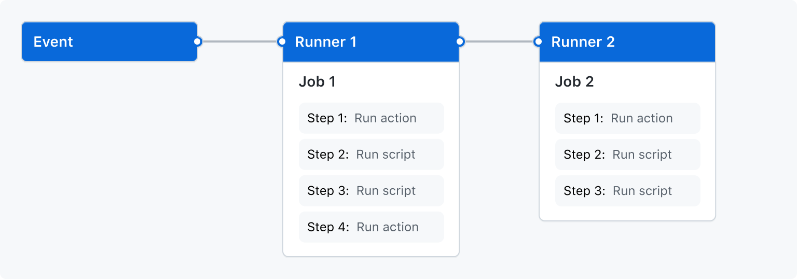
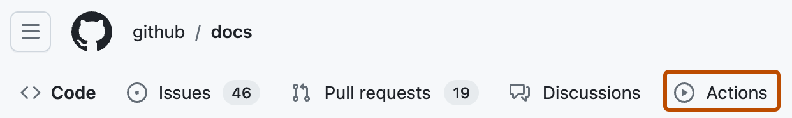
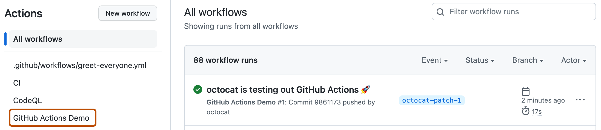
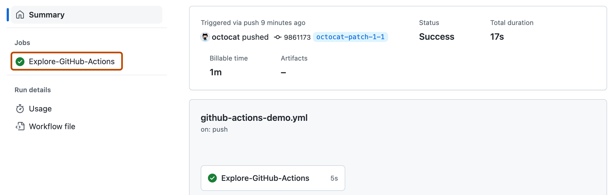
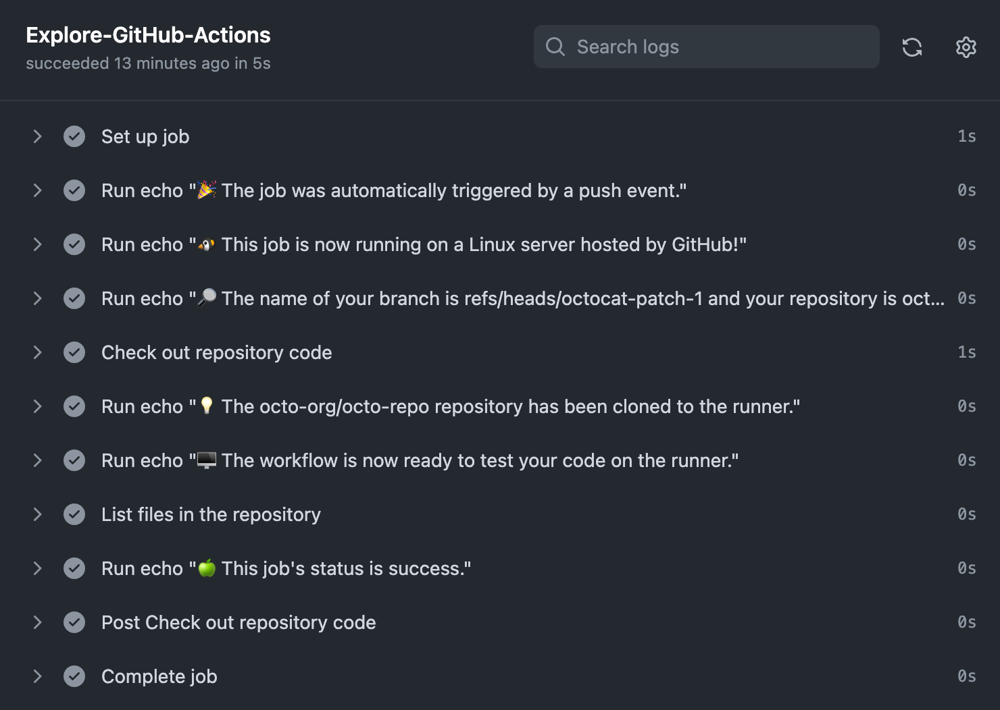
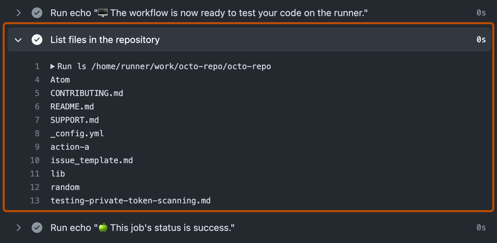

# CI/CD Workflows y GitHub Actions

## Índice

1. [¿Qué es CI/CD?](#1-qué-es-cicd)
   - [1.1 Integración Continua (CI)](#11-integración-continua-ci)
   - [1.2 Entrega Continua (CD)](#12-entrega-continua-cd)
   - [1.3 Despliegue Continuo (CD)](#13-despliegue-continuo-cd)
2. [El pipeline de CI/CD](#2-el-pipeline-de-cicd)
3. [GitHub Actions](#3-github-actions)
   - [3.1 Conceptos clave](#31-conceptos-clave)
   - [3.2 Estructura de un workflow](#32-estructura-de-un-workflow)
4. [Sintaxis YAML](#4-sintaxis-yaml)
5. [Eventos que disparan workflows](#5-eventos-que-disparan-workflows)
6. [Jobs y Steps](#6-jobs-y-steps)
7. [Runners](#7-runners)
8. [Actions del Marketplace](#8-actions-del-marketplace)
9. [Variables y Secrets](#9-variables-y-secrets)
10. [Ejemplos con Java y Gradle](#10-ejemplos-con-java-y-gradle)
    - [10.1 Build y test básico](#101-build-y-test-básico)
    - [10.2 Workflow con caché de dependencias](#102-workflow-con-caché-de-dependencias)
    - [10.3 Matriz de versiones](#103-matriz-de-versiones)
    - [10.4 Publicar un artefacto JAR](#104-publicar-un-artefacto-jar)
    - [10.5 Pipeline completo: CI + CD con staging y producción](#105-pipeline-completo-ci--cd-con-staging-y-producción)
11. [Buenas prácticas](#11-buenas-prácticas)

---

## 1. ¿Qué es CI/CD?

**CI/CD** es un conjunto de prácticas de ingeniería de software que automatizan las etapas del ciclo de vida de una aplicación: desde la integración del código hasta su despliegue en producción. El objetivo es reducir errores, acelerar las entregas y aumentar la confianza en el software que se publica.

El término agrupa tres conceptos relacionados pero distintos:

| Concepto | Nombre completo | Foco |
|----------|----------------|------|
| **CI** | Continuous Integration | Integrar código frecuentemente y verificarlo automáticamente |
| **CD** | Continuous Delivery | Dejar el software listo para desplegarse en cualquier momento |
| **CD** | Continuous Deployment | Desplegar automáticamente sin intervención manual |

### 1.1 Integración Continua (CI)

La **Integración Continua** es la práctica de que todos los desarrolladores integren su código al repositorio compartido de forma frecuente (idealmente varias veces por día). Cada integración dispara automáticamente:

- **Compilación**: verificar que el código compila sin errores
- **Tests unitarios**: verificar que la lógica de negocio es correcta
- **Análisis estático**: detectar code smells, vulnerabilidades o violaciones de estilo
- **Reporte de cobertura**: medir cuánto del código está cubierto por tests

El principio fundamental es que **los errores se detectan temprano**, cuando aún son baratos de corregir. Si el código de un desarrollador rompe algo, el sistema lo notifica de inmediato, antes de que el cambio se mezcle con el trabajo de otros.

```
Desarrollador A ──→ commit ──→ push ──→ [CI dispara] ──→ build + tests ──→ ✅ OK / ❌ FALLA
Desarrollador B ──→ commit ──→ push ──→ [CI dispara] ──→ build + tests ──→ ✅ OK / ❌ FALLA
```

**Problema que resuelve**: el síndrome del "en mi máquina funciona". Con CI, el código se verifica en un entorno controlado y reproducible, no solo en la máquina de quien lo escribió.

### 1.2 Entrega Continua (CD)

La **Entrega Continua** extiende la CI: además de verificar el código, lo prepara para que pueda desplegarse en producción en cualquier momento. Esto implica:

- Generar el artefacto de deployment (JAR, WAR, imagen Docker, etc.)
- Desplegarlo automáticamente en un entorno de **staging** (pre-producción)
- Ejecutar tests de integración y tests de aceptación en ese entorno
- Dejar el sistema en un estado **listo para producción** con un solo clic humano

El paso a producción **sigue siendo manual**, pero el pipeline garantiza que el software que llega ahí ya fue validado exhaustivamente.

### 1.3 Despliegue Continuo (CD)

El **Despliegue Continuo** va un paso más allá: **elimina la aprobación manual** para producción. Todo cambio que pase la suite de tests automáticamente llega a los usuarios finales.

Esto requiere una cultura y una madurez de testing muy alta. Empresas como Amazon, Netflix y Google despliegan cientos o miles de veces por día usando este modelo.

```
Madurez requerida:
CI → CD (Delivery) → CD (Deployment)
[baja]                              [alta]
```

---

## 2. El pipeline de CI/CD

Un **pipeline** es la secuencia de etapas automatizadas que recorre el código desde que un desarrollador hace `git push` hasta que el software llega a producción.

```
┌─────────┐   ┌──────────┐   ┌────────┐   ┌──────────┐   ┌────────────┐
│  Código │──▶│  Build   │──▶│ Tests  │──▶│ Staging  │──▶│ Producción │
│  commit │   │ compilar │   │ unit   │   │ deploy   │   │   deploy   │
└─────────┘   └──────────┘   │ integr │   │ e2e test │   └────────────┘
                              │ cover  │   └──────────┘
                              └────────┘
```

Cada etapa del pipeline tiene una responsabilidad clara:

| Etapa | Descripción | Si falla... |
|-------|-------------|-------------|
| **Source** | Se detecta el cambio de código (push, PR) | El pipeline no arranca |
| **Build** | Se compila el código y se resuelven dependencias | No se pueden ejecutar los tests |
| **Test** | Se corren tests unitarios, de integración y de aceptación | No se genera el artefacto |
| **Package** | Se genera el artefacto deployable (JAR, Docker image) | No hay nada para desplegar |
| **Deploy Staging** | Se despliega en el entorno de pre-producción | No se valida en contexto real |
| **Deploy Prod** | Se despliega en producción | Manual (CD Delivery) o auto (CD Deployment) |

**La regla de oro del pipeline**: si cualquier etapa falla, el pipeline se detiene. El artefacto **nunca llega a producción** si los tests no pasaron.

---

## 3. GitHub Actions

**GitHub Actions** es la plataforma de CI/CD integrada en GitHub. Permite definir workflows como archivos YAML que se almacenan en el propio repositorio, se versionan junto con el código y se ejecutan en respuesta a eventos de GitHub.



### Ventajas respecto a otras herramientas

| Característica | GitHub Actions | Jenkins | CircleCI |
|----------------|---------------|---------|----------|
| Configuración | YAML en el repo | Interfaz web / Jenkinsfile | YAML en el repo |
| Infraestructura | Gestionada por GitHub | Self-hosted | Cloud o self-hosted |
| Integración con GitHub | Nativa | Via plugins | Buena |
| Costo | Gratis para repos públicos | Gratis (self-hosted) | Gratis con límites |
| Marketplace de acciones | Sí (miles de actions) | Plugins | Orbs |

### 3.1 Conceptos clave

```
Repositorio
└── .github/
    └── workflows/
        ├── ci.yml        ← Workflow 1
        └── deploy.yml    ← Workflow 2
```

| Concepto | Descripción |
|----------|-------------|
| **Workflow** | Proceso automatizado definido en un archivo YAML. Un repo puede tener múltiples workflows. |
| **Event** | El disparador del workflow: `push`, `pull_request`, `schedule`, `workflow_dispatch`, etc. |
| **Job** | Unidad de trabajo dentro de un workflow. Los jobs corren en paralelo por defecto. |
| **Step** | Cada paso dentro de un job. Los steps se ejecutan secuencialmente. |
| **Action** | Unidad reutilizable de código que realiza una tarea específica (checkout, setup-java, etc.). |
| **Runner** | El servidor (virtual o físico) donde se ejecuta el job. |

### 3.2 Estructura de un workflow

```
Workflow (ci.yml)
├── name: "CI Pipeline"
├── on: [push, pull_request]          ← Events
└── jobs:
    ├── build:                         ← Job 1
    │   ├── runs-on: ubuntu-latest     ← Runner
    │   └── steps:
    │       ├── uses: actions/checkout ← Step 1 (action)
    │       ├── uses: actions/setup-java ← Step 2 (action)
    │       └── run: ./gradlew build  ← Step 3 (comando shell)
    └── test:                          ← Job 2
        ├── needs: [build]             ← Dependencia
        └── steps: ...
```

---

## 4. Sintaxis YAML

Los workflows se escriben en **YAML** (YAML Ain't Markup Language), un formato de serialización de datos legible por humanos. Algunas reglas esenciales:

```yaml
# Esto es un comentario

# Clave: valor
nombre: "Mi Workflow"

# Listas (con guion)
triggers:
  - push
  - pull_request

# Objetos anidados (con indentación de 2 espacios)
jobs:
  mi-job:
    runs-on: ubuntu-latest

# Texto multilínea (con |)
run: |
  echo "Línea 1"
  echo "Línea 2"
  ./gradlew build

# Expresiones y contextos (con ${{ }})
nombre: ${{ github.actor }}
```

> **Error común**: YAML es sensible a la indentación. Usar tabs en lugar de espacios causa errores. Siempre usar 2 espacios.

---

## 5. Eventos que disparan workflows

El campo `on` define cuándo se ejecuta el workflow.

```yaml
# Disparo simple
on: push

# Múltiples eventos
on: [push, pull_request]

# Con filtros
on:
  push:
    branches:
      - main
      - 'release/**'
    paths:
      - 'src/**'
      - 'build.gradle'

  pull_request:
    branches:
      - main
    types: [opened, synchronize, reopened]

  # Ejecución programada (cron)
  schedule:
    - cron: '0 6 * * 1-5'   # Lunes a viernes a las 6:00 UTC

  # Disparo manual desde la interfaz de GitHub
  workflow_dispatch:
    inputs:
      environment:
        description: 'Entorno de deploy'
        required: true
        default: 'staging'
        type: choice
        options: [staging, production]
```

| Evento | Cuándo se dispara |
|--------|------------------|
| `push` | Al hacer `git push` a una rama |
| `pull_request` | Al abrir, actualizar o cerrar un PR |
| `schedule` | En un horario definido con sintaxis cron |
| `workflow_dispatch` | Manualmente desde la UI o API de GitHub |
| `release` | Al publicar un release en GitHub |
| `workflow_call` | Cuando otro workflow lo invoca |

---

## 6. Jobs y Steps

### Jobs

Los **jobs** son la unidad principal de un workflow. Por defecto se ejecutan **en paralelo**; para secuenciarlos se usa `needs`.

```yaml
jobs:
  compilar:
    runs-on: ubuntu-latest
    steps:
      - run: ./gradlew compileJava

  testear:
    runs-on: ubuntu-latest
    needs: compilar          # espera a que "compilar" termine
    steps:
      - run: ./gradlew test

  desplegar:
    runs-on: ubuntu-latest
    needs: [compilar, testear]   # espera a ambos
    steps:
      - run: ./deploy.sh
```

Diagrama de ejecución:
```
compilar ──→ testear ──→ desplegar
              (necesita compilar)   (necesita ambos)
```

### Steps

Los **steps** se ejecutan secuencialmente dentro de un job. Hay dos tipos:

**1. `run`** — ejecuta comandos shell directamente:
```yaml
steps:
  - name: Compilar
    run: ./gradlew compileJava

  - name: Comandos múltiples
    run: |
      echo "Verificando versión de Java"
      java -version
      ./gradlew test
```

**2. `uses`** — invoca una **Action** (reutilizable, de GitHub o del Marketplace):
```yaml
steps:
  - name: Checkout del código
    uses: actions/checkout@v4

  - name: Configurar JDK 21
    uses: actions/setup-java@v4
    with:
      java-version: '21'
      distribution: 'temurin'
```

### Condicionales

```yaml
steps:
  - name: Deploy solo en main
    if: github.ref == 'refs/heads/main'
    run: ./deploy.sh

  - name: Notificar solo si falla
    if: failure()
    run: echo "El pipeline falló"
```

---

## 7. Runners

Los **runners** son los servidores donde se ejecutan los jobs. GitHub provee runners gratuitos hospedados en la nube:

| Runner | Sistema Operativo | Procesador |
|--------|------------------|------------|
| `ubuntu-latest` | Ubuntu 22.04 | x64 |
| `windows-latest` | Windows Server 2022 | x64 |
| `macos-latest` | macOS Monterey | x64 / ARM64 |

```yaml
jobs:
  linux-job:
    runs-on: ubuntu-latest

  windows-job:
    runs-on: windows-latest

  macos-job:
    runs-on: macos-latest
```

También es posible configurar **self-hosted runners**: servidores propios conectados a GitHub, útiles cuando se necesita hardware específico, acceso a red privada o mayor control del entorno.

---

## 8. Actions del Marketplace

Las **Actions** son bloques reutilizables publicados en el [GitHub Marketplace](https://github.com/marketplace?type=actions). Se referencian con `uses: owner/repo@version`.

Las más usadas en proyectos Java:

| Action | Qué hace |
|--------|----------|
| `actions/checkout@v4` | Clona el repositorio en el runner |
| `actions/setup-java@v4` | Instala y configura una versión de JDK |
| `actions/cache@v4` | Cachea el directorio `.gradle` entre runs |
| `actions/upload-artifact@v4` | Guarda archivos generados (JARs, reportes) |
| `actions/download-artifact@v4` | Descarga artefactos entre jobs |
| `codecov/codecov-action@v4` | Sube reportes de cobertura a Codecov |

> **Siempre usar una versión específica** (`@v4`, `@v4.1.0`) en lugar de `@latest` para evitar que cambios en la action rompan el pipeline.

---

## 9. Variables y Secrets

### Contextos predefinidos

GitHub expone información del entorno a través de **contextos**:

```yaml
steps:
  - name: Info del contexto
    run: |
      echo "Repo: ${{ github.repository }}"
      echo "Branch: ${{ github.ref_name }}"
      echo "Commit: ${{ github.sha }}"
      echo "Actor: ${{ github.actor }}"
      echo "Event: ${{ github.event_name }}"
```

### Variables de entorno

```yaml
env:
  APP_ENV: production          # a nivel de workflow (global)

jobs:
  mi-job:
    env:
      DB_HOST: localhost        # a nivel de job

    steps:
      - name: Build
        env:
          JAVA_OPTS: "-Xmx512m"  # a nivel de step
        run: ./gradlew build
```

### Secrets

Los **secrets** son valores sensibles (contraseñas, tokens, claves API) que se configuran en la UI de GitHub y nunca se muestran en los logs.

Se configuran en: `Settings → Secrets and variables → Actions → New repository secret`

```yaml
steps:
  - name: Deploy a producción
    env:
      SERVER_PASSWORD: ${{ secrets.SERVER_PASSWORD }}
      API_KEY: ${{ secrets.DEPLOY_API_KEY }}
    run: ./deploy.sh
```

> GitHub enmascara automáticamente los secrets en los logs mostrando `***` en lugar del valor real.

---

## 10. Ejemplos con Java y Gradle

### Interfaz de GitHub Actions

Al acceder a la pestaña **Actions** de un repositorio se ven todos los workflows y sus ejecuciones:



Al seleccionar una ejecución se ve el estado de cada job:



Al ingresar a un job se ven todos los steps con su resultado:



Los logs de cada step se pueden expandir para ver la salida completa:





---

### 10.1 Build y test básico

El workflow más simple para un proyecto Java con Gradle: compilar y correr los tests en cada push.

```yaml
# .github/workflows/ci.yml
name: CI

on:
  push:
    branches: [main, develop]
  pull_request:
    branches: [main]

jobs:
  build-and-test:
    runs-on: ubuntu-latest

    steps:
      - name: Checkout del código
        uses: actions/checkout@v4

      - name: Configurar JDK 21
        uses: actions/setup-java@v4
        with:
          java-version: '21'
          distribution: 'temurin'

      - name: Dar permisos al wrapper de Gradle
        run: chmod +x gradlew

      - name: Compilar
        run: ./gradlew compileJava

      - name: Ejecutar tests
        run: ./gradlew test

      - name: Generar reporte de cobertura
        run: ./gradlew jacocoTestReport
```

**¿Qué hace este workflow?**
- Se dispara en cada push a `main` o `develop`, y en PRs hacia `main`
- Clona el repositorio
- Instala JDK 21 (distribución Temurin, antes AdoptOpenJDK)
- Compila el código, corre los tests y genera el reporte de cobertura

---

### 10.2 Workflow con caché de dependencias

Gradle descarga las dependencias desde Internet en cada ejecución. El caché evita esa descarga cuando las dependencias no cambiaron, reduciendo el tiempo del pipeline de varios minutos a segundos.

```yaml
# .github/workflows/ci.yml
name: CI con caché

on:
  push:
    branches: [main]
  pull_request:

jobs:
  build-and-test:
    runs-on: ubuntu-latest

    steps:
      - name: Checkout del código
        uses: actions/checkout@v4

      - name: Configurar JDK 21
        uses: actions/setup-java@v4
        with:
          java-version: '21'
          distribution: 'temurin'
          cache: gradle          # ← caché integrado en setup-java

      - name: Dar permisos al wrapper
        run: chmod +x gradlew

      - name: Build y tests
        run: ./gradlew build

      - name: Subir reporte de tests
        uses: actions/upload-artifact@v4
        if: always()             # subir incluso si los tests fallan
        with:
          name: test-results
          path: build/reports/tests/test/
          retention-days: 7
```

El flag `cache: gradle` en `setup-java` configura automáticamente el caché del directorio `~/.gradle` usando el archivo `build.gradle` como clave. Si `build.gradle` no cambia entre runs, las dependencias se restauran del caché.

---

### 10.3 Matriz de versiones

La **matriz** permite correr el mismo job con múltiples combinaciones de valores (versiones de Java, sistemas operativos, etc.) sin duplicar código.

```yaml
# .github/workflows/compatibility.yml
name: Compatibilidad multi-JDK

on: [push, pull_request]

jobs:
  test-matrix:
    runs-on: ${{ matrix.os }}

    strategy:
      matrix:
        java-version: [17, 21]
        os: [ubuntu-latest, windows-latest]
      fail-fast: false       # si un combo falla, los otros siguen corriendo

    steps:
      - uses: actions/checkout@v4

      - name: Configurar JDK ${{ matrix.java-version }}
        uses: actions/setup-java@v4
        with:
          java-version: ${{ matrix.java-version }}
          distribution: 'temurin'
          cache: gradle

      - name: Dar permisos al wrapper
        run: chmod +x gradlew
        if: runner.os != 'Windows'

      - name: Ejecutar tests en ${{ matrix.os }} con Java ${{ matrix.java-version }}
        run: ./gradlew test
```

Esta configuración genera **4 jobs en paralelo**:

| Job | OS | Java |
|-----|----|------|
| 1 | ubuntu-latest | 17 |
| 2 | ubuntu-latest | 21 |
| 3 | windows-latest | 17 |
| 4 | windows-latest | 21 |

---

### 10.4 Publicar un artefacto JAR

Cuando el build es exitoso, se puede guardar el JAR generado como artefacto del workflow para descargarlo o usarlo en jobs posteriores.

```yaml
# .github/workflows/build-artifact.yml
name: Build y publicar artefacto

on:
  push:
    branches: [main]

jobs:
  build:
    runs-on: ubuntu-latest

    steps:
      - uses: actions/checkout@v4

      - uses: actions/setup-java@v4
        with:
          java-version: '21'
          distribution: 'temurin'
          cache: gradle

      - name: Dar permisos al wrapper
        run: chmod +x gradlew

      - name: Build (sin tests para el artefacto)
        run: ./gradlew jar

      - name: Subir JAR como artefacto
        uses: actions/upload-artifact@v4
        with:
          name: app-jar
          path: build/libs/*.jar
          retention-days: 30

  # Job separado que consume el artefacto
  deploy-staging:
    runs-on: ubuntu-latest
    needs: build

    steps:
      - name: Descargar JAR
        uses: actions/download-artifact@v4
        with:
          name: app-jar
          path: ./artifacts

      - name: Verificar JAR descargado
        run: ls -la ./artifacts/

      - name: Deploy al servidor de staging
        env:
          STAGING_HOST: ${{ secrets.STAGING_HOST }}
          STAGING_USER: ${{ secrets.STAGING_USER }}
          STAGING_KEY: ${{ secrets.STAGING_SSH_KEY }}
        run: |
          echo "$STAGING_KEY" > /tmp/deploy_key
          chmod 600 /tmp/deploy_key
          scp -i /tmp/deploy_key ./artifacts/*.jar \
            $STAGING_USER@$STAGING_HOST:/opt/app/app.jar
```

---

### 10.5 Pipeline completo: CI + CD con staging y producción

Un pipeline de producción real separa las responsabilidades en múltiples jobs con condiciones de disparo claras.

```yaml
# .github/workflows/pipeline.yml
name: Pipeline CI/CD

on:
  push:
    branches: [main, develop]
  pull_request:
    branches: [main]

jobs:
  # ── 1. Verificación de calidad ─────────────────────────────────
  quality:
    name: Calidad del código
    runs-on: ubuntu-latest

    steps:
      - uses: actions/checkout@v4

      - uses: actions/setup-java@v4
        with:
          java-version: '21'
          distribution: 'temurin'
          cache: gradle

      - run: chmod +x gradlew

      - name: Compilar y verificar estilo
        run: ./gradlew compileJava checkstyleMain

      - name: Ejecutar tests unitarios
        run: ./gradlew test

      - name: Reporte de cobertura
        run: ./gradlew jacocoTestReport

      - name: Subir resultados de tests
        uses: actions/upload-artifact@v4
        if: always()
        with:
          name: test-reports
          path: build/reports/

  # ── 2. Build del artefacto ────────────────────────────────────
  build:
    name: Build artefacto
    runs-on: ubuntu-latest
    needs: quality

    steps:
      - uses: actions/checkout@v4

      - uses: actions/setup-java@v4
        with:
          java-version: '21'
          distribution: 'temurin'
          cache: gradle

      - run: chmod +x gradlew

      - name: Generar JAR
        run: ./gradlew jar -x test

      - name: Subir JAR
        uses: actions/upload-artifact@v4
        with:
          name: app-${{ github.sha }}
          path: build/libs/*.jar

  # ── 3. Deploy a staging (solo desde develop o main) ──────────
  deploy-staging:
    name: Deploy a Staging
    runs-on: ubuntu-latest
    needs: build
    if: |
      github.event_name == 'push' &&
      (github.ref == 'refs/heads/main' || github.ref == 'refs/heads/develop')

    environment: staging        # requiere aprobación si se configura en GitHub

    steps:
      - name: Descargar JAR
        uses: actions/download-artifact@v4
        with:
          name: app-${{ github.sha }}
          path: ./dist

      - name: Deploy a staging
        run: |
          echo "Desplegando commit ${{ github.sha }} en staging..."
          # Aquí irían los comandos reales de deploy

      - name: Verificar salud del servicio
        run: |
          sleep 10
          curl --fail https://staging.miapp.com/health || exit 1

  # ── 4. Deploy a producción (solo desde main, requiere aprobación) ──
  deploy-production:
    name: Deploy a Producción
    runs-on: ubuntu-latest
    needs: deploy-staging
    if: github.ref == 'refs/heads/main' && github.event_name == 'push'

    environment: production     # requiere aprobación manual en GitHub Settings

    steps:
      - name: Descargar JAR
        uses: actions/download-artifact@v4
        with:
          name: app-${{ github.sha }}
          path: ./dist

      - name: Deploy a producción
        run: |
          echo "Desplegando commit ${{ github.sha }} en producción..."
          # Aquí irían los comandos reales de deploy

      - name: Notificar deploy exitoso
        run: echo "Deploy de ${{ github.sha }} a producción completado por ${{ github.actor }}"
```

**Flujo de este pipeline:**

```
push a main/develop
        │
        ▼
   [quality]  ← tests + cobertura + estilo
        │ (si pasa)
        ▼
    [build]   ← genera el JAR
        │ (si pasa, y es push a main/develop)
        ▼
[deploy-staging] ← deploy automático a staging
        │ (si pasa, y es push a main, con aprobación humana)
        ▼
[deploy-production] ← deploy a producción
```

---

## 11. Buenas prácticas

### Fijar versiones de las actions

```yaml
# Mal: puede romperse si la action cambia
uses: actions/checkout@main

# Bien: versión semántica fija
uses: actions/checkout@v4

# Mejor: hash de commit exacto (máxima seguridad)
uses: actions/checkout@11bd71901bbe5b1630ceea73d27597364c9af683
```

### Usar caché para acelerar builds

```yaml
- uses: actions/setup-java@v4
  with:
    java-version: '21'
    distribution: 'temurin'
    cache: gradle              # cachea ~/.gradle automáticamente
```

### Limitar permisos del GITHUB_TOKEN

```yaml
permissions:
  contents: read               # solo lectura por defecto
  pull-requests: write         # solo lo que el workflow necesita
```

### Separar concerns en múltiples workflows

```
.github/workflows/
├── ci.yml           # tests y calidad (en cada push/PR)
├── build.yml        # genera artefactos (en push a main)
└── deploy.yml       # deploys (disparo manual o en release)
```

### Usar environments para aprobaciones manuales

En `Settings → Environments` se puede configurar un entorno con **Required reviewers**: antes de que el job de deploy corra, uno o más revisores deben aprobarlo desde la UI de GitHub. Esto implementa la "aprobación humana" del modelo CD Delivery.

### No hardcodear valores sensibles

```yaml
# Mal: credencial expuesta en el código
run: mysql -u root -pMiContraseña123 < schema.sql

# Bien: usar secrets
run: mysql -u root -p${{ secrets.DB_PASSWORD }} < schema.sql
```

### Fallar rápido con `fail-fast`

```yaml
strategy:
  matrix:
    java: [17, 21]
  fail-fast: true    # cancela los jobs restantes si uno falla
```

O deshabilitarlo cuando se quiere ver el resultado en todas las combinaciones:

```yaml
  fail-fast: false   # útil en matrices de compatibilidad
```
