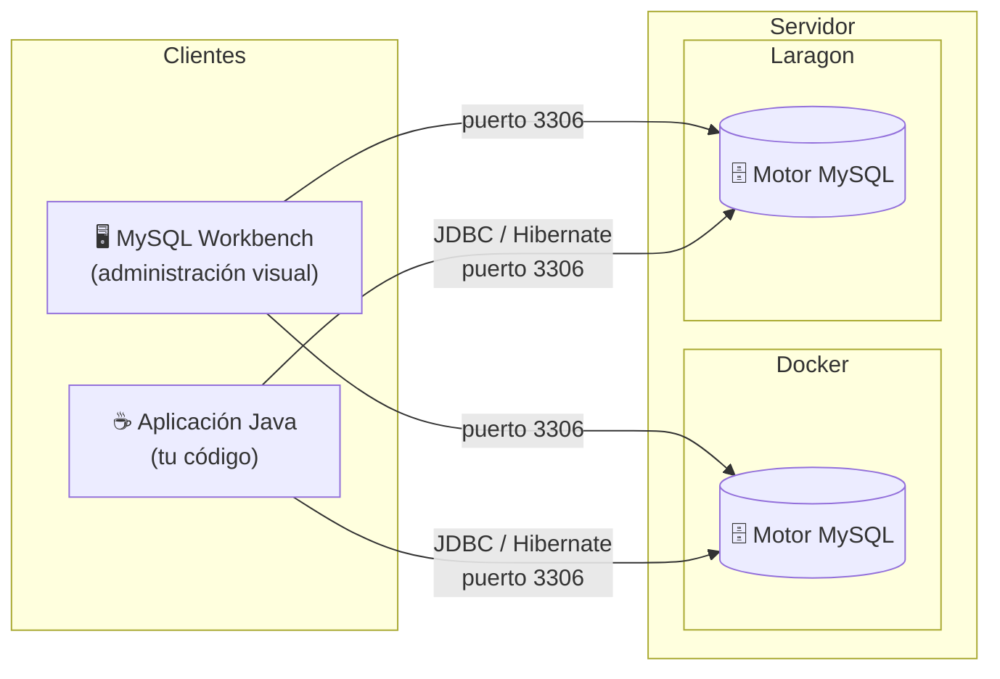

# Unidad 2 - Desarrollo de aplicaciones con bases de datos relacionales

## Proyectos de ejemplo

| Carpeta | Descripción |
|---------|-------------|
| [`002b-ejemplo-java-sql`](002b-ejemplo-java-sql/) | Conexión directa con JDBC puro (sin ORM) |
| [`002b-ejemplo-orm`](002b-ejemplo-orm/) | Implementación completa con Hibernate (capas datos, lógica y presentación) |

## Índice

1. [Introducción](#1-introducción)
2. [Diseño y levantamiento de la base de datos](#2-diseño-y-levantamiento-de-la-base-de-datos)
3. [Conexión directa con JDBC](#3-conexión-directa-con-jdbc)
4. [ORM - Object Relational Mapping](#4-orm---object-relational-mapping)
5. [JPA y Hibernate](#5-jpa-y-hibernate)
6. [Relaciones entre entidades](#6-relaciones-entre-entidades)
7. [Consultas avanzadas con CriteriaBuilder](#7-consultas-avanzadas-con-criteriabuilder)
8. [Pruebas unitarias con H2](#8-pruebas-unitarias-con-h2)
9. [Conceptos avanzados clave](#9-conceptos-avanzados-clave)

---

## 1. Introducción

Las aplicaciones empresariales suelen organizarse en **capas**: una capa de presentación (interfaz de usuario), una capa de negocio (lógica de la aplicación) y una **capa de datos** (acceso y persistencia de información). En esta unidad nos enfocamos en esa última capa: cómo conectar una aplicación Java a una base de datos relacional y cómo manipular los datos desde el código.

### El rol del diseño de la base de datos

En materias como **Bases de Datos I y II** se estudia cómo modelar y diseñar una base de datos: definir tablas, columnas, tipos de datos, claves primarias, claves foráneas, relaciones y restricciones. Ese diseño es la base sobre la que trabajamos acá.

**Desde la perspectiva del desarrollador**, la pregunta no es cómo diseñar el esquema sino cómo conectar la aplicación a ese esquema ya definido, cómo representar las tablas como objetos Java, y cómo realizar operaciones de lectura y escritura de forma eficiente y mantenible.

### Los tres pasos del acceso a datos

| Paso | Descripción |
|------|-------------|
| **Diseño de la BD** | Definir tablas, campos, relaciones, restricciones e índices |
| **Conexión** | Conectar la aplicación Java a la base de datos (via JDBC o un ORM) |
| **Acceso a datos** | Crear objetos que provean métodos para realizar operaciones CRUD (crear, leer, actualizar, eliminar) |

---

## 2. Diseño y levantamiento de la base de datos

### ¿Qué es Docker y para qué sirve?

**Docker** es una plataforma que permite empaquetar y ejecutar aplicaciones dentro de **contenedores**: entornos aislados que incluyen todo lo que esa aplicación necesita para funcionar (binarios, librerías, configuración), sin depender del sistema operativo del host.

A diferencia de una máquina virtual, un contenedor no virtualiza el hardware: comparte el kernel del sistema operativo y arranca en segundos. Esto lo hace ideal para levantar servicios como bases de datos en el entorno de desarrollo sin necesidad de instalarlos directamente en la máquina.

El flujo básico es:
1. Se descarga una **imagen** (plantilla del servicio, por ej. `mysql`)
2. Docker crea un **contenedor** a partir de esa imagen
3. El contenedor corre de forma aislada, exponiendo los puertos que se le indiquen

En el contexto de esta unidad, Docker permite tener MySQL funcionando en minutos, sin instalación manual, en cualquier sistema operativo.

### Instalación en Windows

#### Docker Desktop

1. Verificar que la virtualización esté habilitada en la BIOS (en la mayoría de las PCs modernas ya lo está).
2. Habilitar **WSL 2** (Windows Subsystem for Linux), que Docker Desktop usa como backend:
   - Abrir PowerShell como administrador y ejecutar:
     ```powershell
     wsl --install
     ```
   - Reiniciar la PC si lo solicita.
3. Descargar **Docker Desktop** desde [docs.docker.com/desktop/setup/install/windows-install](https://docs.docker.com/desktop/setup/install/windows-install/).
4. Ejecutar el instalador y seguir los pasos (dejar marcada la opción "Use WSL 2 instead of Hyper-V").
5. Al finalizar, iniciar Docker Desktop desde el menú de inicio. El ícono de la ballena en la barra de tareas indica que está corriendo.
6. Verificar la instalación abriendo una terminal (CMD o PowerShell) y ejecutando:
   ```bash
   docker --version
   ```

> **Nota**: Docker Desktop requiere Windows 10 (versión 1903 o superior) o Windows 11.

#### MySQL Workbench

MySQL Workbench es el cliente gráfico oficial para administrar bases de datos MySQL.

1. Descargar el instalador desde [dev.mysql.com/downloads/workbench](https://dev.mysql.com/downloads/workbench/).
2. En la página de descarga, hacer clic en **"No thanks, just start my download"** para omitir el registro.
3. Ejecutar el instalador `.msi` y seguir los pasos con las opciones por defecto.
4. Al abrir MySQL Workbench por primera vez, la pantalla principal mostrará las conexiones disponibles. Se configurará una nueva conexión luego de levantar el contenedor Docker.

### Alternativa: Laragon (sin Docker)

Si Docker Desktop no puede instalarse en la máquina (por restricciones de permisos, versión de Windows, o recursos limitados), **Laragon** es una alternativa más sencilla. Es un entorno de desarrollo local para Windows que incluye MySQL preconfigurado, sin necesidad de virtualización.

1. Descargar **Laragon Full** desde [laragon.org/download](https://laragon.org/download/).
2. Ejecutar el instalador y seguir los pasos con las opciones por defecto.
3. Abrir Laragon y hacer clic en **"Iniciar todo"** (Start All). Esto levanta el servidor MySQL en el puerto `3306`.
4. Para administrar la base de datos, Laragon incluye **HeidiSQL** (cliente similar a MySQL Workbench). Se accede desde el menú **Base de datos → HeidiSQL**.

Los datos de conexión por defecto de Laragon son:

```
hostname: 127.0.0.1
port:     3306
username: root
password: (vacío)
```

#### Establecer una contraseña para root

Por seguridad, se recomienda asignar una contraseña al usuario `root` antes de usar la base de datos. Para eso:

1. Con Laragon corriendo, abrir **HeidiSQL** desde el menú **Base de datos → HeidiSQL**.
2. Conectarse con `root` y contraseña vacía.
3. En la barra superior, ir a **Herramientas → Ejecutar SQL** (o abrir una pestaña de consulta con `Ctrl+T`).
4. Ejecutar el siguiente comando reemplazando `nueva_contraseña` por la contraseña elegida:

```sql
ALTER USER 'root'@'localhost' IDENTIFIED BY 'nueva_contraseña';
FLUSH PRIVILEGES;
```

5. Cerrar HeidiSQL y volver a conectarse usando la nueva contraseña para verificar que funciona.

> **Importante**: una vez asignada la contraseña, actualizar el archivo `hibernate.cfg.xml` del proyecto con el mismo valor:
> ```xml
> <property name="hibernate.connection.password">nueva_contraseña</property>
> ```

### Motor vs. Cliente

Una base de datos tiene dos componentes:
- **Motor**: administra las tablas y los datos (servidor)
- **Cliente**: interfaz para administrar la base de datos (ej: MySQL Workbench)



> El motor corre en segundo plano (dentro de Docker o Laragon) y los clientes se conectan a él a través del puerto `3306`. Puede haber múltiples clientes conectados al mismo tiempo. Solo se usa **una** de las dos opciones de servidor.

### Levantar MySQL con Docker

En lugar de instalar MySQL en la máquina, se usa un contenedor Docker:

```bash
docker run --name nombre -p 3306:3306 -e MYSQL_ROOT_PASSWORD=123456 mysql
```

Conectarse desde MySQL Workbench con:

```
hostname: 127.0.0.1
port:     3306
username: root
password: 123456
```

Una vez conectado, se crea un **schema** (equivale a "base de datos"), tablas y datos.

### Problema de persistencia

Cuando el contenedor Docker se apaga:
- El servidor de BD queda inaccesible
- Si se crea un segundo contenedor, **no tiene acceso a los datos del primero**
- Si se borra el contenedor, **se pierden todos los datos**

### Solución: Docker Volume

Un **Docker Volume** permite almacenar y acceder a datos persistentes, independientemente del ciclo de vida del contenedor.

```bash
# 1. Crear el volumen
docker volume create mysql-data

# 2. Iniciar MySQL usando ese volumen
docker run --name mysql-container \
  -p 3306:3306 \
  -v mysql-data:/var/lib/mysql \
  -e MYSQL_ROOT_PASSWORD=123456 \
  -d mysql
```

Los datos en `/var/lib/mysql` dentro del contenedor se almacenan en el volumen `mysql-data`. Si el contenedor se detiene o elimina, los datos persisten. Un nuevo contenedor que monte el mismo volumen tendrá acceso a todos los datos previos.

---

## 3. Conexión directa con JDBC

**JDBC** (Java Database Connectivity) es un conjunto de APIs que permite a aplicaciones Java interactuar con bases de datos relacionales. Requiere un **driver** específico para cada motor.

### Dependencia en Gradle

```groovy
dependencies {
    implementation 'mysql:mysql-connector-java:8.0.28'
}
```

### Modelo de ejemplo

Se trabaja con una tabla `users`:

```sql
CREATE TABLE users (
    id     INT PRIMARY KEY AUTO_INCREMENT,
    name   VARCHAR(45) NOT NULL,
    active BIT NOT NULL
);
```

### Tres objetos centrales de JDBC

| Objeto | Descripción |
|--------|-------------|
| `Connection` | Representa la conexión a la base de datos |
| `Statement` / `PreparedStatement` | Comando SQL a ejecutar |
| `ResultSet` | Objeto que contiene los resultados de una consulta |

### Lectura de datos (SELECT)

```java
public class Main {
    public static void main(String[] args) {
        Connection connection = null;
        try {
            // Establecer conexión
            connection = DriverManager.getConnection(
                "jdbc:mysql://localhost:3306/schema", "user", "password"
            );

            // Ejecutar consulta
            Statement statement = connection.createStatement();
            ResultSet resultSet = statement.executeQuery("SELECT * FROM users");

            // Procesar resultados
            while (resultSet.next()) {
                String name   = resultSet.getString("name");
                boolean active = resultSet.getBoolean("active");
                System.out.println(name + " " + active);
            }

            connection.close();
        } catch (SQLException e) {
            e.printStackTrace();
        }
    }
}
```

### Escritura de datos (INSERT y UPDATE)

Se usa `PreparedStatement` para evitar **SQL Injection** y parametrizar las consultas:

```java
String url = "jdbc:mysql://localhost:3306/schema";

try (Connection conn = DriverManager.getConnection(url, "user", "password")) {

    // INSERT
    String insertQuery = "INSERT INTO users (name, active) VALUES (?, ?)";
    PreparedStatement stmt = conn.prepareStatement(insertQuery);
    stmt.setString(1, "John");
    stmt.setBoolean(2, true);
    int rowsAffected = stmt.executeUpdate();
    System.out.println(rowsAffected + " filas afectadas");

    // UPDATE
    String updateQuery = "UPDATE users SET active = ? WHERE id = ?";
    PreparedStatement stmt2 = conn.prepareStatement(updateQuery);
    stmt2.setBoolean(1, false);
    stmt2.setInt(2, 1);
    int rowsAffected2 = stmt2.executeUpdate();
    System.out.println(rowsAffected2 + " filas afectadas");

    stmt.close();
    stmt2.close();

} catch (SQLException e) {
    e.printStackTrace();
}
```

> **Nota**: El bloque `try-with-resources` cierra automáticamente la conexión al finalizar.

### Limitaciones de JDBC puro

Aunque JDBC funciona, tiene desventajas en proyectos reales:
- Código SQL disperso por toda la aplicación
- Mapeo manual entre columnas y atributos de objetos Java
- Difícil de mantener ante cambios en el modelo
- No maneja relaciones entre tablas de forma automática

Para resolver esto existe el patrón **ORM**.

---

## 4. ORM - Object Relational Mapping

Los **ORM** (mapeadores objeto-relacional) son herramientas que permiten trabajar con objetos Java sin preocuparse por la estructura de la base de datos subyacente.

Un ORM proporciona una **capa de abstracción** entre la aplicación y la BD, mapeando automáticamente:
- Clases Java → Tablas
- Instancias de clases → Filas
- Atributos → Columnas

### Ventajas

| Ventaja | Descripción |
|---------|-------------|
| **Reducción de complejidad** | Se trabaja con objetos en lugar de SQL puro |
| **Portabilidad** | Cambiar de MySQL a PostgreSQL requiere mínimos cambios |
| **Seguridad** | Previene ataques de SQL Injection por diseño |
| **Productividad** | Automatiza el mapeo objeto-tabla |
| **Mantenimiento** | Cambios en el modelo se reflejan sin modificar SQL manualmente |

### Patrón Repository

El patrón **Repository** organiza el acceso a datos agrupando todas las consultas a la base de datos en una sola clase. El resto de la aplicación (Service, Main) no conoce Hibernate ni SQL: solo llama a los métodos del Repository.

**Estructura del proyecto de ejemplo:**

```
data/
  User.java           ← Entidad JPA (una clase por tabla)
  Repository.java     ← Todas las consultas a la BD
  HibernateUtil.java  ← Configuración de Hibernate
service/
  UserService.java    ← Lógica de negocio
Main.java             ← Presentación (punto de entrada)
```

**Beneficio principal**: si se cambia el ORM o la BD, solo se modifica el Repository, sin tocar la lógica ni la presentación.

### Relación entre tabla, entidad y Repository

El siguiente diagrama muestra cómo una tabla de la base de datos se conecta con las distintas capas de la aplicación Java:

```
BASE DE DATOS                     CAPA DE DATOS (Java)
─────────────────────────────     ─────────────────────────────────────────────────────

Tabla: users                      Entidad: User.java
┌────────────────────────────┐    ┌──────────────────────────────────────────────────┐
│ id     INT  PK AUTO_INC    │◄──►│ @Id @GeneratedValue  private Integer id;         │
│ name   VARCHAR(45) NOT NULL│◄──►│ @Column("name")      private String name;        │
│ active BIT         NOT NULL│◄──►│ @Column("active")    private boolean active;     │
└────────────────────────────┘    └──────────────────────────────────────────────────┘
         │                                          │
         │  Hibernate traduce objetos ↔ filas       │
         │                                          ▼
         │                        Repository.java
         │                        ┌──────────────────────────────────────────────────┐
         │  INSERT INTO users ◄───│ saveUser(User u)      → session.persist(u)       │
         │  SELECT * FROM users◄──│ findAllUsers()        → session.createQuery(...) │
         │  SELECT … WHERE id ◄───│ findUserById(id)      → session.get(User, id)    │
         │  UPDATE users SET  ◄───│ updateUser(User u)    → session.merge(u)         │
         │  DELETE FROM users ◄───│ deleteUser(id)        → session.remove(...)      │
         └────────────────────────┘                                                  │
                                                                                     │
                                  CAPA DE LÓGICA                                     │
                                  Service: UserService.java                          │
                                  ┌──────────────────────────────────────────────────┘
                                  │  registrar(name, active)  → valida + llama Repository
                                  │  desactivar(id)           → busca, modifica, guarda
                                  │  eliminar(id)             → delega al Repository
                                  └──────────────────────────────────────────────────

                                  CAPA DE PRESENTACIÓN
                                  Main.java
                                  ┌──────────────────────────────────────────────────┐
                                  │  service.registrar(...)                          │
                                  │  service.listarTodos().forEach(sout)             │
                                  │  service.desactivar(1)                           │
                                  └──────────────────────────────────────────────────┘
```

> Cada fila de la tabla `users` corresponde a una instancia de `User`. Hibernate se encarga de convertir automáticamente entre ambas representaciones. El Repository expone métodos con nombres de negocio en lugar de SQL, y el Service agrega validaciones antes de llamar al Repository.

---

## 5. JPA y Hibernate

**JPA** (Java Persistence API) es una *especificación* de Java: define las interfaces, anotaciones y reglas para mapear objetos a bases de datos relacionales, pero no es una implementación.

**Hibernate** es la implementación de JPA más popular. En la práctica: se programa usando las anotaciones JPA (`@Entity`, `@Id`, `@Column`...) y Hibernate se encarga de traducirlas al SQL específico del motor de BD configurado.

### Anotaciones JPA

| Anotación | Descripción |
|-----------|-------------|
| `@Entity` | Marca la clase como entidad: Hibernate la mapea a una tabla |
| `@Table(name="...")` | Especifica el nombre de la tabla (opcional si coincide con la clase) |
| `@Id` | Campo que es clave primaria |
| `@GeneratedValue` | Delega la generación del ID a la base de datos |
| `@Column(name="...")` | Mapea el atributo a una columna específica |
| `@OneToMany`, `@ManyToOne`, etc. | Define relaciones entre entidades |

### Estrategias de @GeneratedValue

| Estrategia | Descripción | Uso recomendado |
|------------|-------------|-----------------|
| `IDENTITY` | Usa AUTO_INCREMENT de la BD | MySQL — simple, pero deshabilita inserciones en batch |
| `SEQUENCE` | Usa secuencias de la BD | PostgreSQL, Oracle — recomendada por rendimiento |
| `AUTO` | Hibernate decide según el dialecto | Portable, pero el comportamiento varía por BD |
| `TABLE` | Usa una tabla auxiliar para IDs | Evitar — el peor rendimiento (locking) |

### Ventajas de Hibernate sobre JDBC puro

- **Menos código**: no se escribe SQL para operaciones básicas
- **Portabilidad**: traduce operaciones a SQL específico de cada BD mediante dialectos
- **Rendimiento**: tiene caché de primer y segundo nivel para reducir consultas
- **Relaciones complejas**: maneja `@OneToMany`, `@ManyToMany`, etc. automáticamente

### Dependencias en Gradle

```groovy
dependencies {
    implementation 'mysql:mysql-connector-java:8.0.28'
    implementation 'org.hibernate:hibernate-core:7.3.1.Final'
}
```

> **Nota sobre versiones**: Hibernate 7.x (actual, requiere Java 17+) usa `jakarta.persistence`. Las versiones anteriores usaban `javax.persistence` — si encontrás ejemplos en internet con ese import, están desactualizados.

### 5.1 Definir una Entidad

```java
import jakarta.persistence.*;

@Entity
@Table(name = "users")
public class User {

    @Id
    @GeneratedValue(strategy = GenerationType.IDENTITY)
    private Integer id;

    @Column(name = "name", nullable = false, length = 45)
    private String name;

    @Column(name = "active", nullable = false)
    private boolean active;

    // Constructor vacío obligatorio: Hibernate lo necesita para crear instancias
    // al leer filas de la BD mediante reflexión.
    public User() {}

    public User(String name, boolean active) {
        this.name   = name;
        this.active = active;
    }

    // Getters y setters
}
```

### 5.2 Configuración: hibernate.cfg.xml

Se crea dentro de la carpeta `resources/`:

```xml
<?xml version="1.0" encoding="UTF-8"?>
<!DOCTYPE hibernate-configuration PUBLIC
    "-//Hibernate/Hibernate Configuration DTD 3.0//EN"
    "http://www.hibernate.org/dtd/hibernate-configuration-3.0.dtd">

<hibernate-configuration>
    <session-factory>

        <property name="hibernate.connection.driver_class">com.mysql.cj.jdbc.Driver</property>
        <!-- createDatabaseIfNotExist=true: el driver crea el schema si no existe -->
        <property name="hibernate.connection.url">jdbc:mysql://localhost:3306/ejemplo_orm?serverTimezone=UTC&amp;createDatabaseIfNotExist=true</property>
        <property name="hibernate.connection.username">root</property>
        <property name="hibernate.connection.password">123456</property>

        <!-- El dialecto se autodetecta en Hibernate 7; no hace falta especificarlo -->

        <!-- Controla qué hace Hibernate con las tablas al iniciar:
             create-drop → recrea las tablas al arrancar y las elimina al cerrar (demos)
             create      → recrea las tablas al arrancar (borra datos previos)
             update      → agrega columnas nuevas sin borrar datos existentes
             validate    → verifica que las tablas coincidan con las entidades
             none        → no toca el esquema (producción) -->
        <property name="hibernate.hbm2ddl.auto">create-drop</property>

        <!-- Imprime el SQL generado en consola, útil para aprender y depurar -->
        <property name="hibernate.show_sql">true</property>
        <property name="hibernate.format_sql">true</property>

        <property name="hibernate.cache.use_second_level_cache">false</property>
        <property name="hibernate.cache.use_query_cache">false</property>

        <!-- Cada clase @Entity debe registrarse aquí -->
        <mapping class="org.example.model.User"/>

    </session-factory>
</hibernate-configuration>
```

> **Producción**: nunca usar `create`, `update` ni `create-drop` en producción. Para gestionar el esquema en ambientes productivos se usan herramientas de migración como **Flyway** o **Liquibase**.

### 5.3 HibernateUtil: gestión de la SessionFactory

La `SessionFactory` es costosa de crear (lee la configuración, establece el pool de conexiones), por lo que se instancia **una sola vez** usando el patrón Singleton:

```java
public class HibernateUtil {

    private static final SessionFactory sessionFactory;

    // El bloque static{} se ejecuta una única vez cuando la JVM carga esta clase.
    static {
        try {
            sessionFactory = new Configuration().configure().buildSessionFactory();
        } catch (Exception e) {
            throw new RuntimeException("Error al inicializar Hibernate", e);
        }
    }

    // Una Session representa una "conversación" con la BD.
    // Se abre una por operación y se cierra al terminar.
    public static Session getSession() {
        return sessionFactory.openSession();
    }

    public static void shutdown() {
        sessionFactory.close();
    }
}
```

### 5.4 Repository: operaciones CRUD

```java
public class Repository {

    // ── User ──────────────────────────────────────────────────────────────────

    public void saveUser(User user) {
        try (Session session = HibernateUtil.getSession()) {
            session.beginTransaction();
            session.persist(user);        // INSERT
            session.getTransaction().commit();
        }
    }

    public void updateUser(User user) {
        try (Session session = HibernateUtil.getSession()) {
            session.beginTransaction();
            session.merge(user);          // UPDATE
            session.getTransaction().commit();
        }
    }

    public void deleteUser(Integer id) {
        try (Session session = HibernateUtil.getSession()) {
            session.beginTransaction();
            User user = session.get(User.class, id);
            if (user != null) session.remove(user);  // DELETE
            session.getTransaction().commit();
        }
    }

    public User findUserById(Integer id) {
        try (Session session = HibernateUtil.getSession()) {
            return session.get(User.class, id);       // SELECT WHERE id = ?
        }
    }

    public List<User> findAllUsers() {
        try (Session session = HibernateUtil.getSession()) {
            // JPQL: opera sobre la clase Java User, no directamente sobre la tabla.
            // Hibernate traduce "FROM User" a "SELECT * FROM users".
            return session.createQuery("FROM User", User.class).getResultList();
        }
    }
}
```

### Diferencias entre persist(), merge() y remove()

| Método | Operación | Estado del objeto | Requiere transacción activa |
|--------|-----------|-------------------|-----------------------------|
| `persist(obj)` | INSERT | Nuevo (sin id) | Sí |
| `merge(obj)` | UPDATE | Modificado fuera de sesión | Sí |
| `remove(obj)` | DELETE | Gestionado por la sesión actual | Sí |
| `get(Clase, id)` | SELECT | — (retorna el objeto o null) | No |

> Hibernate 6 eliminó los métodos `save()`, `update()` y `delete()` heredados de versiones anteriores. Los métodos correctos son `persist()`, `merge()` y `remove()`, que son el estándar JPA.

### 5.5 Consultas con CriteriaBuilder

`CriteriaBuilder` permite construir consultas tipadas sin escribir SQL ni JPQL en texto. Va dentro del Repository:

```java
public List<User> findUsersByName(String nombre) {
    try (Session session = HibernateUtil.getSession()) {

        CriteriaBuilder builder = session.getCriteriaBuilder();
        CriteriaQuery<User> query = builder.createQuery(User.class);
        Root<User> root = query.from(User.class);

        Predicate likePredicate = builder.like(root.get("name"), "%" + nombre + "%");
        query.where(likePredicate);
        query.select(root);

        return session.createQuery(query).getResultList();
    }
}
```

**Ventajas de CriteriaBuilder sobre JPQL en strings:**
- Errores detectados en tiempo de compilación, no en ejecución
- Más fácil construir consultas dinámicas (con filtros opcionales)
- Totalmente tipado

---

## 6. Relaciones entre entidades

Las bases de datos relacionales se caracterizan por tener tablas que se relacionan entre sí. Estas relaciones deben definirse también en el ORM.

### Tipos de relaciones

| Tipo | Anotación | Descripción |
|------|-----------|-------------|
| 1 a 1 | `@OneToOne` | Una entidad se asocia con exactamente una instancia de otra |
| 1 a N | `@OneToMany` / `@ManyToOne` | Una entidad se asocia con varias instancias de otra |
| N a N | `@ManyToMany` | Varias instancias de una entidad se asocian con varias de otra |

### Ejemplo en MySQL: relación 1 a N

```sql
-- Tabla padre (uno)
CREATE TABLE Materias (
    id     INT PRIMARY KEY AUTO_INCREMENT,
    nombre VARCHAR(100) NOT NULL
);

-- Tabla hija (muchos) con clave foránea
CREATE TABLE Alumnos (
    id         INT PRIMARY KEY AUTO_INCREMENT,
    nombre     VARCHAR(100) NOT NULL,
    id_materia INT,
    FOREIGN KEY (id_materia) REFERENCES Materias(id)
);
```

### 6.1 Relación 1 a 1 (@OneToOne)

```java
@Entity
public class Person {
    @Id
    private Long id;

    @OneToOne
    private Address address;  // Person es la entidad propietaria (tiene la FK)

    // Getters y setters
}

@Entity
public class Address {
    @Id
    private Long id;

    @OneToOne(mappedBy = "address")  // Indica que Person es el propietario
    private Person person;

    // Getters y setters
}
```

**¿Qué hace `mappedBy`?**
Indica el **lado inverso** de la relación. La entidad propietaria es la que contiene la clave foránea en la tabla. `mappedBy` le dice a Hibernate que busque la columna en la tabla de la entidad propietaria, en lugar de crear una nueva columna.

### 6.2 Relación 1 a N (@OneToMany / @ManyToOne)

```java
@Entity
public class Department {
    @Id
    private Long id;

    @OneToMany(mappedBy = "department")  // Un departamento tiene muchos empleados
    private List<Employee> employees;

    // Getters y setters
}

@Entity
public class Employee {
    @Id
    private Long id;

    @ManyToOne                           // Muchos empleados pertenecen a un departamento
    private Department department;       // La FK está en la tabla Employee

    // Getters y setters
}
```

### 6.3 Relación N a N (@ManyToMany)

Requiere una **tabla intermedia** para almacenar las asociaciones:

```java
@Entity
public class Student {
    @Id
    private Long id;
    private String name;

    @ManyToMany
    @JoinTable(
        name = "student_course",                          // Nombre de la tabla intermedia
        joinColumns = @JoinColumn(name = "student_id"),   // FK hacia Student
        inverseJoinColumns = @JoinColumn(name = "course_id") // FK hacia Course
    )
    private List<Course> courses;

    // Getters y setters
}

@Entity
public class Course {
    @Id
    private Long id;
    private String name;

    @ManyToMany(mappedBy = "courses")  // Course es el lado inverso
    private List<Student> students;

    // Getters y setters
}
```

La tabla `student_course` tiene dos columnas (`student_id` y `course_id`) que Hibernate gestiona automáticamente.

### 6.4 @JoinColumn

`@JoinColumn` especifica el **nombre de la columna de clave foránea** en la tabla de la entidad secundaria:

```java
@Entity
public class EntidadPrincipal {
    @Id @GeneratedValue
    private Long id;

    @OneToMany
    @JoinColumn(name = "entidad_principal_id")  // Nombre de la FK en la tabla secundaria
    private List<EntidadSecundaria> entidadesSecundarias;
}

@Entity
public class EntidadSecundaria {
    @Id @GeneratedValue
    private Long id;

    @ManyToOne
    @JoinColumn(name = "entidad_principal_id")  // Misma columna FK
    private EntidadPrincipal entidadPrincipal;
}
```

---

## 7. Consultas avanzadas con CriteriaBuilder

La sección 5.5 introdujo el uso básico de `CriteriaBuilder`. Esta sección cubre todas las formas de filtrar datos: comparaciones simples, búsquedas parciales, rangos, valores nulos, listas, filtros combinados, filtros opcionales y consultas sobre tablas relacionadas.

### Estructura base

Toda consulta con `CriteriaBuilder` sigue el mismo esquema dentro de una sesión:

```java
CriteriaBuilder cb   = session.getCriteriaBuilder();
CriteriaQuery<T> cq  = cb.createQuery(T.class);
Root<T> root         = cq.from(T.class);

// ... armar predicados ...

cq.select(root).where(/* predicado */);
return session.createQuery(cq).getResultList();
```

- **`CriteriaBuilder`**: fábrica de predicados y expresiones
- **`CriteriaQuery`**: representa la consulta completa
- **`Root`**: punto de partida para referenciar campos de la entidad

---

### 7.1 Filtros de igualdad y desigualdad

```java
// campo == valor
cb.equal(root.get("activo"), true)

// campo != valor
cb.notEqual(root.get("estado"), "CANCELADO")
```

---

### 7.2 Comparaciones numéricas y de fechas

```java
// campo > valor  (greaterThan)
cb.greaterThan(root.get("salario"), 50000.0)

// campo >= valor  (greaterThanOrEqualTo)
cb.greaterThanOrEqualTo(root.get("edad"), 18)

// campo < valor  (lessThan)
cb.lessThan(root.get("stock"), 10)

// campo <= valor  (lessThanOrEqualTo)
cb.lessThanOrEqualTo(root.get("precio"), 999.99)

// campo BETWEEN min AND max
cb.between(root.get("fecha"), LocalDate.of(2024, 1, 1), LocalDate.of(2024, 12, 31))
```

---

### 7.3 Búsqueda parcial de texto (LIKE)

```java
// contiene la cadena (LIKE '%valor%')
cb.like(root.get("nombre"), "%" + valor + "%")

// empieza con (LIKE 'valor%')
cb.like(root.get("nombre"), valor + "%")

// termina con (LIKE '%valor')
cb.like(root.get("nombre"), "%" + valor)

// case-insensitive: convertir ambos lados a minúsculas
cb.like(cb.lower(root.get("nombre")), "%" + valor.toLowerCase() + "%")
```

---

### 7.4 Valores nulos

```java
// campo IS NULL
cb.isNull(root.get("fechaBaja"))

// campo IS NOT NULL
cb.isNotNull(root.get("fechaBaja"))
```

---

### 7.5 Listas de valores (IN)

```java
// campo IN (v1, v2, v3)
root.get("estado").in("ACTIVO", "PENDIENTE")

// equivalente explícito con CriteriaBuilder
cb.in(root.get("estado")).value("ACTIVO").value("PENDIENTE")

// NOT IN
cb.not(root.get("estado").in("CANCELADO", "RECHAZADO"))
```

---

### 7.6 Combinación de predicados (AND / OR / NOT)

Los predicados se combinan para formar condiciones compuestas:

```java
Predicate activo   = cb.equal(root.get("activo"), true);
Predicate sinStock = cb.lessThan(root.get("stock"), 5);

// AND: ambas condiciones deben cumplirse
cq.where(cb.and(activo, sinStock));

// OR: al menos una condición debe cumplirse
cq.where(cb.or(activo, sinStock));

// NOT: niega un predicado
cq.where(cb.not(activo));

// Combinación anidada: activo AND (stock < 5 OR precio > 1000)
Predicate precioCaro = cb.greaterThan(root.get("precio"), 1000.0);
cq.where(cb.and(activo, cb.or(sinStock, precioCaro)));
```

---

### 7.7 Filtros opcionales (dinámicos)

Cuando no todos los filtros están siempre presentes (por ejemplo, una búsqueda con parámetros opcionales), se construye la lista de predicados en tiempo de ejecución:

```java
public List<Producto> buscar(String nombre, Double precioMax, Boolean soloActivos) {
    try (Session session = HibernateUtil.getSessionFactory().openSession()) {

        CriteriaBuilder cb  = session.getCriteriaBuilder();
        CriteriaQuery<Producto> cq = cb.createQuery(Producto.class);
        Root<Producto> root = cq.from(Producto.class);

        List<Predicate> predicados = new ArrayList<>();

        if (nombre != null && !nombre.isBlank()) {
            predicados.add(cb.like(cb.lower(root.get("nombre")), "%" + nombre.toLowerCase() + "%"));
        }
        if (precioMax != null) {
            predicados.add(cb.lessThanOrEqualTo(root.get("precio"), precioMax));
        }
        if (soloActivos != null && soloActivos) {
            predicados.add(cb.equal(root.get("activo"), true));
        }

        // Si no hay filtros, trae todo; si hay, aplica el AND de todos
        cq.select(root).where(cb.and(predicados.toArray(new Predicate[0])));

        return session.createQuery(cq).getResultList();
    }
}
```

> La clave está en acumular predicados en una `List<Predicate>` y aplicar `cb.and(...)` al final. Si la lista está vacía, `cb.and()` no agrega restricciones y la consulta trae todos los registros.

---

### 7.8 Filtros en tablas relacionadas (Join)

Cuando se necesita filtrar por un campo de una entidad relacionada, se usa un `Join`. Requiere que la relación esté mapeada con `@ManyToOne`, `@OneToMany` u otra anotación.

**Ejemplo**: filtrar `Pedido` por el nombre del cliente (entidad relacionada):

```java
// Entidades relacionadas:
// Pedido @ManyToOne→ Cliente (campo "cliente", tiene campo "nombre")

public List<Pedido> buscarPorNombreCliente(String nombreCliente) {
    try (Session session = HibernateUtil.getSessionFactory().openSession()) {

        CriteriaBuilder cb = session.getCriteriaBuilder();
        CriteriaQuery<Pedido> cq = cb.createQuery(Pedido.class);
        Root<Pedido> pedidoRoot = cq.from(Pedido.class);

        // JOIN hacia la tabla Cliente
        Join<Pedido, Cliente> clienteJoin = pedidoRoot.join("cliente");

        // Filtrar por campo de la entidad relacionada
        Predicate filtro = cb.like(clienteJoin.get("nombre"), "%" + nombreCliente + "%");

        cq.select(pedidoRoot).where(filtro);
        return session.createQuery(cq).getResultList();
    }
}
```

**Tipos de JOIN disponibles:**

| Tipo | Método | Equivalente SQL |
|------|--------|----------------|
| INNER JOIN (default) | `root.join("campo")` | Solo registros con relación |
| LEFT JOIN | `root.join("campo", JoinType.LEFT)` | Incluye registros sin relación |
| RIGHT JOIN | `root.join("campo", JoinType.RIGHT)` | Incluye todos los del lado derecho |

**JOIN con múltiples niveles** (navegar por más de una relación):

```java
// Pedido → Cliente → Ciudad
Root<Pedido> pedidoRoot = cq.from(Pedido.class);
Join<Pedido, Cliente> clienteJoin = pedidoRoot.join("cliente");
Join<Cliente, Ciudad> ciudadJoin  = clienteJoin.join("ciudad");

Predicate filtroCiudad = cb.equal(ciudadJoin.get("nombre"), "Córdoba");
cq.select(pedidoRoot).where(filtroCiudad);
```

---

### 7.9 Ordenamiento y límite de resultados

```java
// ORDER BY campo ASC
cq.orderBy(cb.asc(root.get("nombre")));

// ORDER BY campo DESC
cq.orderBy(cb.desc(root.get("fecha")));

// ORDER BY múltiples campos
cq.orderBy(cb.asc(root.get("apellido")), cb.desc(root.get("salario")));

// Limitar resultados (equivalente a LIMIT)
session.createQuery(cq).setMaxResults(10).getResultList();

// Paginación (LIMIT + OFFSET)
session.createQuery(cq)
    .setFirstResult(20)   // saltar los primeros 20
    .setMaxResults(10)    // traer los próximos 10
    .getResultList();
```

---

## 8. Pruebas unitarias con H2

### ¿Por qué H2?

**H2** es una base de datos relacional escrita en Java que se ejecuta como motor embebido. No requiere instalar un servidor separado.

| Característica | Descripción |
|---------------|-------------|
| **En memoria** | Los datos se almacenan en RAM, no en disco |
| **Liviana y rápida** | Ideal para tests unitarios |
| **Compatible con Hibernate** | Funciona con las mismas anotaciones JPA |
| **Sin estado persistente** | Cada test arranca con la BD limpia |

> H2 permite ejecutar tests unitarios que simulan el acceso a una BD relacional real, asegurando el correcto funcionamiento sin depender de MySQL.

### Estructura de un test con Hibernate + H2

```java
public class UserDAOTest {

    private SessionFactory sessionFactory;
    private Session session;
    private Transaction transaction;
    private UserDAO userDAO;

    @Before
    public void setUp() {
        // Inicializar Hibernate (apuntando a H2 en el hibernate.cfg.xml de tests)
        Configuration configuration = new Configuration();
        configuration.configure();

        sessionFactory = configuration.buildSessionFactory();
        session        = sessionFactory.openSession();
        transaction    = session.beginTransaction();

        userDAO = new UserDAO(session);
    }

    @After
    public void tearDown() {
        // Rollback para no persistir cambios entre tests
        transaction.rollback();
        session.close();
        sessionFactory.close();
    }

    @Test
    public void testCreateUser() {
        User user = new User("John Doe", "johndoe@example.com");
        userDAO.create(user);

        assertNotNull(user.getId());

        User savedUser = userDAO.getById(user.getId());
        assertEquals(user, savedUser);
    }

    @Test
    public void testGetAllUsers() {
        User user1 = new User("John Doe", "johndoe@example.com");
        User user2 = new User("Jane Doe", "janedoe@example.com");
        userDAO.create(user1);
        userDAO.create(user2);

        List<User> userList = userDAO.getAll();

        assertEquals(2, userList.size());
        assertEquals(user1, userList.get(0));
        assertEquals(user2, userList.get(1));
    }
}
```

**Patrón clave**: `@Before` configura el entorno y `@After` hace rollback, garantizando que cada test es independiente.

---

## 9. Conceptos avanzados clave

### FetchType: LAZY vs EAGER

Al acceder a relaciones entre entidades, Hibernate puede cargar los datos relacionados de dos formas:

| Tipo | Comportamiento | Cuándo usar |
|------|---------------|-------------|
| `FetchType.LAZY` | Carga los datos relacionados **solo cuando se accede a ellos** | Por defecto en `@OneToMany` y `@ManyToMany`. Usar cuando no siempre se necesita la colección |
| `FetchType.EAGER` | Carga los datos relacionados **junto con la entidad principal** | Por defecto en `@ManyToOne` y `@OneToOne`. Útil para datos siempre necesarios y de tamaño reducido |

> **Atención con LAZY**: si se accede a la colección fuera de una sesión Hibernate activa, se lanzará una `LazyInitializationException`. Siempre acceder a datos lazy dentro del bloque `try (Session session = ...)`.

> **Nunca usar EAGER para resolver el problema N+1**. La solución correcta es optimizar la consulta (con `JOIN FETCH` o `@EntityGraph`).

```java
// Cargar la lista de empleados solo cuando se llama a department.getEmployees()
@OneToMany(mappedBy = "department", fetch = FetchType.LAZY)
private List<Employee> employees;

// Siempre cargar el departamento junto con el empleado
@ManyToOne(fetch = FetchType.EAGER)
private Department department;
```

> **Regla general**: usar `LAZY` por defecto en colecciones y `EAGER` en relaciones simples de tipo `@ManyToOne`.

### El problema N+1

El problema N+1 ocurre cuando se carga una lista de N entidades y luego se accede a una relación de cada una, generando N consultas adicionales (1 para la lista + N para los relacionados).

**Ejemplo**: al cargar 10 departamentos con `LAZY` y acceder a los empleados de cada uno, Hibernate ejecuta 11 consultas (1 + 10).

**Soluciones recomendadas**:

```java
// 1. JOIN FETCH en JPQL - carga todo en una sola query SQL
TypedQuery<Department> query = em.createQuery(
    "SELECT d FROM Department d JOIN FETCH d.employees", Department.class
);

// 2. CriteriaBuilder equivalente (en Hibernate Session)
CriteriaQuery<Department> q = builder.createQuery(Department.class);
Root<Department> root = q.from(Department.class);
root.fetch("employees", JoinType.LEFT);

// 3. @EntityGraph (declarativo, sin modificar la query base)
// @EntityGraph(attributePaths = {"employees"})
// List<Department> findAll();
```

> **Regla general**: configurar todas las relaciones como `LAZY` por defecto y optimizar consulta a consulta según las necesidades reales.

### Resumen del flujo completo

```
Aplicación Java
    ↓
    DAO (AlumnoDAO)
    ↓
    HibernateUtil → Session
    ↓
    Hibernate ORM (mapea objetos ↔ tablas)
    ↓
    JDBC Driver (mysql-connector-java)
    ↓
    MySQL (en Docker con volumen persistente)
```

---

## Referencia rápida de anotaciones

| Anotación | Uso |
|-----------|-----|
| `@Entity` | Marca la clase como entidad JPA |
| `@Table(name="...")` | Especifica el nombre de la tabla |
| `@Id` | Campo que es clave primaria |
| `@GeneratedValue(strategy=...)` | Estrategia de generación del ID |
| `@Column(name="...")` | Mapea el atributo a una columna |
| `@OneToOne` | Relación uno a uno |
| `@OneToMany` | Relación uno a muchos |
| `@ManyToOne` | Relación muchos a uno |
| `@ManyToMany` | Relación muchos a muchos |
| `@JoinColumn(name="...")` | Especifica la columna de clave foránea |
| `@JoinTable(...)` | Define la tabla intermedia (N a N) |
| `mappedBy="..."` | Indica el lado inverso de la relación |
