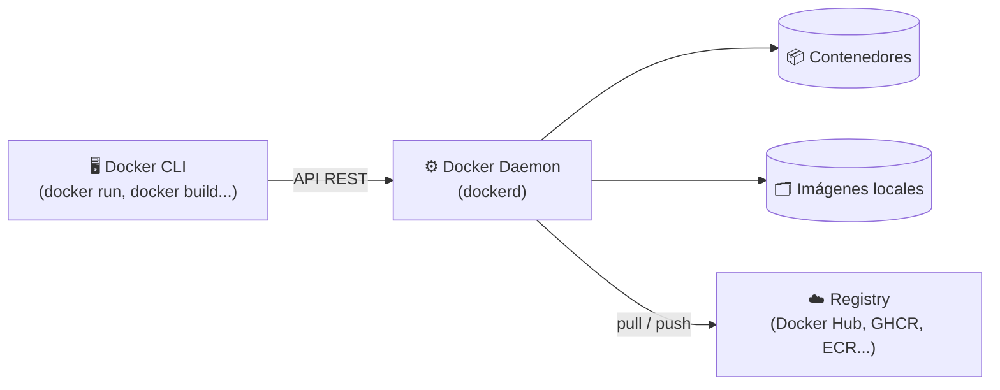
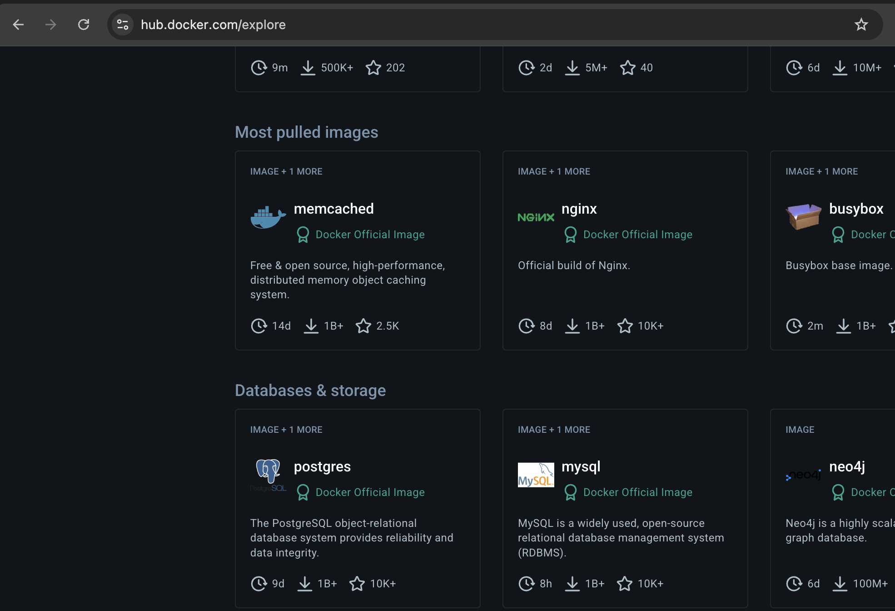
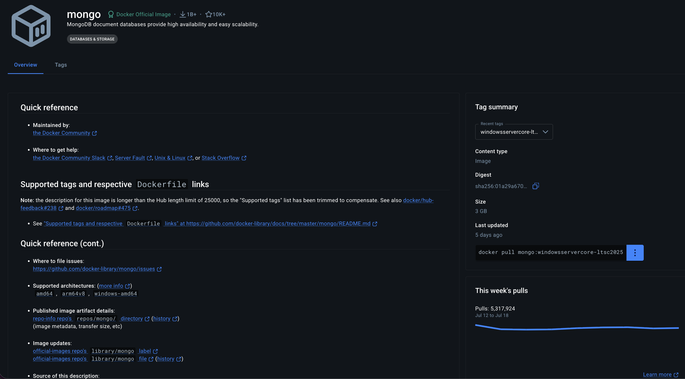
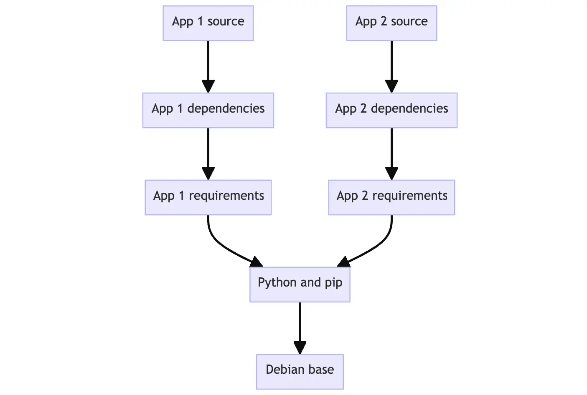
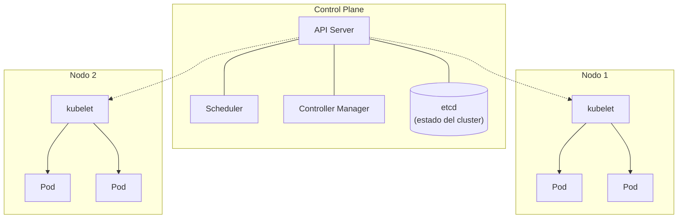

# Unidad 4 — Introducción a Docker

Material de apoyo para la **Unidad 4** de **Programación 2** — Ingeniería en Computación (UCSE).

---

## Índice

1. [¿Por qué contenedores?](#1-por-qué-contenedores)
2. [Contenedores vs máquinas virtuales](#2-contenedores-vs-máquinas-virtuales)
3. [¿Cómo funciona un contenedor por dentro?](#3-cómo-funciona-un-contenedor-por-dentro)
4. [¿Qué es Docker?](#4-qué-es-docker)
5. [Arquitectura de Docker](#5-arquitectura-de-docker)
6. [Instalación](#6-instalación)
7. [Imágenes y contenedores — comandos básicos](#7-imágenes-y-contenedores--comandos-básicos)
8. [Dockerfile — crear una imagen propia](#8-dockerfile--crear-una-imagen-propia)
9. [Volúmenes — persistencia de datos](#9-volúmenes--persistencia-de-datos)
10. [Redes en Docker](#10-redes-en-docker)
11. [Docker Compose — orquestación multi-contenedor](#11-docker-compose--orquestación-multi-contenedor)
12. [Introducción a Kubernetes](#12-introducción-a-kubernetes)
13. [Docker vs Kubernetes — cuándo usar cada uno](#13-docker-vs-kubernetes--cuándo-usar-cada-uno)
14. [Ejercicio integrador](#14-ejercicio-integrador)
15. [Alternativas y ecosistema](#15-alternativas-y-ecosistema)
16. [Recursos recomendados](#16-recursos-recomendados)

---

## 1. ¿Por qué contenedores?

### El problema: "en mi máquina funciona"

Una aplicación no es solo código: depende de una versión específica del lenguaje, de librerías, de variables de entorno, de un sistema operativo. Cuando un desarrollador dice "en mi máquina funciona" y el mismo código falla en el servidor, casi siempre es porque **el entorno es distinto**, no porque el código esté mal.

```
Desarrollador          Testing              Producción
Java 21, Linux    →    Java 17, Windows  →  Java 21, Linux (otra distro)
MySQL 8.0               MySQL 5.7             PostgreSQL
```

Antes de los contenedores, este problema se resolvía con documentación ("instalar tal versión de tal cosa"), scripts de instalación frágiles, o máquinas virtuales completas — soluciones lentas, pesadas o poco confiables.

### La idea de los contenedores

Un **contenedor** empaqueta la aplicación junto con **todo lo que necesita para correr**: el runtime, las librerías, las variables de entorno, los archivos de configuración. Ese paquete corre igual en la laptop del desarrollador, en el servidor de testing y en producción.

> **Contenedorización**: empaquetar una aplicación y sus dependencias en una unidad estándar y portable que corre de forma aislada, igual en cualquier entorno.

Esto no es exclusivo de Docker — Docker es la herramienta que **popularizó** este modelo (2013) y hoy es el estándar de facto, pero el concepto de contenedor es más general y anterior.

---

## 2. Contenedores vs máquinas virtuales

Ambos resuelven "aislar y empaquetar aplicaciones", pero de formas muy distintas.

```
      Máquinas Virtuales                    Contenedores

┌─────┐ ┌─────┐ ┌─────┐          ┌─────┐ ┌─────┐ ┌─────┐
│ App │ │ App │ │ App │          │ App │ │ App │ │ App │
├─────┤ ├─────┤ ├─────┤          ├─────┤ ├─────┤ ├─────┤
│ Bins│ │ Bins│ │ Bins│          │ Bins│ │ Bins│ │ Bins│
├─────┤ ├─────┤ ├─────┤          └─────┘ └─────┘ └─────┘
│ SO  │ │ SO  │ │ SO  │              │       │       │
│invit│ │invit│ │invit│              └───────┼───────┘
└─────┘ └─────┘ └─────┘               Docker Engine
    │       │       │                        │
    └───────┼───────┘                   SO Host (kernel)
      Hipervisor                             │
            │                            Hardware
       SO Host
            │
        Hardware
```

| | Máquinas Virtuales | Contenedores |
|---|---|---|
| **Virtualiza** | El hardware completo | El sistema operativo (procesos aislados) |
| **Incluye** | Kernel + SO invitado completo | Solo la app y sus dependencias |
| **Arranque** | Minutos | Milisegundos / segundos |
| **Tamaño** | GBs | MBs (a veces KBs) |
| **Aislamiento** | Total (kernel propio) | Proceso aislado (kernel compartido con el host) |
| **Densidad** | Pocas VMs por servidor físico | Cientos de contenedores por servidor |
| **Uso típico** | Aislar sistemas operativos distintos | Empaquetar y distribuir aplicaciones |

Un contenedor **no es una VM liviana**: es un proceso más del sistema operativo host, pero con visibilidad restringida — cree que está solo en su propio sistema de archivos, red y espacio de procesos.

---

## 3. ¿Cómo funciona un contenedor por dentro?

Un contenedor no es magia: es una combinación de features del kernel de Linux que existen desde hace años. Docker las combinó y les puso una interfaz simple.

| Tecnología | Qué aporta |
|------------|-----------|
| **Namespaces** | Aíslan lo que el proceso puede *ver*: su propio árbol de procesos (PID), su propia red, su propio sistema de archivos, su propio hostname |
| **cgroups** (control groups) | Limitan lo que el proceso puede *usar*: cuánta CPU, memoria, I/O de disco |
| **Union File System** (overlay2, etc.) | Permite apilar capas de archivos de solo lectura + una capa de escritura, para que las imágenes se compartan y reutilicen eficientemente |

En Windows y macOS, Docker no corre nativamente (esas tecnologías son de Linux): Docker Desktop levanta una máquina virtual liviana de Linux por detrás, de forma transparente para el usuario.

> **Idea clave**: un contenedor no es un objeto separado del sistema operativo — es un proceso Linux normal, con `namespaces` y `cgroups` aplicados para que se comporte como si estuviera aislado.

---

## 4. ¿Qué es Docker?

Docker es la plataforma que estandarizó la creación, distribución y ejecución de contenedores. Provee:

| Componente | Para qué sirve |
|------------|----------------|
| **Docker Engine** | El motor que crea y ejecuta contenedores en la máquina |
| **Dockerfile** | Receta de texto para construir una imagen |
| **Imagen** | Plantilla inmutable (código + dependencias + configuración) a partir de la cual se crean contenedores |
| **Contenedor** | Instancia en ejecución de una imagen |
| **Docker Hub / Registry** | Repositorio para publicar y descargar imágenes |
| **Docker Compose** | Herramienta para definir y correr aplicaciones de múltiples contenedores |

### Imagen vs contenedor

Es la misma relación que **clase vs objeto** en programación orientada a objetos:

| | Clase | Imagen |
|---|-------|--------|
| Definición | Plantilla estática | Plantilla estática (capas de archivos) |
| Instancia | Objeto en memoria | Contenedor en ejecución |
| Cantidad | Una clase → muchos objetos | Una imagen → muchos contenedores |

```bash
docker run mysql   # a partir de la imagen "mysql", crea y arranca un contenedor
```

---

## 5. Arquitectura de Docker

Docker usa un modelo **cliente-servidor**:




*Diagrama oficial de Docker. El **Client** envía comandos (`docker run`, `docker build`, `docker pull`); el **Docker Host** corre el daemon, que gestiona imágenes y contenedores localmente; el **Registry** almacena y distribuye imágenes. Fuente: [Docker Docs — Docker overview](https://docs.docker.com/get-started/docker-overview/)*

| Componente | Rol |
|------------|-----|
| **Client** (CLI) | El comando `docker` que usa el desarrollador para dar órdenes (`run`, `build`, `pull`...) |
| **Docker Host** | La máquina donde corre el **Docker daemon**; ahí viven las imágenes descargadas/construidas y los contenedores en ejecución |
| **Docker daemon** (`dockerd`) | Proceso en background dentro del host que recibe los comandos del Client vía API REST, y construye, corre y gestiona contenedores e imágenes |
| **Registry** | Servidor donde se almacenan y distribuyen imágenes (Docker Hub es el público y por defecto) |

Siguiendo el diagrama: `docker run` le pide al daemon una imagen; si no la tiene descargada localmente en el Host, el daemon la busca en el Registry (`docker pull` implícito), la guarda en el Host, y recién ahí crea el contenedor. `docker build` genera una imagen nueva directamente en el Host, sin tocar el Registry (a menos que después se haga `docker push`).

El Client y el daemon pueden estar en la misma máquina (caso típico en desarrollo) o en máquinas distintas (el Client se conecta de forma remota a un daemon en un servidor).

---

## 6. Instalación

### Docker Desktop (Windows / macOS)

Incluye el daemon, el CLI y una interfaz gráfica.

1. Descargar desde [docker.com/products/docker-desktop](https://www.docker.com/products/docker-desktop/)
2. En Windows: requiere **WSL 2** habilitado (`wsl --install` desde PowerShell como administrador)
3. Instalar y reiniciar si se solicita
4. Verificar la instalación:

```bash
docker --version
docker run hello-world
```

`hello-world` es una imagen mínima pensada para confirmar que Docker está corriendo correctamente.

### Linux

Docker Desktop existe para Linux, pero lo más común es instalar el Engine directamente vía el gestor de paquetes de la distro. Ver la [guía oficial por distribución](https://docs.docker.com/engine/install/).

---

## 7. Imágenes y contenedores — comandos básicos

### Docker Hub — el registry por defecto

[Docker Hub](https://hub.docker.com) es el **registry público** de Docker: un repositorio en la nube donde cualquiera puede publicar y descargar imágenes. Es el registry que Docker usa **por defecto** — cuando se corre `docker pull nginx` sin especificar otro registry, Docker busca la imagen `nginx` ahí.


*Sección "Explore" de Docker Hub, organizada por categorías (más descargadas, bases de datos, etc.). Cada tarjeta muestra el nombre de la imagen, si es una imagen oficial, su descripción y estadísticas de uso.*

Cada tarjeta de imagen muestra información clave para decidir si conviene usarla:

| Dato | Qué indica |
|------|-----------|
| **Docker Official Image** | Insignia verde — imagen mantenida y revisada por Docker en conjunto con el proyecto original (ej: `nginx`, `mysql`, `postgres`). Es la señal de mayor confianza |
| **Verified Publisher** | Publicada por una organización verificada por Docker (empresas como MongoDB, Bitnami, etc.), aunque no sea "oficial" |
| **Pulls** (↓) | Cantidad de veces que se descargó la imagen — una señal indirecta de qué tan usada y confiable es |
| **Stars** (★) | Cantidad de usuarios que marcaron la imagen como favorita |
| **Última actualización** | Hace cuánto se publicó la última versión — una imagen sin actualizar hace años puede tener vulnerabilidades sin parchear |

### La página de una imagen

Al entrar a una imagen específica (por ejemplo [`mongo`](https://hub.docker.com/_/mongo)) se ve el detalle completo:


*Página de la imagen oficial `mongo`: descripción, tags disponibles, tamaño, arquitecturas soportadas (`amd64`, `arm64v8`...) y el comando `docker pull` listo para copiar.*

Ahí se encuentra lo necesario para elegir bien qué descargar:

- **Tags**: las versiones disponibles de la imagen (ej: `mongo:7`, `mongo:6`, `mongo:latest`). Elegir una versión específica (no `latest`) es una buena práctica para reproducibilidad
- **Tamaño (Size)**: cuánto pesa esa imagen — relevante para tiempos de descarga y de arranque
- **Arquitecturas soportadas**: si la imagen corre en `amd64` (Intel/AMD), `arm64` (Apple Silicon, Raspberry Pi), etc.
- **Comando `docker pull`**: listo para copiar y pegar en la terminal
- **Dockerfile de la imagen**: muchas imágenes oficiales linkean el Dockerfile con el que se construyeron, útil para entender qué trae por dentro

> **Importante**: cualquiera puede publicar una imagen a Docker Hub, igual que cualquiera puede publicar un paquete a npm o PyPI. Antes de usar una imagen que no sea oficial ni de un publisher verificado, conviene revisar su Dockerfile o su código fuente — es software de terceros corriendo en tu máquina.

### Buscar y descargar imágenes

La búsqueda puede hacerse desde la web (como en las capturas de arriba) o directamente desde la terminal:

```bash
docker search nginx           # buscar imágenes en Docker Hub
docker pull nginx             # descargar la imagen "nginx" (tag "latest" por defecto)
docker pull nginx:1.27        # descargar una versión (tag) específica
docker images                 # listar imágenes descargadas localmente
```

### Correr contenedores

```bash
docker run nginx                          # corre en primer plano (bloquea la terminal)
docker run -d nginx                       # -d = detached, corre en segundo plano
docker run -d --name mi-nginx nginx       # --name = nombre elegido para el contenedor
docker run -d -p 8080:80 nginx            # -p = mapea puerto host:contenedor
docker run -it ubuntu bash                # -it = interactivo + terminal (para shells)
docker run -e VAR=valor nginx             # -e = variable de entorno
```

| Flag | Significado |
|------|-------------|
| `-d` | Detached — corre en background |
| `-p host:contenedor` | Publica un puerto del contenedor en el host |
| `-e VAR=valor` | Define una variable de entorno |
| `--name` | Le pone nombre al contenedor (si no, Docker asigna uno aleatorio) |
| `-it` | Modo interactivo con terminal (`-i` = interactive, `-t` = tty) |
| `-v` | Monta un volumen o carpeta del host (ver [sección 9](#9-volúmenes--persistencia-de-datos)) |
| `--rm` | Elimina el contenedor automáticamente al detenerse |

### Gestionar contenedores

```bash
docker ps                     # contenedores corriendo
docker ps -a                  # todos los contenedores (incluidos detenidos)
docker stop mi-nginx          # detener (envía SIGTERM)
docker start mi-nginx         # volver a iniciar un contenedor detenido
docker restart mi-nginx       # reiniciar
docker rm mi-nginx            # eliminar un contenedor detenido
docker rm -f mi-nginx         # forzar eliminación (aunque esté corriendo)
```

### Inspeccionar y depurar

```bash
docker logs mi-nginx          # ver la salida (stdout/stderr) del contenedor
docker logs -f mi-nginx       # seguir los logs en vivo (follow)
docker exec -it mi-nginx bash # abrir una shell DENTRO de un contenedor corriendo
docker inspect mi-nginx       # metadata completa en JSON (IP, mounts, config...)
docker stats                  # uso de CPU/memoria en vivo de los contenedores
```

### Limpieza

```bash
docker image rm nginx         # eliminar una imagen
docker system prune           # eliminar contenedores parados, redes y caches sin uso
docker system prune -a        # además, eliminar imágenes no usadas por ningún contenedor
```

---

## 8. Dockerfile — crear una imagen propia

Un **Dockerfile** es un archivo de texto con instrucciones para construir una imagen, capa por capa.

### Ejemplo: aplicación Spring Boot (Unidad 3)

```dockerfile
# Etapa 1: build — compila el proyecto con Gradle
FROM eclipse-temurin:21-jdk AS build
WORKDIR /app
COPY . .
RUN ./gradlew build -x test

# Etapa 2: runtime — imagen final, liviana, sin herramientas de build
FROM eclipse-temurin:21-jre
WORKDIR /app
COPY --from=build /app/build/libs/*.jar app.jar
EXPOSE 8080
ENTRYPOINT ["java", "-jar", "app.jar"]
```

### Instrucciones principales

| Instrucción | Qué hace |
|-------------|----------|
| `FROM` | Imagen base sobre la que se construye |
| `WORKDIR` | Directorio de trabajo dentro del contenedor (lo crea si no existe) |
| `COPY` | Copia archivos del host a la imagen |
| `RUN` | Ejecuta un comando durante el **build** (ej: instalar dependencias, compilar) |
| `ENV` | Define una variable de entorno |
| `EXPOSE` | Documenta qué puerto usa la app (no lo publica; eso lo hace `-p` en `docker run`) |
| `ENTRYPOINT` / `CMD` | Comando que se ejecuta cuando **arranca el contenedor** |

### Cada instrucción es una capa

Cada línea del Dockerfile (`FROM`, `COPY`, `RUN`...) genera una **capa** (layer) de solo lectura, que se apila sobre las anteriores mediante el union file system mencionado en la [sección 3](#3-cómo-funciona-un-contenedor-por-dentro). Docker cachea cada capa: si una línea no cambió desde el último build, la reutiliza en vez de rehacerla.


*Dos apps distintas ("App 1" y "App 2") comparten las mismas capas base (`Debian base`, `Python and pip`) y solo difieren en las capas superiores (dependencias y código fuente propio). Docker descarga y almacena esas capas compartidas una sola vez. Fuente: [Docker Docs — Understanding the image layers](https://docs.docker.com/get-started/docker-concepts/building-images/understanding-image-layers/)*

Esto explica por qué el **orden de las instrucciones importa**: si `COPY . .` (el código fuente, que cambia todo el tiempo) va antes que `RUN` de instalar dependencias, cada build invalida el cache de dependencias también. Poniendo primero lo que cambia menos (imagen base, dependencias) y al final lo que cambia más (código propio), la mayoría de los builds reutilizan casi todas las capas y son mucho más rápidos.

### `RUN` vs `ENTRYPOINT`/`CMD`

Es una confusión común: `RUN` pasa **una sola vez, al construir la imagen**. `ENTRYPOINT`/`CMD` pasa **cada vez que se arranca un contenedor** a partir de esa imagen.

### Multi-stage build

El ejemplo de arriba usa **dos etapas** (`AS build` y la final): la primera tiene el JDK completo y Gradle para compilar, pero esa etapa **no forma parte de la imagen final** — solo se copia el `.jar` ya compilado. Resultado: una imagen final mucho más liviana, sin herramientas de desarrollo innecesarias en producción.

### Construir y correr la imagen propia

```bash
docker build -t mi-app:1.0 .          # -t = tag (nombre:versión), "." = contexto de build
docker run -d -p 8080:8080 mi-app:1.0
```

### `.dockerignore`

Igual que `.gitignore`, evita copiar archivos innecesarios (o sensibles) al contexto de build:

```
.git
build/
.gradle/
*.md
```

### Buenas prácticas

- Usar imágenes base **oficiales** y con versión fija (`eclipse-temurin:21-jre`, no `latest`)
- Preferir variantes `slim` o `alpine` cuando sea posible (menor tamaño, menor superficie de ataque)
- Poner las instrucciones que cambian menos **primero** (ej: instalar dependencias antes de copiar el código) para aprovechar el cache de capas
- No incluir credenciales ni secretos en el Dockerfile ni en la imagen
- Un proceso principal por contenedor (no meter la app y la base de datos en el mismo contenedor)

---

## 9. Volúmenes — persistencia de datos

Los contenedores son **efímeros por diseño**: si se elimina el contenedor, se pierde todo lo escrito en su sistema de archivos. Para datos que deben sobrevivir (bases de datos, uploads, etc.) se usan **volúmenes**.

| Tipo | Descripción | Uso típico |
|------|-------------|-----------|
| **Named volume** | Gestionado por Docker, vive fuera del contenedor | Datos de una base de datos |
| **Bind mount** | Vincula una carpeta específica del host | Código fuente en desarrollo (hot reload) |
| **tmpfs** | Vive solo en memoria RAM, nunca se persiste a disco | Datos temporales sensibles |

```bash
# Named volume
docker volume create datos-mysql
docker run -d -v datos-mysql:/var/lib/mysql -e MYSQL_ROOT_PASSWORD=123 mysql

# Bind mount (carpeta local del host)
docker run -d -v $(pwd)/config:/etc/app/config mi-app

# Listar / inspeccionar / eliminar volúmenes
docker volume ls
docker volume inspect datos-mysql
docker volume rm datos-mysql
```

> Si se borra el contenedor pero **no** el volumen, los datos siguen intactos: un nuevo contenedor que monte el mismo volumen los recupera tal cual.

---

## 10. Redes en Docker

Por defecto, cada contenedor tiene su propia IP interna y está aislado de los demás. Docker provee varios modos de red:

| Driver | Comportamiento |
|--------|----------------|
| `bridge` (default) | Red privada interna; los contenedores se ven entre sí si están en la misma red bridge |
| `host` | El contenedor comparte la red del host directamente (sin aislamiento de red) |
| `none` | Sin red |

```bash
docker network create mi-red
docker run -d --network mi-red --name db mysql
docker run -d --network mi-red --name app mi-app
```

Dentro de `mi-red`, el contenedor `app` puede conectarse a la base de datos usando el **nombre del contenedor como hostname** (`db`), en vez de una IP — Docker resuelve el nombre automáticamente vía DNS interno.

```properties
# application.properties de la app, apuntando al contenedor "db" por nombre
spring.datasource.url=jdbc:mysql://db:3306/midb
```

---

## 11. Docker Compose — orquestación multi-contenedor

Una aplicación real casi nunca es un solo contenedor: hay una app, una base de datos, quizás un cache, un proxy. Levantar cada uno a mano con `docker run` es tedioso y difícil de reproducir. **Docker Compose** define toda la aplicación en un único archivo declarativo.

### `docker-compose.yml`

```yaml
services:
  app:
    build: .
    ports:
      - "8080:8080"
    environment:
      SPRING_DATASOURCE_URL: jdbc:mysql://db:3306/midb
      SPRING_DATASOURCE_USERNAME: root
      SPRING_DATASOURCE_PASSWORD: 123456
    depends_on:
      - db

  db:
    image: mysql:8.0
    environment:
      MYSQL_ROOT_PASSWORD: 123456
      MYSQL_DATABASE: midb
    ports:
      - "3306:3306"
    volumes:
      - datos-mysql:/var/lib/mysql

volumes:
  datos-mysql:
```

### Comandos

```bash
docker compose up              # crea y arranca todos los servicios (primer plano)
docker compose up -d           # en background
docker compose up --build      # reconstruye las imágenes antes de levantar
docker compose down            # detiene y elimina los contenedores (mantiene volúmenes)
docker compose down -v         # además elimina los volúmenes
docker compose ps              # estado de los servicios
docker compose logs -f app     # logs de un servicio en particular
```

### Qué resuelve Compose

| Sin Compose | Con Compose |
|-------------|-------------|
| Un `docker run` largo por cada contenedor | Un archivo YAML declarativo, versionable en git |
| Crear red y volúmenes a mano | Compose los crea automáticamente |
| Recordar el orden de arranque | `depends_on` documenta las dependencias |
| Reproducir el entorno en otra máquina requiere reescribir comandos | `docker compose up` reproduce el entorno completo |

> Docker Compose es ideal para **desarrollo local y aplicaciones de un solo servidor**. Cuando la aplicación necesita correr en **varios servidores**, escalar automáticamente, o recuperarse sola de fallos, se pasa a un orquestador como Kubernetes.

---

## 12. Introducción a Kubernetes

### El problema que resuelve

Compose orquesta contenedores en **una sola máquina**. Kubernetes (a menudo abreviado **K8s**) orquesta contenedores en un **cluster de muchas máquinas**, y agrega capacidades que Compose no tiene:

- **Auto-healing**: si un contenedor se cae, Kubernetes lo reinicia solo
- **Escalado automático**: agregar o quitar réplicas según la carga
- **Rolling updates**: desplegar una nueva versión sin downtime
- **Balanceo de carga** entre réplicas
- **Distribución en múltiples nodos** físicos o virtuales

Kubernetes nació en Google (basado en su sistema interno *Borg*) y se donó a la **Cloud Native Computing Foundation (CNCF)** en 2015. Hoy es el estándar de facto para orquestación de contenedores en producción.

### Arquitectura de un cluster



| Componente | Rol |
|------------|-----|
| **Control Plane** | "Cerebro" del cluster: decide qué corre dónde |
| **API Server** | Punto de entrada; todo (incluido `kubectl`) habla con el cluster a través de él |
| **etcd** | Base de datos clave-valor donde se guarda el estado deseado del cluster |
| **Scheduler** | Decide en qué nodo se ubica cada Pod nuevo |
| **Nodo (Node)** | Máquina (física o virtual) que corre las cargas de trabajo |
| **kubelet** | Agente en cada nodo que se asegura de que los contenedores asignados estén corriendo |

### Objetos principales

| Objeto | Qué es |
|--------|--------|
| **Pod** | La unidad mínima desplegable: uno o más contenedores que comparten red y almacenamiento. Casi siempre, un Pod = un contenedor de aplicación |
| **Deployment** | Declara cuántas réplicas de un Pod deben existir y gestiona actualizaciones (rolling updates) |
| **Service** | Expone un conjunto de Pods bajo una IP/nombre estable, y balancea carga entre ellos (los Pods son efímeros y cambian de IP) |
| **ConfigMap / Secret** | Configuración y datos sensibles desacoplados de la imagen |
| **Namespace** | Aísla lógicamente recursos dentro de un mismo cluster (ej: `dev`, `staging`, `prod`) |

### Declarativo, no imperativo

Igual que Compose, Kubernetes se maneja con archivos YAML que declaran el **estado deseado**; el cluster se encarga de alcanzarlo y mantenerlo.

```yaml
# deployment.yaml
apiVersion: apps/v1
kind: Deployment
metadata:
  name: mi-app
spec:
  replicas: 3
  selector:
    matchLabels:
      app: mi-app
  template:
    metadata:
      labels:
        app: mi-app
    spec:
      containers:
        - name: mi-app
          image: mi-app:1.0
          ports:
            - containerPort: 8080
---
# service.yaml
apiVersion: v1
kind: Service
metadata:
  name: mi-app-service
spec:
  selector:
    app: mi-app
  ports:
    - port: 80
      targetPort: 8080
  type: LoadBalancer
```

```bash
kubectl apply -f deployment.yaml -f service.yaml   # aplica los manifiestos al cluster
kubectl get pods                                    # ver los pods corriendo
kubectl get deployments
kubectl get services
kubectl scale deployment mi-app --replicas=5        # escalar manualmente
kubectl logs -f <nombre-del-pod>                     # ver logs de un pod
kubectl describe pod <nombre-del-pod>                 # detalle y eventos de un pod
```

### Probarlo localmente

No hace falta un cluster real ni una cuenta cloud para aprender Kubernetes. Existen herramientas para correr un cluster de un solo nodo en la propia máquina:

| Herramienta | Características |
|-------------|-----------------|
| **Docker Desktop** | Incluye Kubernetes como opción activable en su configuración |
| **[Minikube](https://minikube.sigs.k8s.io/)** | Cluster local de un nodo, la más usada para aprender |
| **[Kind](https://kind.sigs.k8s.io/)** (Kubernetes IN Docker) | Corre nodos de Kubernetes como contenedores Docker; muy liviano, ideal para CI |
| **[k3s](https://k3s.io/)** | Distribución liviana de Kubernetes (Rancher/SUSE), pensada para edge y recursos limitados |

---

## 13. Docker vs Kubernetes — cuándo usar cada uno

No compiten entre sí: Kubernetes **usa** un container runtime (frecuentemente compatible con imágenes Docker) por debajo. La pregunta real es **cuánta orquestación necesita el proyecto**.

```
Un contenedor          →  docker run
Varios contenedores,   →  Docker Compose
  un solo servidor
Muchos servicios,      →  Kubernetes (o un servicio managed:
  alta disponibilidad,    EKS / GKE / AKS)
  múltiples servidores,
  auto-scaling
```

| Escenario | Herramienta recomendada |
|-----------|--------------------------|
| Desarrollo local, aprender, proyectos chicos | Docker + `docker run` |
| App con DB y algún servicio más, un solo servidor | Docker Compose |
| Producción con alta disponibilidad, múltiples nodos, auto-scaling | Kubernetes |
| Equipo chico sin experiencia en infraestructura, quiere producción simple | Servicios managed más simples (ver [sección 15](#15-alternativas-y-ecosistema)) antes que Kubernetes autoadministrado |

> Kubernetes resuelve problemas reales, pero tiene una curva de aprendizaje y una complejidad operativa considerables. Adoptarlo "porque es lo que se usa en la industria" sin necesitar sus capacidades suele ser sobre-ingeniería.

---

## 14. Ejercicio integrador

Contenerizar y orquestar una aplicación de dos servicios: la API REST de la **Unidad 3** (Spring Boot) y su base de datos.

### Requerimientos

1. Escribir un **Dockerfile** multi-stage para la aplicación Spring Boot (build con Gradle, runtime con JRE)
2. Escribir un **`docker-compose.yml`** que levante:
   - El servicio `app` (build a partir del Dockerfile)
   - El servicio `db` (imagen oficial `mysql`, con volumen para persistencia)
3. La app debe conectarse a `db` **por nombre de servicio**, no por IP fija
4. Verificar que los datos persistan: `docker compose down` (sin `-v`) y volver a levantar con `docker compose up` — los datos cargados previamente deben seguir estando
5. **Extra (Kubernetes)**: escribir `deployment.yaml` y `service.yaml` para desplegar la misma app en un cluster local (Minikube o Kind), con `replicas: 2`

### Checklist de verificación

- [ ] `docker build` compila la imagen sin errores
- [ ] `docker compose up` levanta ambos servicios y la app responde en `http://localhost:8080`
- [ ] Los datos sobreviven a un `docker compose down` / `up`
- [ ] `docker compose down -v` limpia todo, incluidos los volúmenes
- [ ] (Extra) `kubectl get pods` muestra 2 réplicas corriendo

---

## 15. Alternativas y ecosistema

Docker es el más conocido, pero el ecosistema de contenedores tiene múltiples jugadores en cada capa.

### Container runtimes y herramientas CLI

| Herramienta | Empresa / Comunidad | Notas |
|-------------|---------------------|-------|
| **Docker Engine** | Docker, Inc. | El más popular, estándar de facto |
| **[Podman](https://podman.io/)** | Red Hat | Compatible con comandos Docker (`alias docker=podman`); no requiere un daemon corriendo como root — modelo *daemonless* |
| **[containerd](https://containerd.io/)** | CNCF (originado en Docker) | Runtime de bajo nivel; es el que usa Docker por debajo, y también Kubernetes directamente |
| **[CRI-O](https://cri-o.io/)** | CNCF / Red Hat | Runtime liviano diseñado específicamente para Kubernetes |

### Orquestadores

| Herramienta | Empresa / Comunidad | Notas |
|-------------|---------------------|-------|
| **Kubernetes** | CNCF (originado en Google) | El estándar de la industria |
| **Docker Swarm** | Docker, Inc. | Orquestador nativo de Docker, mucho más simple que K8s; en declive frente a Kubernetes |
| **[Nomad](https://www.nomadproject.io/)** | HashiCorp | Orquestador más simple y genérico (no solo contenedores); se integra con el resto del stack HashiCorp (Consul, Vault) |
| **[Rancher](https://www.rancher.com/)** | SUSE | Plataforma de gestión de múltiples clusters de Kubernetes |
| **[OpenShift](https://www.redhat.com/en/technologies/cloud-computing/openshift)** | Red Hat | Distribución empresarial de Kubernetes, con capas extra de seguridad, CI/CD y developer experience |

### Kubernetes administrado (cloud)

Correr y mantener un cluster de Kubernetes propio (parchear, escalar el control plane, alta disponibilidad) es trabajo operativo considerable. Los principales proveedores cloud ofrecen Kubernetes **como servicio administrado**, donde el control plane lo gestiona el proveedor:

| Servicio | Proveedor |
|----------|-----------|
| **EKS** (Elastic Kubernetes Service) | AWS |
| **GKE** (Google Kubernetes Engine) | Google Cloud |
| **AKS** (Azure Kubernetes Service) | Microsoft Azure |
| **DOKS** (DigitalOcean Kubernetes) | DigitalOcean |

### Registries de imágenes

| Registry | Proveedor | Notas |
|----------|-----------|-------|
| **Docker Hub** | Docker, Inc. | El registry público por defecto; imágenes oficiales de la mayoría de tecnologías |
| **GitHub Container Registry (GHCR)** | GitHub | Integrado con repos y Actions de GitHub |
| **Amazon ECR** | AWS | Registry privado integrado con el resto de servicios AWS |
| **Artifact Registry** | Google Cloud | Sucesor de Google Container Registry |

### Alternativas "serverless" para no pensar en orquestación

Para equipos que no quieren operar contenedores en absoluto, existen plataformas que reciben directamente una imagen (o el código) y gestionan todo el ciclo de vida:

| Plataforma | Proveedor |
|------------|-----------|
| **Cloud Run** | Google Cloud — recibe una imagen Docker, escala a cero automáticamente |
| **AWS Fargate** | AWS — corre contenedores sin gestionar servidores/nodos |
| **Azure Container Apps** | Microsoft Azure |
| **Railway / Render / Fly.io** | Plataformas independientes orientadas a simplicidad para equipos chicos |

---

## 16. Recursos recomendados

### Docker

| Recurso | Institución | Por qué leerlo |
|---------|------------|----------------|
| [Docker Docs — Get Started](https://docs.docker.com/get-started/) | **Docker, Inc.** | Guía oficial de introducción: conceptos, primer contenedor, primer Dockerfile |
| [Dockerfile reference](https://docs.docker.com/reference/dockerfile/) | **Docker, Inc.** | Referencia completa de todas las instrucciones de un Dockerfile |
| [Docker Compose file reference](https://docs.docker.com/reference/compose-file/) | **Docker, Inc.** | Referencia completa del formato `docker-compose.yml` |
| [Docker Hub](https://hub.docker.com/) | **Docker, Inc.** | Repositorio de imágenes oficiales (buscar antes de escribir un Dockerfile desde cero) |
| [Play with Docker](https://labs.play-with-docker.com/) | **Docker, Inc.** | Entorno online gratuito para practicar comandos sin instalar nada |

### Kubernetes

| Recurso | Institución | Por qué leerlo |
|---------|------------|----------------|
| [Kubernetes Documentation — Concepts](https://kubernetes.io/docs/concepts/) | **CNCF / Kubernetes** | Documentación oficial: Pods, Deployments, Services explicados desde cero |
| [Kubernetes Basics (tutorial interactivo)](https://kubernetes.io/docs/tutorials/kubernetes-basics/) | **CNCF / Kubernetes** | Tutorial oficial paso a paso, con cluster interactivo en el navegador |
| [Minikube — Get Started](https://minikube.sigs.k8s.io/docs/start/) | **Kubernetes SIG** | Cómo levantar un cluster local para practicar |
| [kubectl Cheat Sheet](https://kubernetes.io/docs/reference/kubectl/cheatsheet/) | **CNCF / Kubernetes** | Referencia rápida de los comandos más usados de `kubectl` |

### Conceptos y comparativas

| Recurso | Institución | Por qué leerlo |
|---------|------------|----------------|
| [What is a Container?](https://www.docker.com/resources/what-container/) | **Docker, Inc.** | Explicación conceptual de qué es un contenedor y en qué se diferencia de una VM |
| [CNCF Cloud Native Landscape](https://landscape.cncf.io/) | **CNCF** | Mapa interactivo de todo el ecosistema cloud native — útil para ver dónde encaja cada herramienta mencionada en esta unidad |
| [Kubernetes vs Docker vs Docker Swarm](https://www.redhat.com/en/topics/containers/kubernetes-vs-docker) | **Red Hat** | Comparativa clara sobre cuándo usar cada herramienta |
| [The Twelve-Factor App](https://12factor.net/) | **Heroku** | Metodología de referencia para diseñar apps que funcionen bien en contenedores (config por entorno, logs a stdout, procesos sin estado) |
