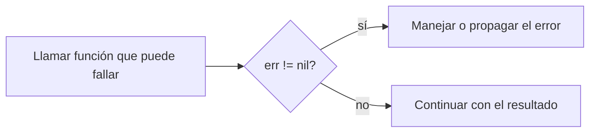
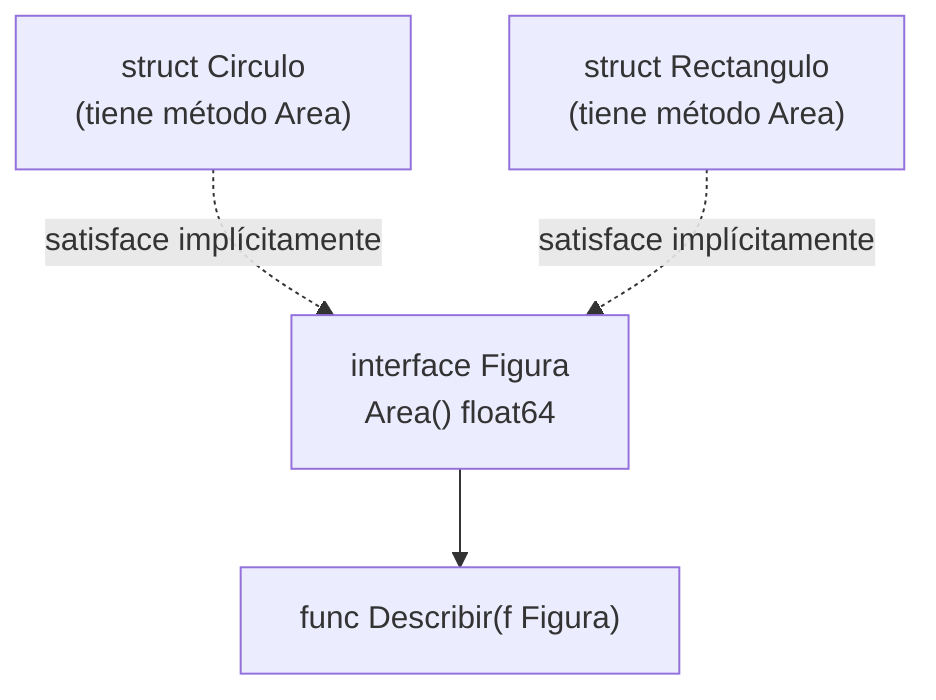
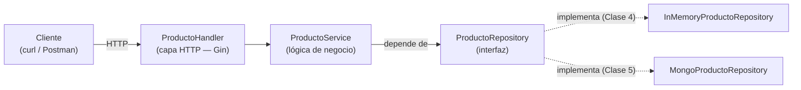
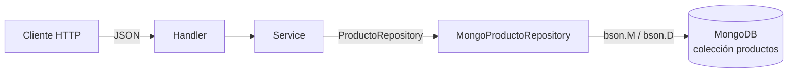
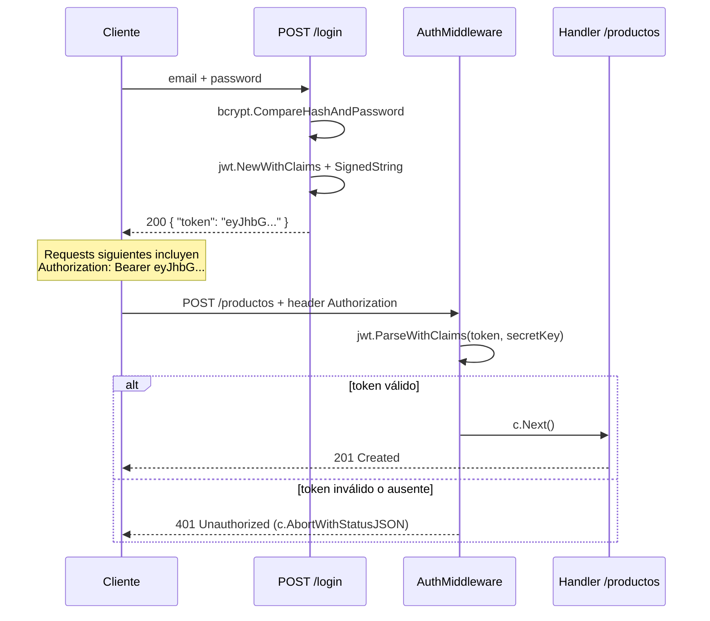

# Unidad 6 — Introducción a Go (Golang)

Material de apoyo para la **Unidad 6** de **Programación 2** — Ingeniería en Computación (UCSE).

---

## Índice

1. [Clase 1 — Introducción a Go](#clase-1--introducción-a-go)
2. [Clase 2 — Módulos, paquetes, structs, interfaces y punteros](#clase-2--módulos-paquetes-structs-interfaces-y-punteros)
3. [Clase 3 — net/http, Gin y REST en Go](#clase-3--nethttp-gin-y-rest-en-go)
4. [Clase 4 — Arquitectura en capas e inyección de dependencias](#clase-4--arquitectura-en-capas-e-inyección-de-dependencias)
5. [Clase 5 — MongoDB y el driver de Go](#clase-5--mongodb-y-el-driver-de-go)
6. [Clase 6 — JWT, bcrypt, middlewares y logging](#clase-6--jwt-bcrypt-middlewares-y-logging)
7. [Ejercicios prácticos](#ejercicios-prácticos)
8. [Recursos recomendados](#recursos-recomendados)

---

## Clase 1 — Introducción a Go

### ¿Qué es Go y por qué existe

Go (también llamado **Golang**, por su dominio `golang.org`) fue creado en **Google** por **Robert Griesemer, Rob Pike y Ken Thompson**. El diseño arrancó en 2007 y se liberó como código abierto el **10 de noviembre de 2009**.

Nació de una frustración concreta: con equipos gigantes, millones de líneas de C++ y builds que tardaban minutos u horas, el ciclo de desarrollo en Google se había vuelto lento y pesado. La [FAQ oficial de Go](https://go.dev/doc/faq) lo resume así:

> "Go was born out of frustration with existing languages and environments for the work we were doing at Google. [...] One had to choose either efficient compilation, efficient execution, or ease of programming; all three were not available in the same mainstream language."

| Problema que Google tenía | Cómo responde Go |
|---|---|
| Builds de C++ lentísimos en proyectos gigantes | Compilación a binario nativo diseñada para ser rápida |
| Herencia y dependencias complejas en C++/Java | Sin herencia de clases, sistema de tipos deliberadamente simple |
| Hardware multicore mal aprovechado por los lenguajes existentes | Concurrencia nativa: `goroutine` y `channel` (mención al final) |
| Falta de un estilo de código unificado entre equipos | `gofmt`: un único formato, no configurable |

> **Concepto clave**: Go no compite en expresividad con lenguajes como Python o Scala. Apunta a **simplicidad operativa a gran escala**: que miles de ingenieros lean y mantengan código ajeno sin sorpresas. Por eso tiene deliberadamente pocas construcciones — no hay excepciones, no hay herencia, y durante años no hubo genéricos.

Hoy Go está detrás de herramientas que ya conocés — **Docker**, **Kubernetes**, `terraform`, `Prometheus` — siempre en el terreno de backends, CLIs y servicios de red: el mismo terreno donde vamos a construir una REST API en esta unidad.

### Instalación y herramientas

Go se distribuye como un único binario (compilador + toolchain), sin dependencias externas. Se descarga desde [go.dev/dl](https://go.dev/dl/).

```bash
brew install go        # macOS
go version              # go version go1.26.x darwin/arm64
```

A diferencia de Java (JDK + Maven/Gradle separados), Go trae **todo integrado en un solo comando**:

| Comando | Para qué sirve |
|---|---|
| `go run archivo.go` | Compila y ejecuta en un solo paso, sin dejar binario en disco (equivalente a correr desde el IDE) |
| `go build` | Compila a un binario nativo ejecutable, autocontenido |
| `go fmt` | Formatea el código según el estilo oficial — no configurable |
| `go vet` | Analiza el código en busca de errores que compilan pero probablemente están mal (linter estático básico) |

```bash
go run main.go     # compila y corre — el más usado durante desarrollo
go build main.go   # genera un binario nativo (ej: "main")
./main              # no necesita JVM ni Go instalado para correr
go fmt ./...        # formatea todos los .go del proyecto
go vet ./...        # busca errores sospechosos en todo el proyecto
```

> **Concepto clave**: un binario de `go build` es **autocontenido** — no depende de una JVM ni de librerías instaladas aparte. Es una diferencia fuerte respecto a un `.jar`, que necesita un JRE en el servidor destino, y una de las razones por las que Go da imágenes Docker finales muy livianas.

### Estructura mínima de un programa

Todo archivo `.go` declara a qué **paquete** pertenece. `main` es especial: marca un ejecutable, y Go busca dentro una función `main()` sin parámetros ni retorno.

```go
package main

import "fmt"

func main() {
    fmt.Println("Hola, Go!")
}
```

| Elemento | Rol |
|---|---|
| `package main` | Declara el paquete; `main` produce un ejecutable (no una librería) |
| `import "fmt"` | Importa el paquete estándar `fmt` (formatted I/O) |
| `func main()` | Punto de entrada — Go la ejecuta automáticamente |

A diferencia de Java, **no hace falta envolver todo en una clase**: las funciones existen sueltas a nivel de archivo. Tampoco hace falta punto y coma (el compilador los infiere) ni paréntesis en las condiciones de `if`/`for`.

> Organizar un programa en múltiples archivos y paquetes propios (`go mod`, exportación por mayúscula/minúscula) es tema de la **Clase 2**. Acá todo vive en un solo `package main`.

### Variables y tipos primitivos

Go es **tipado estáticamente**, como Java, pero casi nunca hace falta escribir el tipo — el compilador lo infiere.

```go
var edad int = 30          // declaración explícita
var precio = 19.99         // tipo inferido
ciudad := "Santiago"        // forma corta ":=" — SOLO dentro de funciones
```

| Forma | Dónde se usa |
|---|---|
| `var nombre tipo = valor` | En cualquier lado, incluso fuera de funciones |
| `var nombre = valor` | En cualquier lado, tipo inferido |
| `nombre := valor` | Solo dentro de funciones (la forma más usada) |

| Tipo | Descripción | Equivalente en Java |
|---|---|---|
| `int`, `int8/16/32/64` | Enteros con signo | `int`, `long` |
| `uint`, `uint8` (= `byte`) | Enteros sin signo | sin equivalente directo |
| `float32`, `float64` | Punto flotante | `float`, `double` |
| `string` | Texto inmutable, UTF-8 | `String` |
| `bool` | `true` / `false` | `boolean` |
| `rune` | Un carácter Unicode (alias de `int32`) | `char` (pero `rune` es un code point completo) |

> **Concepto clave — valores cero**: una variable declarada sin valor inicial **no queda indefinida**: recibe el "valor cero" de su tipo (`int`→`0`, `string`→`""`, `bool`→`false`). Elimina toda una categoría de bugs de "variable no inicializada".

```go
const Pi = 3.14159   // const: debe resolverse en tiempo de compilación
```

### Control de flujo

**`if`** — sin paréntesis, llaves obligatorias, y admite una sentencia de inicialización con scope propio:

```go
if edad >= 18 {
    fmt.Println("Mayor de edad")
} else {
    fmt.Println("Menor")
}

if valor, err := calcular(); err == nil {
    fmt.Println("Resultado:", valor)
} else {
    fmt.Println("Error:", err)
}
// "valor" y "err" no existen fuera de este bloque
```

**`for`** — Go **no tiene `while`, `do-while` ni `foreach`**. Todo se escribe con `for`:

```go
for i := 0; i < 5; i++ { fmt.Println(i) }   // 1. clásico

n := 0
for n < 3 { n++ }                             // 2. como "while"

for { break }                                 // 3. infinito, se corta con break

numeros := []int{10, 20, 30}
for indice, valor := range numeros {          // 4. for-range
    fmt.Println(indice, valor)
}
```

**`switch`** — cada `case` **termina implícitamente**, no hace falta `break` (si se necesita continuar al siguiente case, existe `fallthrough` explícito):

```go
switch dia {
case "sabado", "domingo":
    fmt.Println("Fin de semana")
default:
    fmt.Println("Día de semana")
}
```

### Funciones y múltiples valores de retorno

```go
func restar(a, b int) int {   // parámetros consecutivos del mismo tipo: se omite el repetido
    return a - b
}
```

Una función puede **retornar más de un valor**, sin crear una clase o tupla envolvente:

```go
func dividir(a, b int) (int, int) {
    return a / b, a % b
}

c, r := dividir(17, 5)   // c=3, r=2
```

Este mecanismo es la base del manejo de errores de Go: una función que puede fallar retorna `(resultado, error)`. También existen los **retornos con nombre**, donde `return` sin argumentos devuelve las variables ya declaradas en la firma:

```go
func dividir(a, b int) (cociente int, resto int) {
    cociente, resto = a/b, a%b
    return // devuelve cociente y resto automáticamente
}
```

### Slices y maps

Go tiene arrays de tamaño fijo (`[5]int`), pero en la práctica se usa casi siempre el **slice**: una vista redimensionable sobre un array subyacente, equivalente conceptual a un `ArrayList` de Java.

```go
frutas := []string{"manzana", "banana", "pera"}   // slice literal
numeros := make([]int, 0)                          // slice vacío

numeros = append(numeros, 1)        // append devuelve un NUEVO slice
numeros = append(numeros, 2, 3, 4)

fmt.Println(frutas[1:3])             // slicing: ["banana" "pera"]
for i, fruta := range frutas {       // recorrer con range
    fmt.Println(i, fruta)
}
```

> **Concepto clave**: `append` puede devolver un slice distinto al que recibió — si no hay espacio libre, Go reserva un array más grande y copia los datos. Por eso siempre hay que reasignar: `numeros = append(numeros, x)`, nunca solo `append(numeros, x)`.

Un `map` es una tabla clave-valor, equivalente a un `HashMap` de Java:

```go
precios := map[string]float64{"manzana": 500.0, "banana": 350.0}

stock := make(map[string]int)
stock["pera"] = 10

valor, existe := precios["kiwi"]   // "comma ok idiom"
if !existe {
    fmt.Println("no hay precio para kiwi")
}

delete(precios, "banana")
```

> **Cuidado**: leer una clave inexistente **no lanza error** — devuelve el valor cero del tipo junto con `false` en el comma-ok idiom. Si `0` es un valor válido en tu dominio, hay que usar la forma de dos valores para distinguir "no existe" de "existe y vale 0".

### Manejo de errores como valores

La diferencia más marcada frente a Java: **Go no tiene `try`/`catch`/`throw`**. Los errores son **valores comunes** que las funciones retornan, del tipo `error` — una interfaz con un único método:

```go
type error interface {
    Error() string
}
```

```go
func dividir(a, b float64) (float64, error) {
    if b == 0 {
        return 0, errors.New("no se puede dividir por cero")
    }
    return a / b, nil
}

resultado, err := dividir(10, 0)
if err != nil {
    fmt.Println("Error:", err)
    return
}
fmt.Println("Resultado:", resultado)
```

El patrón `if err != nil { ... }` aparece después de casi cualquier llamada que pueda fallar — es la construcción más repetida en código Go real.



Para agregar contexto sin perder el error original se usa `fmt.Errorf` con `%w`:

```go
if err != nil {
    return fmt.Errorf("no se pudo calcular el promedio: %w", err)
}
```

| Con excepciones (Java) | Con errores como valores (Go) |
|---|---|
| El control puede "saltar" niveles de stack de forma invisible en la firma | La función declara el posible fallo **en su firma**: `(resultado, error)` |
| Fácil olvidarse un `catch` y que el error se propague sin control | El error queda **a la vista**, en línea, pegado a cada llamada |

> **Concepto clave**: en Go, un error es parte normal del resultado de una operación (leer un archivo, dividir, una request de red pueden fallar), no un evento "excepcional". Tratarlo como un valor obliga a decidir qué hacer con él en cada punto, en vez de dejarlo viajar silenciosamente stack arriba.

Go sí tiene `panic`/`recover`, pero reservados para errores **realmente irrecuperables** (bug del programa, índice fuera de rango) — no para el control de flujo normal, que siempre es `error` + `if err != nil`.

### Una mención a la concurrencia

Go tiene concurrencia **incorporada en el lenguaje**: las **goroutines** (`go miFuncion()`) son funciones que corren de forma concurrente con un costo de memoria mucho menor que un hilo del sistema operativo, y los **channels** (`chan`) permiten que esas goroutines se comuniquen y sincronicen de forma segura. Es una de las razones por las que Go es tan popular para infraestructura de alta concurrencia. Este curso **no cubre goroutines ni channels** — quedan para profundizar por cuenta propia; lo que necesitamos de acá en adelante (levantar un servidor HTTP, manejar requests) funciona sin escribir concurrencia explícita, porque el framework la maneja por debajo.

---

## Clase 2 — Módulos, paquetes, structs, interfaces y punteros

En la Clase 1 vimos la sintaxis básica de Go: variables, tipos, control de flujo, funciones, slices, maps y errores como valores. Esta clase completa el lenguaje "puro" antes de pasar a la web (Clase 3): cómo se organiza un proyecto Go en módulos y paquetes, cómo se modelan datos con `struct`, cómo se comparten comportamientos con interfaces, y cómo se testea todo con el paquete estándar `testing`. Es la base de POO-sin-clases que vamos a usar en toda la arquitectura en capas de las próximas clases.

### `go mod init` — creando un módulo

En Java, un proyecto se identifica por su `group`/`artifact` en Gradle o Maven. En Go, la unidad equivalente es el **módulo**: un conjunto de paquetes versionado en conjunto, declarado por un archivo `go.mod` en la raíz del proyecto.

```bash
mkdir mi-api && cd mi-api
go mod init github.com/mi-usuario/mi-api
```

```
go: creating new go.mod: module github.com/mi-usuario/mi-api
```

El argumento de `go mod init` es el **module path**: un identificador único que además funciona como prefijo de importación para todos los paquetes del proyecto. Si el módulo va a publicarse, por convención se usa la URL del repositorio (`github.com/usuario/repo`) — así `go get` sabe de dónde descargarlo. Para proyectos de práctica que nunca se publican, alcanza con un nombre simple (`mi-api`).

> **Concepto clave**: no hace falta un IDE ni un wizard (como Spring Initializr) para crear un proyecto Go — `go mod init` es el equivalente mínimo, y genera un solo archivo de texto.

### `go.mod` y `go.sum`

`go mod init` crea `go.mod` con el módulo y la versión de Go usada:

```go
module github.com/mi-usuario/mi-api

go 1.22
```

A medida que se agregan dependencias externas con `go get`, `go.mod` las lista en una sección `require`:

```bash
go get github.com/gin-gonic/gin@latest     # última versión estable
go get github.com/gin-gonic/gin@v1.9.1     # versión específica
go get github.com/gin-gonic/gin@none       # eliminar la dependencia
go mod tidy                                 # agrega lo que falta, saca lo que no se usa
```

```go
module github.com/mi-usuario/mi-api

go 1.22

require github.com/gin-gonic/gin v1.9.1
```

Junto con `go.mod`, Go genera automáticamente `go.sum`: un archivo con los **checksums criptográficos** de cada dependencia (directa e indirecta). No se edita a mano, pero **sí se commitea** al repositorio — garantiza que cualquiera que clone el proyecto descargue exactamente el mismo código, sin alteraciones.

| Archivo | Rol | Equivalente conceptual (Gradle) |
|---------|-----|----------------------------------|
| `go.mod` | Declara el módulo, la versión de Go y las dependencias directas con su versión | `build.gradle` (bloque `dependencies { }`) |
| `go.sum` | Checksums de cada dependencia, directa y transitiva, para builds verificables y reproducibles | lockfile de verificación de dependencias |

`go mod tidy` es el comando que se corre casi siempre después de agregar o sacar un `import`: sincroniza `go.mod`/`go.sum` con lo que el código realmente usa.

### Paquetes: organización por carpeta

En Go, **cada carpeta es un paquete**. Todos los archivos `.go` dentro de una misma carpeta deben declarar el mismo `package` en su primera línea, y ese paquete se importa usando la ruta desde la raíz del módulo.

```
mi-api/
├── go.mod                  → module github.com/mi-usuario/mi-api
├── main.go                 → package main
└── figuras/
    ├── circulo.go           → package figuras
    └── figuras_test.go      → package figuras
```

```go
// figuras/circulo.go
package figuras

// main.go
package main

import "github.com/mi-usuario/mi-api/figuras"
```

> **Diferencia con Java**: en Java el paquete es una ruta completa y explícita (`com.ejemplo.app.figuras`) que debe coincidir exactamente con la ruta de carpetas y con el `import`. En Go el `package` declarado en el archivo es solo el **último componente** (un nombre corto, en minúscula, sin guiones bajos: `figuras`, no `com.ejemplo.figuras`); la ruta completa de importación la arma el module path + la carpeta. No existe una convención de "un archivo = una clase pública" — un paquete agrupa libremente varios archivos relacionados.

`package main` es especial: marca el paquete que compila a un ejecutable, y debe tener una función `func main()`. Cualquier otro nombre de paquete produce una librería que otros paquetes importan.

### Exportación de identificadores: mayúscula vs. minúscula

Java resuelve la visibilidad con modificadores explícitos (`public`, `private`, `protected`). Go no tiene esas palabras clave — usa una convención puramente sintáctica basada en la primera letra del identificador.

| Regla | Efecto |
|-------|--------|
| Empieza con **mayúscula** (`Radio`, `Area`, `Circulo`) | **Exportado**: visible desde otros paquetes |
| Empieza con **minúscula** (`radio`, `calcularArea`) | **Privado al paquete**: invisible fuera de él, aunque otro archivo del mismo paquete sí lo ve |

```go
package figuras

type Circulo struct {
    Radio float64 // exportado — otros paquetes pueden leerlo/escribirlo
    color string   // privado — solo visible dentro del paquete "figuras"
}

func NuevoCirculo(radio float64) Circulo { // exportado — constructor de facto
    return Circulo{Radio: radio, color: "negro"}
}

func validarRadio(r float64) bool { // privado — detalle interno del paquete
    return r > 0
}
```

> **Concepto clave**: la visibilidad aplica a nivel de **paquete**, no de tipo. No hay `protected` ni jerarquías de acceso — o el identificador es visible en todo el módulo (y fuera de él, si el módulo se importa), o solo dentro de su propio paquete.

### Structs: declaración e instanciación

Un `struct` agrupa campos con nombre, igual que los atributos de una clase Java — pero **no es una clase**: no tiene constructores, no soporta herencia, y por defecto es un tipo de valor (se copia, no se referencia, al asignarlo o pasarlo a una función).

```go
type Circulo struct {
    Radio float64
}

type Rectangulo struct {
    Ancho float64
    Alto  float64
}
```

Formas de instanciar:

```go
var c1 Circulo                          // zero value: Radio = 0.0
c2 := Circulo{Radio: 5}                 // struct literal con nombre de campo (recomendado)
c3 := Circulo{5}                        // struct literal posicional (frágil si cambian los campos)
c4 := &Circulo{Radio: 5}                // c4 es *Circulo (puntero al struct), no Circulo
```

> **Zero value**: a diferencia de Java, donde una referencia no inicializada es `null`, en Go un `struct` sin inicializar no es `nil` — existe con todos sus campos en su valor por defecto (`0`, `""`, `false`, `nil` para punteros/slices/maps). Un `struct` "vacío" es perfectamente utilizable.

No hay `new Circulo(5)`: la convención en Go es escribir una función constructora explícita cuando hace falta validar o setear valores por defecto, típicamente llamada `NewXxx`:

```go
func NuevoCirculo(radio float64) (*Circulo, error) {
    if radio <= 0 {
        return nil, fmt.Errorf("radio inválido: %v", radio)
    }
    return &Circulo{Radio: radio}, nil
}
```

### Métodos con receiver: value vs. pointer

Un método en Go es una función con un **receiver** extra antes del nombre — asocia la función a un tipo, similar a un método de instancia en Java, pero declarado *fuera* del `struct`.

```go
func (c Circulo) Area() float64 {
    return math.Pi * c.Radio * c.Radio
}
```

`(c Circulo)` es el receiver. Hay dos formas de declararlo:

| Receiver | Sintaxis | El método recibe | Puede modificar el original |
|----------|----------|-------------------|-------------------------------|
| **Value receiver** | `func (c Circulo) Area() float64` | una **copia** del struct | No |
| **Pointer receiver** | `func (c *Circulo) Escalar(factor float64)` | la **dirección** del struct original | Sí |

```go
// Value receiver: solo lee, no necesita modificar el original
func (c Circulo) Area() float64 {
    return math.Pi * c.Radio * c.Radio
}

// Pointer receiver: modifica el campo del struct original
func (c *Circulo) Escalar(factor float64) {
    c.Radio = c.Radio * factor
}
```

```go
c := Circulo{Radio: 5}
c.Escalar(2)              // Go reescribe esto como (&c).Escalar(2) automáticamente
fmt.Println(c.Radio)      // 10 — el original cambió
```

> **Regla práctica**: usar **pointer receiver** cuando el método necesita modificar el struct, o cuando el struct es grande (evita copiarlo en cada llamada). Usar **value receiver** para structs chicos e inmutables, de solo lectura. Si algún método de un tipo usa pointer receiver, por consistencia se recomienda que **todos** los métodos de ese tipo lo usen.

### Punteros: `&` y `*`

Java no tiene punteros explícitos: toda variable de un tipo objeto (no primitivo) es, por debajo, una referencia — el programador nunca escribe `&` ni `*`. Go sí expone la indirección explícitamente, con dos operadores:

| Operador | Significado |
|----------|-------------|
| `&x` | Dirección de memoria de `x` — produce un `*T` a partir de un `T` |
| `*p` | Dereferencia — accede al valor apuntado por `p` |
| `var p *T` | Declara un puntero a `T`, cuyo zero value es `nil` |

```
var x int = 5           p := &x

Memoria:
┌────────────┐          ┌────────────────┐
│ x: 5       │◄─────────│ p: 0xc0000140a0│
└────────────┘          └────────────────┘
  0xc0000140a0

*p            → 5          (dereferencia: lee el valor apuntado)
*p = 10       → x pasa a valer 10, porque p apunta a x
```

```go
func duplicar(n int) {
    n = n * 2 // modifica la copia local, el original no cambia
}

func duplicarPtr(n *int) {
    *n = *n * 2 // modifica el valor en la dirección apuntada
}

x := 5
duplicar(x)
fmt.Println(x)     // 5 — sin cambios

duplicarPtr(&x)
fmt.Println(x)     // 10 — cambió, porque se pasó la dirección
```

> **Diferencia con Java**: en Java, pasar un objeto a un método siempre pasa la referencia (podés mutar sus campos), pero nunca podés reasignar la variable del llamador ni elegir "pasar por valor" un objeto. En Go, **todo se pasa por valor por defecto** — incluidos los structs, que se copian enteros — y los punteros son la herramienta explícita para compartir y mutar el dato original en lugar de una copia. Esto es exactamente lo que decide la elección value receiver vs. pointer receiver de la sección anterior.

### Interfaces: satisfacción implícita

Una interfaz en Go declara un conjunto de métodos, igual que en Java. La diferencia central es **cómo se satisface**:

```go
type Figura interface {
    Area() float64
}
```

```go
func Describir(f Figura) string {
    return fmt.Sprintf("Área: %.2f", f.Area())
}

func (c Circulo) Area() float64      { return math.Pi * c.Radio * c.Radio }
func (r Rectangulo) Area() float64   { return r.Ancho * r.Alto }

Describir(Circulo{Radio: 5})          // funciona
Describir(Rectangulo{Ancho: 3, Alto: 4}) // también funciona
```

`Circulo` y `Rectangulo` **nunca declaran** que implementan `Figura`. No hay `implements Figura` en ningún lado, ni una anotación, ni una palabra clave: el compilador verifica en el punto de uso (`Describir(Circulo{...})`) que el tipo tenga los métodos necesarios. Esto se conoce como **satisfacción estructural** (o *duck typing* verificado en tiempo de compilación): "si camina como pato y grazna como pato, es un pato".



| | Java | Go |
|---|------|----|
| Declaración de intención | `class Circulo implements Figura` — explícita | Ninguna — se infiere de los métodos que el tipo tiene |
| Acoplamiento | El tipo debe conocer la interfaz al definirse | El tipo no necesita saber que existe la interfaz |
| Verificación | En la declaración de la clase | En el punto donde se usa el valor como esa interfaz (compile-time) |

> **Por qué importa para lo que sigue**: en la Clase 4 vamos a definir un `Repository` como interfaz y tener dos implementaciones (in-memory y luego MongoDB) sin que ninguna de las dos "sepa" que implementa nada — simplemente van a tener los métodos correctos. Eso es lo que permite cambiar de implementación sin tocar el código que depende de la interfaz.

Para forzar en compile-time que un tipo cumple una interfaz (útil como documentación o chequeo temprano), se usa una asignación en blanco:

```go
var _ Figura = Circulo{} // si Circulo deja de tener Area(), esto no compila
```

### Testing básico con `testing` y `go test`

Go trae testing incorporado en la librería estándar, sin frameworks externos ni anotaciones. La convención:

| Convención | Regla |
|------------|-------|
| Archivo | Termina en `_test.go`, vive en la misma carpeta que el código que testea |
| Paquete | El mismo paquete del código (`package figuras`), o `figuras_test` si se quiere testear solo lo exportado |
| Función | `func TestXxx(t *testing.T)` — el nombre debe empezar con `Test` seguido de mayúscula |
| Ejecutar | `go test ./...` corre todos los tests del módulo |

```go
// figuras/circulo_test.go
package figuras

import "testing"

func TestCirculoArea(t *testing.T) {
    c := Circulo{Radio: 2}
    got := c.Area()
    want := 12.566370614359172

    if got != want {
        t.Errorf("Area() = %v; quería %v", got, want)
    }
}

func TestEscalar(t *testing.T) {
    c := Circulo{Radio: 5}
    c.Escalar(2)

    if c.Radio != 10 {
        t.Errorf("Radio después de Escalar(2) = %v; quería 10", c.Radio)
    }
}
```

No hay un `assertEquals` incorporado: los tests son código Go común — se compara el valor obtenido contra el esperado con un `if`, y se reporta la falla con `t.Errorf` (registra el error y sigue corriendo el resto del test) o `t.Fatalf` (registra y corta el test ahí mismo, útil cuando un paso previo hace inútil seguir).

```bash
go test ./...        # corre todos los tests del módulo
go test ./figuras     # solo los de un paquete
go test -v ./...      # verbose: lista cada test y su resultado
go test -run TestArea  # corre solo los tests cuyo nombre matchea el patrón
```

```
--- FAIL: TestCirculoArea (0.00s)
    circulo_test.go:10: Area() = 12.56; quería 12.566370614359172
FAIL
```

> **Concepto clave**: no hace falta agregar ninguna dependencia para testear — `testing` es parte de la librería estándar, y `go test` la detecta automáticamente sin configuración.

---

## Clase 3 — net/http, Gin y REST en Go

### Repaso breve: REST, HTTP y JSON

Esto ya se vio a fondo en la **Unidad 3** (Spring Boot): una API REST expone recursos mediante URLs, usa verbos HTTP para indicar la acción, responde con códigos de estado y transporta datos en JSON. Las reglas no cambian por el lenguaje — lo único que cambia es **cómo se implementan** en Go.

| Verbo | Acción | Código típico de éxito |
|-------|--------|------------------------|
| GET | Leer / consultar | 200 OK |
| POST | Crear | 201 Created |
| PUT | Actualizar (reemplazar) | 200 OK |
| DELETE | Eliminar | 204 No Content |

> **Concepto clave**: en Go no hay un framework "oficial" incluido para REST como Spring Boot en Java. La librería estándar (`net/http`) da lo mínimo indispensable; frameworks como **Gin** se construyen encima para agregar productividad. Entender primero `net/http` ayuda a ver exactamente qué problema resuelve Gin.

### Un handler mínimo con `net/http`

El paquete `net/http` de la librería estándar de Go ya alcanza para levantar un servidor HTTP funcional, sin instalar nada.

```go
package main

import (
	"encoding/json"
	"net/http"
)

type Producto struct {
	ID     string  `json:"id"`
	Nombre string  `json:"nombre"`
	Precio float64 `json:"precio"`
}

func productosHandler(w http.ResponseWriter, r *http.Request) {
	productos := []Producto{
		{ID: "1", Nombre: "Laptop", Precio: 1500.0},
		{ID: "2", Nombre: "Mouse", Precio: 25.0},
	}

	w.Header().Set("Content-Type", "application/json")
	json.NewEncoder(w).Encode(productos)
}

func main() {
	http.HandleFunc("/productos", productosHandler)
	http.ListenAndServe(":8080", nil)
}
```

| Pieza | Qué hace |
|-------|----------|
| `http.HandleFunc(ruta, handler)` | Registra una función para atender una ruta |
| `func(w http.ResponseWriter, r *http.Request)` | Firma obligatoria de todo handler: `w` para escribir la respuesta, `r` con los datos del request |
| `json.NewEncoder(w).Encode(...)` | Serializa un valor Go a JSON y lo escribe directo en la respuesta |
| `http.ListenAndServe(":8080", nil)` | Arranca el servidor y bloquea el proceso escuchando en el puerto 8080 |

Esto funciona, pero rápidamente se vuelve tedioso a mano:

- No hay forma nativa de capturar `/productos/{id}` como parámetro — hay que parsear el path a mano (`strings.Split`, expresiones regulares).
- No hay distinción de métodos: `productosHandler` responde igual a un GET que a un POST a menos que se chequee `r.Method` manualmente.
- Leer y validar el body JSON (`json.NewDecoder(r.Body).Decode(...)`) y devolver errores 400 bien formados requiere repetir el mismo boilerplate en cada handler.
- Setear el código de estado exige llamar `w.WriteHeader(...)` explícitamente antes de escribir el body.

> **Concepto clave**: `net/http` no está mal — es intencionalmente minimalista. El trabajo repetitivo de rutear por método, extraer parámetros, parsear JSON y devolver errores consistentes es exactamente lo que un framework como Gin automatiza.

### Por qué Gin

[Gin](https://github.com/gin-gonic/gin) es el framework HTTP más usado en el ecosistema Go: liviano, rápido (basado en un router tipo *radix tree*) y con una API mucho más expresiva que `net/http` puro.

**Instalación** (requiere tener un módulo Go inicializado con `go mod init`, visto en la Clase 2):

```bash
go get -u github.com/gin-gonic/gin
```

**El mismo endpoint, con Gin:**

```go
package main

import (
	"net/http"

	"github.com/gin-gonic/gin"
)

func main() {
	router := gin.Default()

	router.GET("/productos", func(c *gin.Context) {
		productos := []Producto{
			{ID: "1", Nombre: "Laptop", Precio: 1500.0},
			{ID: "2", Nombre: "Mouse", Precio: 25.0},
		}
		c.JSON(http.StatusOK, productos)
	})

	router.Run(":8080") // equivalente a http.ListenAndServe, con el router de Gin
}
```

| | `net/http` puro | Gin |
|---|---|---|
| Rutear por método + path | Manual (`if r.Method == "GET"`, parseo de path) | `router.GET(path, handler)`, `router.POST(...)`, etc. |
| Parámetros de ruta | Manual | `c.Param("id")` |
| Serializar JSON | `json.NewEncoder(w).Encode(...)` + `Content-Type` a mano | `c.JSON(status, data)` |
| Parsear body JSON + validar | `json.NewDecoder(r.Body).Decode(...)` + validación manual | `c.ShouldBindJSON(&struct)` con tags `binding:"..."` |
| Middlewares (logging, recovery) | No incluidos | `gin.Default()` ya trae logger + recovery de panics |
| Agrupar rutas | No incluido | `router.Group("/api")` (se ve en la Clase 4) |

`gin.Default()` arma un router con dos middlewares ya activados: uno que loguea cada request y otro que recupera panics para que no tumben el servidor. `gin.New()` da un router vacío, sin esos middlewares, para quien los quiera configurar manualmente.

### Rutas y parámetros

Gin distingue dos formas de recibir parámetros en un request GET: parte del **path** o parte del **query string**.

```go
// Parámetro de path: /productos/3
router.GET("/productos/:id", func(c *gin.Context) {
	id := c.Param("id") // "3"
	c.JSON(http.StatusOK, gin.H{"id": id})
})

// Parámetro de query: /productos?nombre=Laptop
router.GET("/productos", func(c *gin.Context) {
	nombre := c.Query("nombre")               // "" si no viene
	nombre = c.DefaultQuery("nombre", "todos") // con valor por defecto
	c.JSON(http.StatusOK, gin.H{"filtro": nombre})
})
```

| Método | Extrae | Ejemplo de URL |
|--------|--------|-----------------|
| `c.Param("id")` | Segmento de la ruta declarado como `:id` | `/productos/3` → `"3"` |
| `c.Query("nombre")` | Query string | `/productos?nombre=Laptop` → `"Laptop"` |
| `c.DefaultQuery("nombre", "x")` | Query string, con valor por defecto si falta | `/productos` → `"x"` |

`gin.H` es simplemente un alias de Gin para `map[string]interface{}` — una forma rápida de armar un JSON ad hoc sin declarar un struct.

### Tags `json:"..."` para (de)serialización

Cuando un struct de Go se convierte a JSON (o viceversa), por defecto Go usa el **nombre del campo tal cual** (en mayúscula, porque tiene que estar exportado). Los tags `json:"..."` controlan ese mapeo:

```go
type Producto struct {
	ID     string  `json:"id,omitempty"`
	Nombre string  `json:"nombre"`
	Precio float64 `json:"precio"`
}
```

| Tag | Efecto |
|-----|--------|
| `json:"nombre"` | El campo `Nombre` se serializa/deserializa como `"nombre"` en el JSON (minúscula) |
| `json:"id,omitempty"` | Si el campo tiene el valor cero (`""`, `0`, `nil`...), se omite del JSON de salida |
| `json:"-"` | El campo nunca se serializa ni deserializa |

Sin el tag, `Producto{Nombre: "Mouse"}` se serializaría como `{"ID":"","Nombre":"Mouse","Precio":0}` — con mayúsculas, que no es la convención habitual de una API JSON.

### Binding y validación con `c.ShouldBindJSON`

Para recibir datos en un POST/PUT, hay que leer el body JSON del request y volcarlo en un struct de Go. Gin hace esto — y valida al mismo tiempo — con `c.ShouldBindJSON`.

Este es el struct `Producto` que se va a usar en el resto de la Unidad 6:

```go
type Producto struct {
	ID     string  `json:"id,omitempty" bson:"_id,omitempty"`
	Nombre string  `json:"nombre" binding:"required" bson:"nombre"`
	Precio float64 `json:"precio" binding:"required,gt=0" bson:"precio"`
}
```

(El tag `bson:"..."` se usa recién en la Clase 5, con MongoDB — por ahora se puede ignorar.)

```go
router.POST("/productos", func(c *gin.Context) {
	var producto Producto

	if err := c.ShouldBindJSON(&producto); err != nil {
		c.JSON(http.StatusBadRequest, gin.H{"error": err.Error()})
		return
	}

	// Acá todavía no hay persistencia real (eso llega en la Clase 4).
	// Por ahora, se devuelve el mismo producto recibido, como confirmación.
	c.JSON(http.StatusCreated, producto)
})
```

| Tag `binding` | Qué valida |
|---------------|-----------|
| `required` | El campo no puede estar ausente ni tener el valor cero de su tipo (`""`, `0`) |
| `gt=0` | El valor numérico debe ser mayor a 0 (*greater than*) |
| `gte=0` / `lte=100` | Mayor o igual / menor o igual a un valor |
| `email` | Formato de email válido |
| `min=3` / `max=50` | Longitud mínima/máxima (strings) o valor mínimo/máximo (números) |

Gin usa por debajo la librería [`go-playground/validator`](https://github.com/go-playground/validator), la misma familia de validaciones que Bean Validation en Java (`@NotBlank`, `@Positive`) pero expresada como tags de struct en vez de anotaciones separadas.

> **Concepto clave**: si el JSON del body no puede parsearse (JSON inválido) o no cumple las reglas de `binding`, `ShouldBindJSON` devuelve un `error` no nulo y **no** modifica el struct de forma parcial de manera confiable — siempre hay que chequear el error antes de seguir.

### Manejo de errores y códigos HTTP

Gin no lanza excepciones para errores de negocio — sigue el mismo estilo de Go de **devolver errores como valores** (visto en las Clases 1-2). El handler decide explícitamente qué código HTTP corresponde a cada situación, usando `c.JSON(status, body)`:

```go
router.GET("/productos/:id", func(c *gin.Context) {
	id := c.Param("id")

	if id == "" {
		c.JSON(http.StatusBadRequest, gin.H{"error": "id requerido"})
		return
	}

	producto, encontrado := buscarProducto(id) // función propia, ver Clase 4
	if !encontrado {
		c.JSON(http.StatusNotFound, gin.H{"error": "producto no encontrado"})
		return
	}

	c.JSON(http.StatusOK, producto)
})
```

| Constante de `net/http` | Código | Uso típico |
|--------------------------|--------|------------|
| `http.StatusOK` | 200 | GET / PUT exitoso |
| `http.StatusCreated` | 201 | POST exitoso |
| `http.StatusNoContent` | 204 | DELETE exitoso |
| `http.StatusBadRequest` | 400 | Datos inválidos (falla de `binding`, parámetro faltante) |
| `http.StatusNotFound` | 404 | Recurso inexistente |
| `http.StatusInternalServerError` | 500 | Error inesperado del servidor |

Usar las constantes de `net/http` (`http.StatusOK`) en vez del número mágico (`200`) es la convención estándar en Go — Gin las reexpone igual pero conviene importar `net/http` para tenerlas disponibles.

### `context.Context` en un handler de Gin

`gin.Context` (con minúscula el paquete, mayúscula el tipo) es la estructura propia de Gin que agrupa el request, la response y helpers como `c.JSON` o `c.Param`. Es **distinto** del `context.Context` de la librería estándar, pero está conectado a él: todo `*gin.Context` expone el contexto del request subyacente vía `c.Request.Context()`.

```go
func handler(c *gin.Context) {
	ctx := c.Request.Context()
	// ctx viaja hacia abajo a cualquier función que necesite
	// saber si el cliente cortó la conexión o si venció un timeout
	resultado, err := operacionLenta(ctx)
	if err != nil {
		c.JSON(http.StatusInternalServerError, gin.H{"error": err.Error()})
		return
	}
	c.JSON(http.StatusOK, resultado)
}
```

`context.Context` sirve para propagar **cancelación** y **timeouts** a través de una cadena de llamadas: si el cliente cierra la conexión o se agota un plazo, cualquier función que reciba ese `ctx` puede enterarse y abortar el trabajo en curso, en vez de seguir procesando algo que ya nadie espera.

> Por ahora, con handlers simples, `context.Context` no cambia el comportamiento observable. Su importancia real aparece en la **Clase 5**, donde cada llamada al driver de MongoDB (`collection.Find(ctx, ...)`, `collection.InsertOne(ctx, ...)`) recibe este mismo contexto — si el request HTTP se cancela, la operación contra la base de datos se cancela con él.

---

## Clase 4 — Arquitectura en capas e inyección de dependencias

Hasta la Clase 3 escribimos handlers de Gin que reciben la request, la parsean y devuelven la response, todo en la misma función. Funciona para un ejemplo chico, pero no escala: a medida que crece la lógica de negocio, mezclarla con el parseo HTTP hace el código difícil de testear y mantener. Es el mismo problema que motivó la **arquitectura en capas** de Spring Boot en la Unidad 3 — con una diferencia: ahí Spring la impone (anotaciones, contenedor de IoC); en Go es una **convención que aplica el desarrollador**, no un mecanismo del lenguaje ni de Gin.

Esta clase arma esa estructura para la API de `Producto`, y define el contrato (`ProductoRepository`) que la Clase 5 va a reimplementar con MongoDB sin tocar el resto del código.

### Por qué separar en capas

Cada capa tiene una responsabilidad y solo esa:

| Capa | Responsabilidad | Equivalente en Spring Boot (Unidad 3) |
|------|------------------|----------------------------------------|
| **handler** | Recibe la request HTTP, la parsea (`ShouldBindJSON`), llama al service, arma la response y el código de estado | `@RestController` |
| **service** | Lógica de negocio: reglas que no son ni HTTP ni persistencia | `@Service` |
| **repository** | Acceso a datos, definido como interfaz + implementación(es) concretas | `@Repository` / `JpaRepository` |
| **model** | Structs del dominio (`Producto`) | `@Entity` |
| **dto** | Structs de entrada/salida cuando difieren del modelo interno (ej: no exponer un campo, aceptar un formato distinto al de persistencia) | Clases DTO / records |
| **utils** | Funciones auxiliares transversales (formateo, generación de ids, helpers de error) que no pertenecen a ninguna capa de negocio | Clases `*Util` / `*Helper` |

> **Concepto clave**: el handler no debería saber cómo se guardan los datos, y el repository no debería saber que existe HTTP. Si un repository necesitara devolver un `http.StatusNotFound`, algo está mal ubicado. En este ejemplo `Producto` no necesita un DTO separado (los campos de entrada/salida coinciden con el modelo), pero la carpeta `dto/` queda igual en la estructura para el día en que eso deje de ser cierto.

### Estructura de carpetas

Go no impone una estructura de proyecto, pero hay una convención ampliamente adoptada (ver [golang-standards/project-layout](https://github.com/golang-standards/project-layout)) que usamos para esta API:

```
productos-api/
├── cmd/
│   └── api/
│       └── main.go              ← punto de entrada, arma el grafo de dependencias
├── internal/
│   ├── handler/
│   │   └── producto_handler.go
│   ├── service/
│   │   └── producto_service.go
│   ├── repository/
│   │   ├── producto_repository.go        ← la interfaz
│   │   └── inmemory_producto_repository.go
│   ├── model/
│   │   └── producto.go
│   └── dto/
│       └── (vacío por ahora)
├── go.mod
└── go.sum
```

| Carpeta | Por qué |
|---------|---------|
| `cmd/api/` | Convención para el binario ejecutable. Si el proyecto tuviera más de un binario (ej: una API y un worker de background), cada uno sería una subcarpeta de `cmd/`, con su propio `main.go` |
| `internal/` | No es solo una convención de nombres: el **toolchain de Go la hace cumplir**. Cualquier paquete bajo `internal/` solo puede ser importado por código dentro del mismo módulo — otro proyecto que dependiera de este no podría importar `productos-api/internal/service`, aunque quisiera. Es la forma que tiene Go de decir "esto es un detalle de implementación", algo que Java (donde todo vive bajo `src/main/java/...` sin esa barrera) solo logra a medias con `package-private` |

### `router.Group()` — organizar rutas por dominio

Gin permite agrupar rutas relacionadas bajo un mismo prefijo y registrarlas juntas, en vez de llamar `router.GET(...)` suelto por cada endpoint:

```go
func RegisterProductoRoutes(router *gin.Engine, h *ProductoHandler) {
	productos := router.Group("/productos")
	{
		productos.GET("", h.List)
		productos.GET("/:id", h.GetByID)
		productos.POST("", h.Create)
		productos.PUT("/:id", h.Update)
		productos.DELETE("/:id", h.Delete)
	}
}
```

`router.Group("/productos")` devuelve un `*gin.RouterGroup` con el mismo set de métodos (`GET`, `POST`, etc.) que el router — cada ruta registrada ahí queda automáticamente prefijada con `/productos`. Las llaves `{ }` no tienen ningún efecto sintáctico en Go (no delimitan un scope especial de Gin); es una convención visual de la comunidad para marcar "esto pertenece al grupo". Con una sola entidad no se nota la ganancia, pero en una API con `Producto`, `Categoria`, `Usuario`, etc., cada dominio registra su propio grupo y `main.go` (o un router central) solo los combina — evita un archivo de rutas gigante y desordenado.

### El repository como interfaz — por qué, no solo cómo

El repository se declara como **interfaz**, y recién después se escribe una implementación concreta. La razón no es estética: es la misma idea de la Unidad 3 (`ProductoRepository extends JpaRepository`, donde el código del `Service` nunca sabe si por debajo hay MySQL, H2 o Postgres) llevada a Go, pero sin un framework que la genere — acá la escribimos a mano, apoyándonos en la satisfacción implícita de interfaces que vimos en la Clase 2.

```go
type ProductoRepository interface {
	FindAll(ctx context.Context) ([]Producto, error)
	FindByID(ctx context.Context, id string) (Producto, error)
	Create(ctx context.Context, p Producto) (Producto, error)
	Update(ctx context.Context, id string, p Producto) (Producto, error)
	Delete(ctx context.Context, id string) error
}
```

> **Concepto clave**: `Producto` refiere acá a la struct del paquete `model` (en el archivo real la firma completa usa `model.Producto`, como se ve más abajo). El `service` va a depender **únicamente** de este contrato, nunca de una implementación concreta. Esta clase escribe una implementación **in-memory** (un mapa en RAM). La Clase 5 va a agregar una **segunda** implementación, `MongoProductoRepository`, que satisface la misma interfaz hablando con una base de datos real — y el `service` y el `handler` no se van a enterar del cambio. Ese es el valor real de programar contra una interfaz: la implementación es intercambiable sin tocar el resto de las capas.

Cada método recibe `context.Context` como primer parámetro, ya visto en la Clase 3 — se propaga desde el handler hacia abajo, y en la Clase 5 va a ser el mecanismo para cancelar o poner timeout a las llamadas al driver de MongoDB.

### La implementación in-memory

```go
package repository

import (
	"context"
	"fmt"
	"sync"

	"productos-api/internal/model"
)

type InMemoryProductoRepository struct {
	mu        sync.Mutex
	productos map[string]model.Producto
	nextID    int
}

func NewInMemoryProductoRepository() *InMemoryProductoRepository {
	return &InMemoryProductoRepository{
		productos: make(map[string]model.Producto),
	}
}

func (r *InMemoryProductoRepository) FindAll(ctx context.Context) ([]model.Producto, error) {
	r.mu.Lock()
	defer r.mu.Unlock()

	lista := make([]model.Producto, 0, len(r.productos))
	for _, p := range r.productos {
		lista = append(lista, p)
	}
	return lista, nil
}

func (r *InMemoryProductoRepository) FindByID(ctx context.Context, id string) (model.Producto, error) {
	r.mu.Lock()
	defer r.mu.Unlock()

	p, ok := r.productos[id]
	if !ok {
		return model.Producto{}, fmt.Errorf("producto %s no encontrado", id)
	}
	return p, nil
}

func (r *InMemoryProductoRepository) Create(ctx context.Context, p model.Producto) (model.Producto, error) {
	r.mu.Lock()
	defer r.mu.Unlock()

	r.nextID++
	p.ID = fmt.Sprintf("%d", r.nextID)
	r.productos[p.ID] = p
	return p, nil
}
```

`Update` y `Delete` siguen exactamente el mismo patrón: piden el lock, verifican que el `id` exista (devolviendo el mismo error de "no encontrado" que `FindByID` si no), mutan el mapa, liberan el lock.

El `sync.Mutex` protege el mapa porque Gin puede atender requests concurrentes (cada request corre en su propia goroutine) y los mapas de Go **no son seguros para escritura concurrente** — sin el lock, dos requests de creación simultáneas podrían corromper el mapa. Conviene además escribir, al lado de cada implementación, una verificación de compilación como `var _ ProductoRepository = (*InMemoryProductoRepository)(nil)`: si el struct dejara de cumplir algún método de la interfaz, esa línea no compila — se detecta el error ahí, no recién al cablear `main.go`.

### El service — depende de la interfaz, no de la implementación

```go
package service

import (
	"context"
	"fmt"

	"productos-api/internal/model"
	"productos-api/internal/repository"
)

type ProductoService struct {
	repo repository.ProductoRepository // el campo es la interfaz, no *InMemoryProductoRepository
}

func NewProductoService(repo repository.ProductoRepository) *ProductoService {
	return &ProductoService{repo: repo}
}

func (s *ProductoService) ListarTodos(ctx context.Context) ([]model.Producto, error) {
	return s.repo.FindAll(ctx)
}

func (s *ProductoService) BuscarPorID(ctx context.Context, id string) (model.Producto, error) {
	return s.repo.FindByID(ctx, id)
}

func (s *ProductoService) Crear(ctx context.Context, p model.Producto) (model.Producto, error) {
	existentes, err := s.repo.FindAll(ctx)
	if err != nil {
		return model.Producto{}, err
	}
	for _, e := range existentes {
		if e.Nombre == p.Nombre {
			return model.Producto{}, fmt.Errorf("ya existe un producto con nombre %q", p.Nombre)
		}
	}
	return s.repo.Create(ctx, p)
}
```

El campo `repo` tiene tipo `repository.ProductoRepository` (la interfaz), no `*repository.InMemoryProductoRepository`. Es la razón por la que el `service` va a seguir compilando y funcionando igual en la Clase 5, cuando `main.go` empiece a pasarle un `*MongoProductoRepository` en su lugar.

La validación de nombre duplicado en `Crear` es lógica de negocio real: no se puede expresar con un tag `binding:"..."` (eso ya se cubrió en la Clase 3, y valida forma — campo requerido, precio mayor a cero) porque requiere consultar el estado actual de los datos. Esa distinción (validación estructural en el handler vía `binding`, regla de negocio en el service) es la misma que separa `@Valid` de la lógica dentro de un `@Service` en Spring.

### Inyección de dependencias manual

En Spring Boot, el contenedor de IoC escanea clases anotadas (`@Service`, `@Repository`), las instancia y resuelve automáticamente qué pasarle a cada constructor (`@Autowired`). Go no tiene ese contenedor: **no hay reflexión mágica armando el grafo de objetos**. La inyección de dependencias sigue siendo el mismo patrón — una clase recibe sus dependencias desde afuera en vez de crearlas ella misma — pero el cableado se escribe a mano, explícitamente, en un solo lugar: `main.go`.

```go
package main

import (
	"github.com/gin-gonic/gin"

	"productos-api/internal/handler"
	"productos-api/internal/repository"
	"productos-api/internal/service"
)

func main() {
	// 1. Repository: se elige la implementación concreta acá, y en ningún otro lugar
	productoRepo := repository.NewInMemoryProductoRepository()

	// 2. Service: recibe la interfaz (productoRepo la satisface)
	productoService := service.NewProductoService(productoRepo)

	// 3. Handler: recibe el service
	productoHandler := handler.NewProductoHandler(productoService)

	// 4. Router
	router := gin.Default()
	handler.RegisterProductoRoutes(router, productoHandler)

	router.Run(":8080")
}
```

| | Spring Boot (`@Autowired` / constructor injection) | Go (manual) |
|---|---|---|
| Quién arma los objetos | El contenedor de IoC, en tiempo de arranque, vía reflexión | El desarrollador, explícitamente, en `main.go` |
| Cómo se marca una dependencia | Anotaciones (`@Service`, `@Repository`, `@Autowired`) | No hay anotaciones; se pasa por parámetro de constructor |
| Elegir qué implementación inyectar | `@Primary` / `@Qualifier` si hay más de una | Se elige a mano qué función `New...()` se llama en `main.go` |
| Cambiar de implementación (ej: in-memory → Mongo en Clase 5) | Cambiar la anotación o el bean configurado | Cambiar una línea en `main.go` (`repository.NewInMemoryProductoRepository()` → `repository.NewMongoProductoRepository(...)`) |
| Visibilidad del grafo de dependencias | Implícita, hay que conocer el framework para rastrearla | Explícita: todo el grafo se lee de arriba a abajo en `main.go` |

> **Concepto clave**: esto **es** inyección de dependencias — el patrón no depende de un framework. Spring la automatiza con un contenedor; en Go se hace a mano, con constructores comunes y corrientes. La ventaja de la versión manual es que el grafo de objetos es explícito y se puede leer sin conocer ninguna "magia" del framework; la desventaja es que hay que escribirlo, y crece con el proyecto.

### El handler — depende del service

```go
package handler

import (
	"net/http"

	"github.com/gin-gonic/gin"

	"productos-api/internal/model"
	"productos-api/internal/service"
)

type ProductoHandler struct {
	service *service.ProductoService
}

func NewProductoHandler(service *service.ProductoService) *ProductoHandler {
	return &ProductoHandler{service: service}
}

func (h *ProductoHandler) List(c *gin.Context) {
	productos, err := h.service.ListarTodos(c.Request.Context())
	if err != nil {
		c.JSON(http.StatusInternalServerError, gin.H{"error": err.Error()})
		return
	}
	c.JSON(http.StatusOK, productos)
}

func (h *ProductoHandler) GetByID(c *gin.Context) {
	id := c.Param("id")
	producto, err := h.service.BuscarPorID(c.Request.Context(), id)
	if err != nil {
		c.JSON(http.StatusNotFound, gin.H{"error": err.Error()})
		return
	}
	c.JSON(http.StatusOK, producto)
}

func (h *ProductoHandler) Create(c *gin.Context) {
	var producto model.Producto
	if err := c.ShouldBindJSON(&producto); err != nil {
		c.JSON(http.StatusBadRequest, gin.H{"error": err.Error()})
		return
	}

	creado, err := h.service.Crear(c.Request.Context(), producto)
	if err != nil {
		c.JSON(http.StatusBadRequest, gin.H{"error": err.Error()})
		return
	}
	c.JSON(http.StatusCreated, creado)
}
```

`Update` y `Delete` siguen el mismo patrón: `c.Param("id")` + `c.ShouldBindJSON` cuando corresponde + delegar al `service` + traducir el resultado (o el error) a un código HTTP y un body JSON. El handler es la única capa que conoce `gin.Context`, `http.Status...` y JSON — ni el `service` ni el `repository` importan `gin` en ningún momento.

### El flujo completo



La flecha sólida de `Service` a `ProductoRepository` es una dependencia de **interfaz**, en tiempo de compilación. Las flechas punteadas hacia las dos implementaciones muestran que cuál de ellas se usa en runtime se decide en un solo lugar (`main.go`), y ninguna de las dos convive con lógica HTTP ni de negocio.

---

## Clase 5 — MongoDB y el driver de Go

### ¿Qué es MongoDB?

MongoDB es una base de datos **NoSQL orientada a documentos**. En vez de guardar filas en tablas con un esquema fijo (como hace MySQL con JPA en la Unidad 3), guarda **documentos** en formato similar a JSON dentro de **colecciones**.

Un documento no necesita que todas las instancias tengan los mismos campos, ni declarar el esquema por adelantado con un `CREATE TABLE` o un `@Entity`: el esquema lo define, en la práctica, lo que la aplicación decide escribir.

| Relacional (JPA / MySQL — Unidad 3) | Documental (MongoDB) |
|---|---|
| Tabla | Colección |
| Fila (row) | Documento |
| Columna | Campo (field) |
| Esquema fijo, declarado con DDL / `@Entity` | Esquema flexible, cada documento puede variar |
| Clave primaria numérica autoincremental | `_id` (por defecto, un `ObjectID` generado por Mongo) |
| Relaciones vía `JOIN` (`@ManyToOne`, FK) | **Embedding** (subdocumentos anidados) o referencias manuales entre colecciones |
| Tipos de columna simples | Tipos BSON ricos: arrays, subdocumentos, fechas, binarios |

> **Concepto clave**: no hay un "JOIN" nativo pensado para el uso general en MongoDB. El modelado documental tiende a **embeber** lo que casi siempre se lee junto (ej: las líneas de una factura, dentro de la factura) en vez de normalizar en tablas separadas. Para este curso mantenemos el mismo modelo simple de `Producto` — un documento por producto, sin subdocumentos.

### BSON, colecciones y documentos

MongoDB no almacena JSON puro en disco: almacena **BSON** (*Binary JSON*), una representación binaria que agrega tipos que JSON no tiene (fechas, enteros de distinto tamaño, binarios, y el tipo `ObjectID`). El driver de Go convierte automáticamente entre structs de Go y BSON, igual que Jackson convierte entre JSON y objetos Java en Spring Boot. Un documento de la colección `productos` se ve así:

```json
{
  "_id": { "$oid": "6620a1f2c1a2b3c4d5e6f7a8" },
  "nombre": "Teclado mecánico",
  "precio": 45000.5
}
```

`_id` es la clave primaria del documento. Si no se especifica al insertar, Mongo genera automáticamente un `ObjectID`: un identificador de 12 bytes (timestamp + identificador de proceso + contador), representado como una cadena hexadecimal de 24 caracteres.

Una **colección** (`productos`) es un conjunto de documentos, análoga a una tabla pero sin forzar que todos compartan estructura. Una **base de datos** agrupa varias colecciones, igual que un schema de MySQL agrupa tablas.

### CRUD conceptual con `mongosh`

Antes de ir a Go conviene ver el CRUD "a mano" en la shell de Mongo (`mongosh`) — la misma consola a la que se entra con `docker exec -it <contenedor> mongosh`.

```js
use tienda

// Create
db.productos.insertOne({ nombre: "Teclado mecánico", precio: 45000.5 })

// Read
db.productos.find()                              // todos los documentos
db.productos.find({ nombre: "Teclado mecánico" }) // filtro por igualdad
db.productos.findOne({ _id: ObjectId("6620a1f2c1a2b3c4d5e6f7a8") })

// Update
db.productos.updateOne(
  { _id: ObjectId("6620a1f2c1a2b3c4d5e6f7a8") },
  { $set: { precio: 47000 } }
)

// Delete
db.productos.deleteOne({ _id: ObjectId("6620a1f2c1a2b3c4d5e6f7a8") })
```

Cada uno de estos comandos tiene un equivalente casi directo en el driver de Go, como vamos a ver.

### Operadores básicos de query

Los filtros y las actualizaciones en Mongo se arman con documentos que usan **operadores**, identificados por empezar con `$`.

| Operador | Uso | Ejemplo |
|---|---|---|
| `$set` | Actualiza (o agrega) el valor de un campo, sin tocar el resto del documento | `{ $set: { precio: 47000 } }` |
| `$gt` / `$gte` | Mayor que / mayor o igual | `{ precio: { $gt: 10000 } }` |
| `$lt` / `$lte` | Menor que / menor o igual | `{ precio: { $lt: 50000 } }` |
| `$eq` | Igual a (implícito cuando se escribe `{ campo: valor }`) | `{ nombre: { $eq: "Mouse" } }` |
| `$in` | El valor está dentro de una lista | `{ nombre: { $in: ["Mouse", "Teclado mecánico"] } }` |
| `$and` / `$or` | Combina condiciones | `{ $and: [{ precio: { $gt: 1000 } }, { precio: { $lt: 50000 } }] }` |

> **Concepto clave**: en JPA, filtrar y actualizar se hace con JPQL/SQL o con `CriteriaBuilder`. En Mongo, los filtros y los updates **son documentos BSON en sí mismos** — no hay un lenguaje de consulta separado del formato de datos. Esto es literalmente lo que vas a construir en Go con `bson.M` y `bson.D`.

### MongoDB con Docker para desarrollo local

Docker ya lo conocés de la Unidad 5 — acá solo se usa para levantar un contenedor de Mongo sin instalar nada en el sistema, con un volumen para persistencia:

```yaml
services:
  mongo:
    image: mongo:7
    ports:
      - "27017:27017"
    volumes:
      - datos-mongo:/data/db

volumes:
  datos-mongo:
```

```bash
docker compose up -d mongo
```

El puerto por defecto de Mongo es `27017`. Sin variables `MONGO_INITDB_ROOT_USERNAME` / `MONGO_INITDB_ROOT_PASSWORD`, el contenedor arranca sin autenticación — suficiente para desarrollo local, nunca para producción.

### Instalación del driver oficial de Go

MongoDB mantiene un driver oficial para Go. La versión vigente es la **v2** del módulo (`go.mongodb.org/mongo-driver/v2`), que reemplazó a la v1 (`go.mongodb.org/mongo-driver`, ya deprecada).

```bash
go get go.mongodb.org/mongo-driver/v2/mongo
```

Esto agrega la dependencia al `go.mod` del proyecto, junto con sus subpaquetes: `mongo` (cliente, colecciones, operaciones), `bson` (tipos y marshaling BSON, incluido `ObjectID`) y `mongo/options` (opciones de conexión y de cada operación).

```go
import (
    "go.mongodb.org/mongo-driver/v2/bson"
    "go.mongodb.org/mongo-driver/v2/mongo"
    "go.mongodb.org/mongo-driver/v2/mongo/options"
)
```

### Conexión — `mongo.Connect` y `context.Context`

```go
package db

import (
    "context"
    "time"

    "go.mongodb.org/mongo-driver/v2/mongo"
    "go.mongodb.org/mongo-driver/v2/mongo/options"
)

func Conectar(uri string) (*mongo.Client, error) {
    client, err := mongo.Connect(options.Client().ApplyURI(uri))
    if err != nil {
        return nil, err
    }

    // Ping con timeout: si Mongo no responde en 5s, fallamos rápido en vez
    // de colgar la app indefinidamente.
    ctx, cancel := context.WithTimeout(context.Background(), 5*time.Second)
    defer cancel()

    if err := client.Ping(ctx, nil); err != nil {
        return nil, err
    }

    return client, nil
}
```

`mongo.Connect` no recibe `context.Context`: solo configura el cliente y arranca el pool de conexiones en segundo plano, sin bloquear esperando que Mongo esté disponible. Por eso el **ping** es el paso que confirma la conexión real, y es donde tiene sentido pasar un `context` con timeout.

> **Por qué el contexto importa acá**: cada operación contra Mongo (`Find`, `InsertOne`, `UpdateOne`...) recibe un `context.Context` como primer parámetro, igual que ya viste con `net/http` en la Clase 3. Sin un timeout, si la red falla o el servidor está caído, la llamada puede bloquear el handler HTTP indefinidamente. En producción conviene propagar el contexto del request (`c.Request.Context()` en Gin) hasta el repository, para que cancelar la request cancele también la consulta a Mongo.

### `MongoProductoRepository` — la segunda implementación de la interfaz

Este es el punto central de la clase: la interfaz `ProductoRepository`, definida en la Clase 4, no cambia. Tampoco cambian el `service` ni el `handler` que la usan — solo dependen de la interfaz, no de una implementación concreta.

```go
type ProductoRepository interface {
    FindAll(ctx context.Context) ([]Producto, error)
    FindByID(ctx context.Context, id string) (Producto, error)
    Create(ctx context.Context, p Producto) (Producto, error)
    Update(ctx context.Context, id string, p Producto) (Producto, error)
    Delete(ctx context.Context, id string) error
}
```



`model.Producto` (el struct del dominio, fijado en la Clase 4) tiene su `ID` como `string`, pensado para viajar en JSON. Mongo, en cambio, identifica sus documentos con `ObjectID`, un tipo binario propio. La responsabilidad de traducir entre ambos mundos es, precisamente, del repository — por eso se define un struct **interno**, privado al paquete, que sí usa `bson.ObjectID`:

```go
package repository

import (
    "context"
    "errors"

    "go.mongodb.org/mongo-driver/v2/bson"
    "go.mongodb.org/mongo-driver/v2/mongo"
)

// productoDoc es la representación que efectivamente viaja hacia/desde Mongo.
// No se expone fuera del paquete: el resto de la app sigue trabajando con Producto.
type productoDoc struct {
    ID     bson.ObjectID `bson:"_id,omitempty"`
    Nombre string        `bson:"nombre"`
    Precio float64       `bson:"precio"`
}

type MongoProductoRepository struct {
    coll *mongo.Collection
}

func NewMongoProductoRepository(coll *mongo.Collection) *MongoProductoRepository {
    return &MongoProductoRepository{coll: coll}
}

func (r *MongoProductoRepository) aDoc(p Producto) (productoDoc, error) {
    doc := productoDoc{Nombre: p.Nombre, Precio: p.Precio}
    if p.ID != "" {
        oid, err := bson.ObjectIDFromHex(p.ID)
        if err != nil {
            return productoDoc{}, err
        }
        doc.ID = oid
    }
    return doc, nil
}

func aProducto(d productoDoc) Producto {
    return Producto{ID: d.ID.Hex(), Nombre: d.Nombre, Precio: d.Precio}
}
```

> Se eligió mantener `Producto` (definido en la Clase 4) sin tocar, para que `service` y `handler` sigan intactos. `productoDoc` es un detalle de implementación exclusivo de esta clase — la implementación in-memory de la Clase 4 no necesita nada equivalente porque no persiste en formato BSON.

#### `FindAll`

```go
func (r *MongoProductoRepository) FindAll(ctx context.Context) ([]Producto, error) {
    cursor, err := r.coll.Find(ctx, bson.M{})
    if err != nil {
        return nil, err
    }
    defer cursor.Close(ctx)

    var docs []productoDoc
    if err := cursor.All(ctx, &docs); err != nil {
        return nil, err
    }

    productos := make([]Producto, 0, len(docs))
    for _, d := range docs {
        productos = append(productos, aProducto(d))
    }
    return productos, nil
}
```

`bson.M{}` es un filtro vacío ("todos los documentos"). `cursor.All` decodifica todos los resultados directamente en el slice, sin iterar a mano con `cursor.Next()`.

#### `FindByID`

```go
func (r *MongoProductoRepository) FindByID(ctx context.Context, id string) (Producto, error) {
    oid, err := bson.ObjectIDFromHex(id)
    if err != nil {
        return Producto{}, err // id con formato inválido, ni vale la pena consultar
    }

    var doc productoDoc
    err = r.coll.FindOne(ctx, bson.M{"_id": oid}).Decode(&doc)
    if err != nil {
        if errors.Is(err, mongo.ErrNoDocuments) {
            return Producto{}, errors.New("producto no encontrado")
        }
        return Producto{}, err
    }
    return aProducto(doc), nil
}
```

`mongo.ErrNoDocuments` es el error que devuelve `Decode` cuando el filtro no matcheó ningún documento — es la forma en la que el driver representa lo que en la implementación in-memory sería no encontrar el elemento en el slice/map.

#### `Create`

```go
func (r *MongoProductoRepository) Create(ctx context.Context, p Producto) (Producto, error) {
    doc, err := r.aDoc(p) // p.ID llega vacío en un alta, doc.ID queda en su valor cero
    if err != nil {
        return Producto{}, err
    }

    result, err := r.coll.InsertOne(ctx, doc)
    if err != nil {
        return Producto{}, err
    }

    doc.ID = result.InsertedID.(bson.ObjectID) // Mongo generó el ObjectID
    return aProducto(doc), nil
}
```

Como `productoDoc.ID` tiene el tag `omitempty` y llega en su valor cero cuando se crea un producto nuevo, Mongo genera el `ObjectID` automáticamente al insertar. `result.InsertedID` es de tipo `any`, así que hace falta un *type assertion* a `bson.ObjectID` para recuperarlo.

#### `Update`

```go
func (r *MongoProductoRepository) Update(ctx context.Context, id string, p Producto) (Producto, error) {
    oid, err := bson.ObjectIDFromHex(id)
    if err != nil {
        return Producto{}, err
    }

    filtro := bson.M{"_id": oid}
    update := bson.M{"$set": bson.M{"nombre": p.Nombre, "precio": p.Precio}}

    result, err := r.coll.UpdateOne(ctx, filtro, update)
    if err != nil {
        return Producto{}, err
    }
    if result.MatchedCount == 0 {
        return Producto{}, errors.New("producto no encontrado")
    }

    p.ID = id
    return p, nil
}
```

`$set` actualiza solo los campos indicados, sin reemplazar el documento entero (a diferencia de `save()` en JPA, que persiste la entidad completa). `UpdateResult.MatchedCount` en 0 indica que ningún documento matcheó el filtro — el equivalente a "no encontrado".

#### `Delete`

```go
func (r *MongoProductoRepository) Delete(ctx context.Context, id string) error {
    oid, err := bson.ObjectIDFromHex(id)
    if err != nil {
        return err
    }

    result, err := r.coll.DeleteOne(ctx, bson.M{"_id": oid})
    if err != nil {
        return err
    }
    if result.DeletedCount == 0 {
        return errors.New("producto no encontrado")
    }
    return nil
}
```

### El único lugar que cambia: `main.go`

Con las cinco operaciones implementadas, `MongoProductoRepository` cumple la interfaz `ProductoRepository` tal cual la definió la Clase 4. El cambio de backend es, literalmente, una línea en la inyección de dependencias:

```go
// Antes (Clase 4) — in-memory
var repo repository.ProductoRepository = repository.NewInMemoryProductoRepository()

// Ahora — MongoDB
client, err := db.Conectar("mongodb://localhost:27017")
if err != nil {
    log.Fatal(err)
}
coll := client.Database("tienda").Collection("productos")
var repo repository.ProductoRepository = repository.NewMongoProductoRepository(coll)
```

`service.NewProductoService(repo)` y el `handler` reciben exactamente el mismo tipo de siempre (`repository.ProductoRepository`) — no tienen ni idea de si por detrás hay un slice en memoria o una colección de Mongo. Esa es la ventaja de programar contra interfaces en vez de contra tipos concretos.

---

## Clase 6 — JWT, bcrypt, middlewares y logging

Hasta la Clase 5, la API de `/productos` está completa pero **abierta**: cualquiera puede hacer `POST`, `PUT` o `DELETE` sin identificarse. Esta clase cierra ese agujero: los usuarios se autentican con `email` + `password`, reciben un **JWT**, y ese token se exige en las rutas de escritura a través de un **middleware** de Gin.

### Por qué nunca se guarda una contraseña en texto plano

Si la base de datos (o un archivo, o un `SELECT *` filtrado) se filtra, y las contraseñas están guardadas tal cual las escribió el usuario, el atacante obtiene acceso inmediato a esa cuenta — y, porque la gente reutiliza contraseñas, probablemente a otras cuentas del mismo usuario en otros sistemas.

La solución no es "cifrar" la contraseña. Cifrar implica que existe una clave para revertir el proceso, y esa clave también podría filtrarse. Lo que se hace es **hashear**: aplicar una función que transforma la contraseña en un valor de longitud fija, de forma que **no existe una operación inversa práctica** para recuperar el original a partir del hash.

```
password  →  función hash  →  hash (irreversible)
"1234"    →  bcrypt         →  "$2a$10$N9qo8uLOickgx2ZMRZoMy..."
```

En el login, no se "desencripta" el hash guardado para compararlo con lo que escribió el usuario. Se hashea la contraseña ingresada y se comparan los dos hashes.

> **Concepto clave**: un sistema bien diseñado **nunca puede decirte cuál es tu contraseña** — ni el equipo de soporte, ni un atacante que robó la base. Si un sitio te la puede recuperar en texto plano (no "resetear", sino mostrarte la que ya tenías), es una señal de que algo está mal implementado.

### Hashing con bcrypt

Un hash simple como SHA-256 fue diseñado para ser **rápido** — justamente lo contrario de lo que se necesita para passwords. Con hardware moderno (GPUs, ASICs), SHA-256 permite probar miles de millones de contraseñas por segundo contra un hash filtrado (ataque de fuerza bruta / diccionario). Además, dos usuarios con la misma contraseña producen el mismo hash SHA-256, lo que permite ataques con **rainbow tables** (tablas precalculadas de hash → password).

**bcrypt** resuelve ambos problemas:

| Problema de un hash simple | Cómo lo resuelve bcrypt |
|---|---|
| Es rápido de calcular → fuerza bruta viable | Es deliberadamente **lento**, y el costo es ajustable (`cost factor`) |
| Mismo input → mismo output siempre | Incorpora un **salt** aleatorio distinto en cada hash |
| El costo no escala con el hardware futuro | El `cost` se puede subir con los años sin cambiar de algoritmo |

> **Concepto clave — salt**: es un valor aleatorio que bcrypt genera y mezcla con la contraseña antes de hashear. Gracias al salt, dos usuarios con la contraseña `"1234"` terminan con hashes completamente distintos, y las rainbow tables precalculadas dejan de servir. bcrypt guarda el salt **dentro del mismo string de salida** (no hace falta guardarlo aparte).

El paquete oficial es [`golang.org/x/crypto/bcrypt`](https://pkg.go.dev/golang.org/x/crypto/bcrypt):

```go
func GenerateFromPassword(password []byte, cost int) ([]byte, error)
func CompareHashAndPassword(hashedPassword, password []byte) error
```

| Constante | Valor | Significado |
|---|---|---|
| `bcrypt.MinCost` | 4 | costo mínimo permitido |
| `bcrypt.DefaultCost` | 10 | valor recomendado por defecto |
| `bcrypt.MaxCost` | 31 | costo máximo (impracticable en la mayoría de los casos) |

A mayor `cost`, más iteraciones internas y más tiempo de cómputo — cada punto de más aproximadamente **duplica** el tiempo de hashing. `bcrypt` no acepta contraseñas de más de 72 bytes (una limitación conocida del algoritmo).

```go
package auth

import "golang.org/x/crypto/bcrypt"

func HashPassword(password string) (string, error) {
    hash, err := bcrypt.GenerateFromPassword([]byte(password), bcrypt.DefaultCost)
    if err != nil {
        return "", err
    }
    return string(hash), nil
}

func CheckPassword(hash, password string) error {
    // nil si coinciden, error si no
    return bcrypt.CompareHashAndPassword([]byte(hash), []byte(password))
}
```

`GenerateFromPassword` se usa **una vez**, al registrar el usuario. `CompareHashAndPassword` se usa en **cada login**, contra el hash ya guardado.

### Qué es un JWT

Un **JWT** (JSON Web Token, [RFC 7519](https://www.rfc-editor.org/rfc/rfc7519)) es una forma estándar y compacta de representar "claims" de manera que el receptor pueda **verificar que no fueron alterados**. El servidor lo emite tras un login exitoso, y el cliente lo reenvía en cada request para probar quién es sin volver a mandar usuario/contraseña.

Un JWT es un string con tres partes separadas por puntos, cada una codificada en Base64URL:

```
header.payload.signature

eyJhbGciOiJIUzI1NiIsInR5cCI6IkpXVCJ9
.
eyJzdWIiOiJqdWFuQGVtYWlsLmNvbSIsImV4cCI6MTc1MzkwMDAwMH0
.
4f4c1e8a9b2d...firma...
```

| Parte | Contenido | Ejemplo decodificado |
|---|---|---|
| **Header** | Algoritmo de firma y tipo de token | `{"alg": "HS256", "typ": "JWT"}` |
| **Payload** | Los **claims**: datos sobre el usuario y metadata del token | `{"sub": "juan@email.com", "exp": 1753900000}` |
| **Signature** | Firma criptográfica del header + payload, usando un secreto | (binario, no es JSON) |

Claims estándar (registrados por el RFC, todos opcionales pero interoperables):

| Claim | Nombre completo | Uso típico |
|---|---|---|
| `sub` | Subject | identifica al usuario (ej: su email o ID) |
| `iat` | Issued At | timestamp de cuándo se emitió el token |
| `exp` | Expiration Time | timestamp a partir del cual el token deja de ser válido |
| `iss` | Issuer | quién emitió el token |
| `aud` | Audience | para quién está pensado el token |

> **Concepto clave — firma, no cifrado**: el header y el payload están en Base64, **no encriptados**. Cualquiera que intercepte un JWT puede decodificarlos y leer su contenido (probalo en [jwt.io](https://jwt.io)). Lo que garantiza la firma es **integridad**: si alguien modifica el payload (por ejemplo, cambia su propio email por el de un admin), la firma ya no va a coincidir y el servidor rechaza el token al validarlo. **Nunca pongas datos sensibles (contraseñas, tarjetas) en el payload de un JWT.**

Qué garantiza un JWT firmado y qué no:

| Garantiza | No garantiza |
|---|---|
| Que el payload no fue modificado después de firmarlo | Confidencialidad del contenido (es legible por cualquiera) |
| Que lo emitió quien conoce el secreto (o la clave privada) | Que el token no fue robado y reutilizado por otra persona (por eso conviene HTTPS + expiración corta) |
| Verificación **sin consultar una base de datos** en cada request | Revocación inmediata — un JWT emitido es válido hasta que expira, no hay forma nativa de "invalidarlo" antes salvo lógica extra (blacklist, etc.) |

### Generar y validar un JWT en Go

La librería vigente y mantenida para JWT en Go es [`github.com/golang-jwt/jwt/v5`](https://pkg.go.dev/github.com/golang-jwt/jwt/v5) (sucesora de `dgrijalva/jwt-go`, que quedó sin mantenimiento).

```bash
go get github.com/golang-jwt/jwt/v5
```

El secreto de firma es una clave simétrica que solo el servidor conoce — en un proyecto real va en una variable de entorno, nunca hardcodeada ni commiteada:

```go
package auth

import (
    "errors"
    "time"

    "github.com/golang-jwt/jwt/v5"
)

var secretKey = []byte("clave-secreta-del-servidor") // en la práctica: os.Getenv("JWT_SECRET")

func GenerarToken(email string) (string, error) {
    claims := jwt.MapClaims{
        "sub": email,
        "iat": time.Now().Unix(),
        "exp": time.Now().Add(2 * time.Hour).Unix(),
    }

    token := jwt.NewWithClaims(jwt.SigningMethodHS256, claims)
    return token.SignedString(secretKey)
}

func ValidarToken(tokenString string) (jwt.MapClaims, error) {
    token, err := jwt.ParseWithClaims(tokenString, jwt.MapClaims{}, func(t *jwt.Token) (interface{}, error) {
        return secretKey, nil
    })
    if err != nil {
        return nil, err
    }

    claims, ok := token.Claims.(jwt.MapClaims)
    if !ok || !token.Valid {
        return nil, errors.New("token inválido")
    }
    return claims, nil
}
```

- `jwt.NewWithClaims(method, claims)` arma el token en memoria con el algoritmo (`HS256`, HMAC con clave simétrica) y los claims.
- `token.SignedString(secretKey)` calcula la firma y devuelve el string final `header.payload.signature`.
- `jwt.ParseWithClaims(tokenString, claims, keyFunc)` decodifica el token, y el `keyFunc` le devuelve al parser qué clave usar para **verificar** la firma. Si la firma no coincide (token alterado, secreto distinto, o **expirado** — la librería valida `exp` automáticamente), `err` viene con el detalle.
- `jwt.MapClaims` es un `map[string]any` — alcanza para este caso. Para proyectos con más claims propios, la librería también permite definir un struct que implemente la interfaz `Claims` (por ejemplo embebiendo `jwt.RegisteredClaims`).

### Middlewares en Gin

Un **middleware** es una función que se ejecuta **antes** (y opcionalmente después) de que la request llegue al handler final. Sirve para lógica transversal que no pertenece a un handler puntual: autenticación, logging, CORS, rate limiting, recuperación de panics.

En Gin, un middleware tiene la misma firma que un handler: `gin.HandlerFunc`, es decir `func(c *gin.Context)`. La diferencia es cómo se registra y qué hace con `c.Next()`.

```go
func MiMiddleware() gin.HandlerFunc {
    return func(c *gin.Context) {
        // 1. código que corre ANTES del handler
        c.Next()
        // 2. código que corre DESPUÉS del handler (una vez que ya respondió)
    }
}
```

`c.Next()` le cede el control al siguiente eslabón de la cadena (otro middleware, o el handler final) y **vuelve** acá cuando ese eslabón termina — por eso el código después de `c.Next()` corre en la vuelta, con la respuesta ya generada.

| Forma de registrar | Alcance |
|---|---|
| `router.Use(MiMiddleware())` | Global — corre en **todas** las rutas de ese engine |
| `grupo := router.Group("/productos"); grupo.Use(MiMiddleware())` | Todas las rutas de ese grupo |
| `router.POST("/productos", MiMiddleware(), handler)` | Solo esa ruta puntual |

Los middlewares se ejecutan **en el orden en que se registran**, encadenados. Cuando uno decide que la request no debe continuar (ej: token inválido), llama a `c.Abort()` (o directamente `c.AbortWithStatusJSON(...)`, que fija el status/body **y** aborta) en vez de `c.Next()`. Eso corta la cadena: los middlewares y el handler que venían después **no se ejecutan**.

### Middleware de autenticación

Este middleware valida el JWT del header `Authorization: Bearer <token>` en las rutas protegidas. Si falta, está mal formado o es inválido, corta la cadena con `401 Unauthorized` antes de que la request llegue al handler.

```go
package middleware

import (
    "net/http"
    "strings"

    "github.com/gin-gonic/gin"
    "miapp/auth"
)

func AuthMiddleware() gin.HandlerFunc {
    return func(c *gin.Context) {
        header := c.GetHeader("Authorization")
        if header == "" {
            c.AbortWithStatusJSON(http.StatusUnauthorized, gin.H{"error": "falta el header Authorization"})
            return
        }

        partes := strings.SplitN(header, " ", 2)
        if len(partes) != 2 || partes[0] != "Bearer" {
            c.AbortWithStatusJSON(http.StatusUnauthorized, gin.H{"error": "formato esperado: Bearer <token>"})
            return
        }

        claims, err := auth.ValidarToken(partes[1])
        if err != nil {
            c.AbortWithStatusJSON(http.StatusUnauthorized, gin.H{"error": "token inválido o expirado"})
            return
        }

        // deja el email del usuario disponible para los handlers siguientes
        c.Set("usuario", claims["sub"])
        c.Next()
    }
}
```

`c.Set("usuario", claims["sub"])` guarda un valor en el contexto de **esa** request, recuperable en el handler con `c.MustGet("usuario")` o `c.Get("usuario")` — así el handler sabe quién hizo la request sin volver a parsear el token.

Aplicado solo a las rutas de escritura de `/productos`, dejando las de lectura públicas:

```go
productos := router.Group("/productos")
{
    productos.GET("", handler.Listar)
    productos.GET("/:id", handler.BuscarPorID)

    productos.POST("", middleware.AuthMiddleware(), handler.Crear)
    productos.PUT("/:id", middleware.AuthMiddleware(), handler.Actualizar)
    productos.DELETE("/:id", middleware.AuthMiddleware(), handler.Eliminar)
}
```

### Middleware de logging

Un middleware de logging simple mide cuánto tardó la request y registra método, path y status code — típicamente **global**, con `router.Use(...)`, porque tiene sentido para toda la API, no solo `/productos`.

```go
package middleware

import (
    "log"
    "time"

    "github.com/gin-gonic/gin"
)

func LoggerMiddleware() gin.HandlerFunc {
    return func(c *gin.Context) {
        inicio := time.Now()

        c.Next() // ejecuta el resto de la cadena (otros middlewares + handler)

        duracion := time.Since(inicio)
        log.Printf("%s %s -> %d (%s)", c.Request.Method, c.Request.URL.Path, c.Writer.Status(), duracion)
    }
}
```

Todo el código relevante va **después** de `c.Next()`: recién ahí el handler ya corrió, `c.Writer.Status()` tiene el código real de la respuesta (200, 404, 401...), y `duracion` refleja el tiempo total de procesamiento. Registrado con `router.Use(LoggerMiddleware())` **antes** que el grupo de `/productos`, sigue viendo y logueando incluso las requests que `AuthMiddleware` corta con `401` — su código posterior a `c.Next()` corre igual cuando la cadena entera (incluido el abort) ya terminó:

```
2026/07/30 10:15:03 GET /productos -> 200 (1.2ms)
2026/07/30 10:15:07 POST /productos -> 401 (0.3ms)
```

### Login completo

Uniendo todo — store in-memory (en un sistema real, estos documentos vivirían en la misma base Mongo de la Clase 5, colección `usuarios`), modelo y handler de login:

```go
type Usuario struct {
    Email        string `json:"email" binding:"required,email" bson:"email"`
    PasswordHash string `json:"-" bson:"password_hash"`
}
```

`json:"-"` excluye el hash de cualquier respuesta JSON — ni por error se filtra, ni siquiera hasheado.

```go
type LoginRequest struct {
    Email    string `json:"email" binding:"required,email"`
    Password string `json:"password" binding:"required"`
}

func (h *AuthHandler) Login(c *gin.Context) {
    var req LoginRequest
    if err := c.ShouldBindJSON(&req); err != nil {
        c.JSON(http.StatusBadRequest, gin.H{"error": err.Error()})
        return
    }

    usuario, existe := h.store.BuscarPorEmail(req.Email)
    if !existe {
        c.JSON(http.StatusUnauthorized, gin.H{"error": "credenciales inválidas"})
        return
    }

    if err := auth.CheckPassword(usuario.PasswordHash, req.Password); err != nil {
        c.JSON(http.StatusUnauthorized, gin.H{"error": "credenciales inválidas"})
        return
    }

    token, err := auth.GenerarToken(usuario.Email)
    if err != nil {
        c.JSON(http.StatusInternalServerError, gin.H{"error": "no se pudo generar el token"})
        return
    }

    c.JSON(http.StatusOK, gin.H{"token": token})
}
```

Nótese que el mensaje de error es el **mismo** (`"credenciales inválidas"`) tanto si el email no existe como si la contraseña es incorrecta — distinguir ambos casos le regala a un atacante información sobre qué emails están registrados.

### El flujo completo



---

## Ejercicios prácticos

Un ejercicio corto por clase (15-30 minutos), pensado para resolver en el resto de esa misma sesión, justo después de la teoría correspondiente. Cada uno construye sobre el anterior: la Clase 4 arma la API en capas que la Clase 5 conecta a MongoDB, y que la Clase 6 termina protegiendo con JWT — al final de la Unidad 6 el resultado es una única API de `Producto` completa, persistida y con autenticación.

### Práctica corta — Clase 1

Escribir un programa en Go, en un único archivo `main.go`, que gestione una lista de tareas simple en memoria (sin persistencia, sin red — solo lógica con slices, maps y funciones).

#### Requerimientos

1. Definir una función `agregarTarea(tareas []string, nueva string) []string` que agregue `nueva` al slice `tareas` y lo devuelva.
2. Definir una función `contarPalabras(tareas []string) map[string]int` que recorra todas las tareas y devuelva un `map` con la cantidad de veces que aparece cada palabra en el total de las tareas (separando por espacios).
3. Definir una función `buscarTarea(tareas []string, indice int) (string, error)` que devuelva la tarea en esa posición, o un `error` (con `errors.New`) si `indice` está fuera de rango.
4. En `main()`: cargar al menos 4 tareas con `agregarTarea`, imprimir el conteo de palabras con `contarPalabras`, y probar `buscarTarea` con un índice válido y con uno inválido, imprimiendo el error en el segundo caso con `if err != nil`.

#### Checklist de verificación

- [ ] El programa corre con `go run main.go` sin errores de compilación
- [ ] `go vet main.go` no reporta advertencias
- [ ] `go fmt main.go` no modifica el archivo (ya está bien formateado)
- [ ] `buscarTarea` con índice fuera de rango imprime el error en vez de hacer `panic` o crashear
- [ ] Ninguna función usa `try`/`catch` ni ningún mecanismo de excepciones — todo el manejo de errores es con valores `error`

### Práctica corta — Clase 2

Modelar un dominio simple de animales usando lo visto en esta clase.

1. Crear un módulo nuevo con `go mod init` y un paquete `animales` (carpeta `animales/`) con:
   - Una interfaz `Animal` con un método `Sonido() string`.
   - Dos structs que la satisfagan implícitamente: `Perro` (campo `Nombre string`) y `Gato` (campo `Nombre string`), cada uno con su propio método `Sonido()` (value receiver).
2. Agregar un método con **pointer receiver** a `Perro`: `Renombrar(nuevoNombre string)`, que modifique el campo `Nombre` del struct original.
3. Escribir una función `Presentar(a Animal) string` que reciba cualquier `Animal` (sin importar el tipo concreto) y devuelva un string como `"El animal dice: Guau"`.
4. Escribir al menos **3 tests** en `animales_test.go` usando `testing`:
   - Uno que verifique el `Sonido()` de `Perro`.
   - Uno que verifique el `Sonido()` de `Gato`.
   - Uno que verifique que `Renombrar` efectivamente cambia el campo `Nombre` del struct original (probando que el pointer receiver mutó el valor, no una copia).

#### Checklist de verificación

- [ ] `go mod init` genera un `go.mod` válido y el proyecto compila (`go build ./...`)
- [ ] `Perro` y `Gato` satisfacen `Animal` sin ninguna declaración explícita de "implements"
- [ ] `Presentar` acepta tanto un `Perro` como un `Gato` sin cambiar su firma
- [ ] `Renombrar` usa pointer receiver y el cambio se refleja en el struct original después de llamarlo
- [ ] `go test ./...` corre los 3+ tests y todos pasan en verde

### Práctica corta — Clase 3

Armar una API mínima con Gin usando el struct `Producto` definido en esta clase, sin persistencia real (todavía no hay repository — eso es la Clase 4).

**Requerimientos:**

1. `GET /productos` — devuelve un slice fijo en memoria con al menos 2 productos (`Producto{ID, Nombre, Precio}`), serializado como JSON con `c.JSON`.
2. `POST /productos` — recibe un `Producto` en el body con `c.ShouldBindJSON`, valida con los tags `binding:"required"` (en `Nombre`) y `binding:"required,gt=0"` (en `Precio`), y responde `201 Created` con el producto recibido. Si el body es inválido, responder `400 Bad Request` con un mensaje de error.
3. Probar ambos endpoints con `curl` o Postman, incluyendo al menos un caso de `POST` con datos inválidos (ej: `precio` en 0 o negativo) para confirmar que devuelve 400.
4. **Extra**: agregar `GET /productos/:id` que busque por `id` en el slice fijo con `c.Param("id")`, devolviendo `200 OK` si lo encuentra y `404 Not Found` si no.

**Checklist de verificación:**

- [ ] `go get github.com/gin-gonic/gin` corrido y el proyecto compila
- [ ] `GET /productos` devuelve un array JSON válido
- [ ] `POST /productos` con datos válidos devuelve 201 y el producto en el body
- [ ] `POST /productos` con `nombre` vacío o `precio` ≤ 0 devuelve 400 con un mensaje de error
- [ ] (Extra) `GET /productos/:id` devuelve 404 para un ID inexistente

### Práctica corta — Clase 4

Armar la mini-API en capas completa, con CRUD de `Producto` sobre el repository in-memory.

**Requerimientos**

1. Crear la estructura de carpetas `cmd/api`, `internal/{handler,service,repository,model}`.
2. Implementar `ProductoRepository` (interfaz) e `InMemoryProductoRepository`, protegida con `sync.Mutex`.
3. Implementar `ProductoService`, con al menos **una** regla de negocio propia que no sea expresable con `binding` (ej: no permitir dos productos con el mismo nombre, o un precio máximo distinto al de la validación de forma).
4. Implementar `ProductoHandler` con `router.Group("/productos")` y las cinco rutas (`GET`, `GET /:id`, `POST`, `PUT /:id`, `DELETE /:id`), cableado manualmente en `main.go`.

**Checklist**

- [ ] `go build ./...` compila sin errores
- [ ] `GET /productos` devuelve `[]` al arrancar la app (lista vacía, no error)
- [ ] `POST /productos` crea el producto, devuelve `201` y el `id` asignado
- [ ] `GET /productos/:id` devuelve `404` con un mensaje si el id no existe
- [ ] `PUT /productos/:id` y `DELETE /productos/:id` funcionan sobre ids existentes, y devuelven `404` si no existen
- [ ] Ni `internal/service` ni `internal/repository` importan `github.com/gin-gonic/gin` en ningún archivo (verificar separación de capas)

### Práctica corta — Clase 5

Reemplazar la implementación in-memory de la API de productos (Clase 4) por `MongoProductoRepository`, contra un MongoDB real levantado en Docker, y verificar el CRUD end-to-end.

**Requerimientos:**

1. Levantar MongoDB en Docker (`docker run` o `docker-compose.yml`, a elección) con un volumen para persistencia.
2. Implementar `MongoProductoRepository` con los 5 métodos de `ProductoRepository`, usando el driver oficial (`go.mongodb.org/mongo-driver/v2`).
3. Cambiar la inyección en `main.go` para usar `MongoProductoRepository` en vez de la implementación in-memory, sin modificar `service` ni `handler`.
4. Probar el CRUD completo con `curl` o Postman: crear un producto, listarlo, buscarlo por ID, actualizarlo y borrarlo — y confirmar en `mongosh` (`docker exec -it <contenedor> mongosh`) que los documentos realmente aparecen y desaparecen de la colección.

**Checklist de verificación:**

- [ ] `docker run` / `docker compose up` levanta Mongo y el contenedor persiste entre reinicios (usando un volumen)
- [ ] `go get go.mongodb.org/mongo-driver/v2/mongo` agregado al `go.mod`
- [ ] `mongo.Connect` + `Ping` con `context.WithTimeout` confirman la conexión antes de levantar el servidor HTTP
- [ ] Los 5 métodos de `MongoProductoRepository` compilan contra la interfaz `ProductoRepository` sin modificarla
- [ ] `POST /productos` inserta un documento visible con `db.productos.find()` en `mongosh`
- [ ] `GET /productos/:id` con un ID inexistente devuelve un error controlado (no un panic)
- [ ] `PUT /productos/:id` y `DELETE /productos/:id` afectan el documento correcto y responden `MatchedCount`/`DeletedCount` en 0 cuando el ID no existe
- [ ] `service.go` y el `handler` no tienen ninguna línea modificada respecto a la Clase 4

### Práctica corta — Clase 6

**Objetivo (15-30 min)**: agregar autenticación a la API de `/productos` de las clases anteriores.

**Requerimientos**:

1. Implementar `POST /login`: recibe `email` y `password`, busca el usuario en un store in-memory (un `map[string]Usuario` alcanza, con al menos un usuario precargado con password hasheada por bcrypt), valida con `bcrypt.CompareHashAndPassword` y devuelve un JWT firmado con `exp` de 2 horas.
2. Implementar `AuthMiddleware()` que valide el header `Authorization: Bearer <token>` con `jwt.ParseWithClaims`, y responda `401` con `c.AbortWithStatusJSON` si falta, está mal formado o es inválido/expirado.
3. Aplicar `AuthMiddleware()` únicamente a `POST /productos`, `PUT /productos/:id` y `DELETE /productos/:id`. Las rutas `GET` quedan públicas.
4. (Opcional) Agregar `LoggerMiddleware()` global con `router.Use()` que loguee método, path, status y duración de cada request.

**Checklist de verificación**:

- [ ] `POST /login` con credenciales correctas devuelve `200` y un token JWT
- [ ] `POST /login` con password incorrecta devuelve `401` (mismo mensaje que si el email no existe)
- [ ] `GET /productos` responde sin necesidad de token
- [ ] `POST /productos` sin header `Authorization` responde `401` y **no** llega a crear el producto
- [ ] `POST /productos` con `Authorization: Bearer <token-del-login>` responde `201` y crea el producto
- [ ] Un token con `exp` vencido (probar con una expiración de pocos segundos) es rechazado con `401`

---

## Recursos recomendados

### Go — el lenguaje

| Recurso | Institución | Por qué leerlo |
|---------|------------|----------------|
| [A Tour of Go](https://go.dev/tour/) | **Go team / Google** | Tutorial interactivo oficial, corre en el navegador — ideal para practicar la sintaxis de las Clases 1-2 |
| [Effective Go](https://go.dev/doc/effective_go) | **Go team / Google** | Guía oficial de idiomatismo: cómo escribir Go "como se espera", más allá de que compile |
| [Go by Example](https://gobyexample.com/) | Comunidad | Ejemplos cortos y ejecutables por tema (structs, interfaces, errores, etc.) |
| [Documentación de módulos](https://go.dev/doc/modules/managing-dependencies) | **Go team / Google** | Referencia oficial de `go mod`, `go.sum` y gestión de dependencias |
| [pkg.go.dev](https://pkg.go.dev/) | **Go team / Google** | Buscador y referencia de la librería estándar y de cualquier paquete público (incluye `testing`, `net/http`, `context`) |

### Gin y REST en Go

| Recurso | Institución | Por qué leerlo |
|---------|------------|----------------|
| [Gin — Documentación oficial](https://gin-gonic.com/docs/) | **Gin** | Guía y ejemplos oficiales: rutas, binding, middlewares, grupos |
| [Gin — Repositorio en GitHub](https://github.com/gin-gonic/gin) | **Gin** | Código fuente y ejemplos adicionales en el README del proyecto |
| [go-playground/validator](https://github.com/go-playground/validator) | Comunidad | Referencia completa de los tags de validación que usa `binding` (`required`, `gt`, `email`, etc.) |
| [golang-standards/project-layout](https://github.com/golang-standards/project-layout) | Comunidad | Convención de estructura de carpetas (`cmd/`, `internal/`) usada en la Clase 4 |

### MongoDB

| Recurso | Institución | Por qué leerlo |
|---------|------------|----------------|
| [MongoDB Manual — CRUD](https://www.mongodb.com/docs/manual/crud/) | **MongoDB, Inc.** | Documentación oficial de operaciones CRUD y operadores de query |
| [MongoDB Go Driver](https://www.mongodb.com/docs/drivers/go/current/) | **MongoDB, Inc.** | Guía oficial del driver de Go: conexión, CRUD, `bson`, manejo de `ObjectID` |
| [pkg.go.dev — mongo-driver](https://pkg.go.dev/go.mongodb.org/mongo-driver/v2/mongo) | **MongoDB, Inc.** | Referencia completa de la API del driver |
| [MongoDB Compass](https://www.mongodb.com/products/compass) | **MongoDB, Inc.** | Cliente gráfico para explorar colecciones y documentos sin usar `mongosh` |

### Seguridad — JWT y bcrypt

| Recurso | Institución | Por qué leerlo |
|---------|------------|----------------|
| [jwt.io](https://jwt.io/) | **Auth0** | Debugger interactivo de JWT — pegar un token y ver header/payload/signature decodificados |
| [RFC 7519 — JSON Web Token](https://www.rfc-editor.org/rfc/rfc7519) | **IETF** | La especificación formal: estructura y claims estándar |
| [golang-jwt/jwt](https://github.com/golang-jwt/jwt) | Comunidad | Librería usada en la Clase 6 para generar y validar JWT en Go |
| [pkg.go.dev — x/crypto/bcrypt](https://pkg.go.dev/golang.org/x/crypto/bcrypt) | **Go team / Google** | Referencia oficial de `GenerateFromPassword` y `CompareHashAndPassword` |
