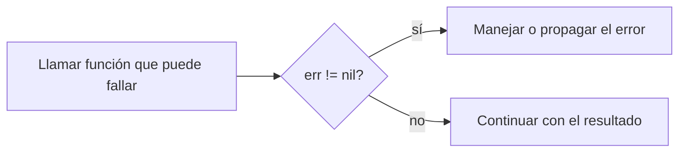
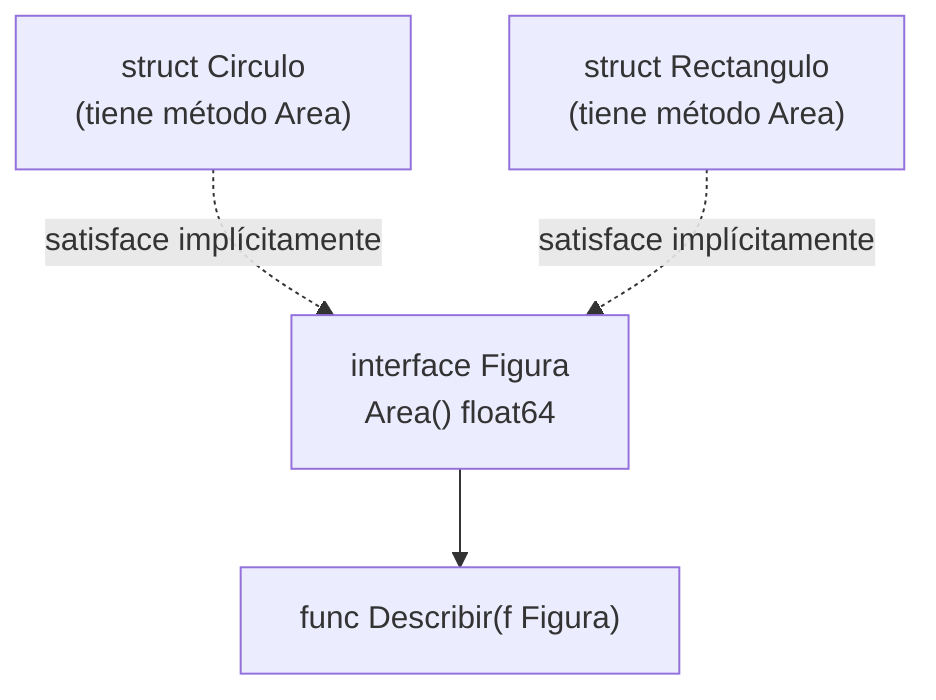
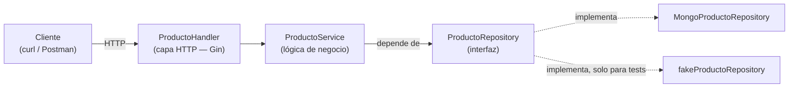
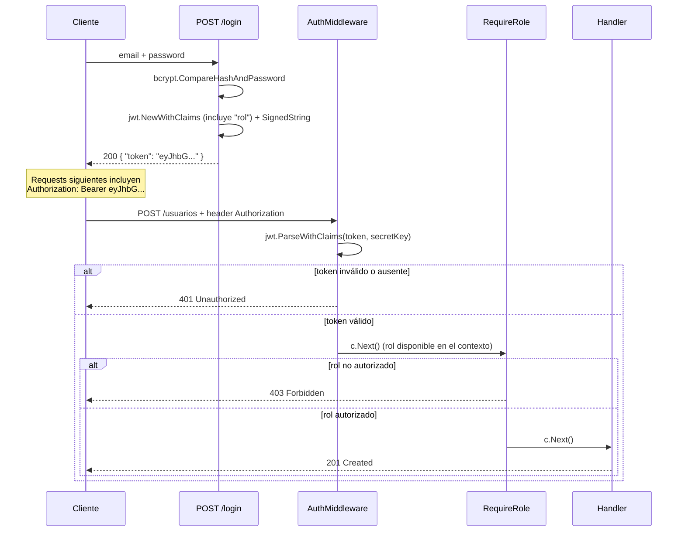

# Unidad 6 — Introducción a Go (Golang)

Material de apoyo para la **Unidad 6** de **Programación 2** — Ingeniería en Computación (UCSE).

---

## Índice

1. [Clase 1 — Introducción a Go](#clase-1--introducción-a-go)
2. [Clase 2 — Arrancás el TP: Gin, MongoDB y arquitectura en capas](#clase-2--arrancás-el-tp-gin-mongodb-y-arquitectura-en-capas)
3. [Clase 3 — Gin en profundidad](#clase-3--gin-en-profundidad)
4. [Clase 4 — Arquitectura, inyección de dependencias y testing](#clase-4--arquitectura-inyección-de-dependencias-y-testing)
5. [Clase 5 — MongoDB en profundidad](#clase-5--mongodb-en-profundidad)
6. [Clase 6 — JWT, bcrypt, middlewares y autorización por rol](#clase-6--jwt-bcrypt-middlewares-y-autorización-por-rol)
7. [Ejercicios prácticos](#ejercicios-prácticos)
8. [Recursos recomendados](#recursos-recomendados)

---

## Clase 1 — Introducción a Go

### ¿Qué es Go y por qué existe

Go (también llamado **Golang**, por su dominio `golang.org`) fue creado en **Google** por **Robert Griesemer, Rob Pike y Ken Thompson**. El diseño arrancó en 2007 y se liberó como código abierto el **10 de noviembre de 2009**.

Nació de una frustración concreta: con equipos gigantes, millones de líneas de C++ y builds que tardaban minutos u horas, el ciclo de desarrollo en Google se había vuelto lento y pesado. La [FAQ oficial de Go](https://go.dev/doc/faq) lo resume así:

> "Go was born out of frustration with existing languages and environments for the work we were doing at Google. [...] One had to choose either efficient compilation, efficient execution, or ease of programming; all three were not available in the same mainstream language."

| Problema que Google tenía | Cómo responde Go |
|---|---|
| Builds de C++ lentísimos en proyectos gigantes | Compilación a binario nativo diseñada para ser rápida |
| Herencia y dependencias complejas en C++/Java | Sin herencia de clases, sistema de tipos deliberadamente simple |
| Hardware multicore mal aprovechado por los lenguajes existentes | Concurrencia nativa: `goroutine` y `channel` (mención al final) |
| Falta de un estilo de código unificado entre equipos | `gofmt`: un único formato, no configurable |

> **Concepto clave**: Go no compite en expresividad con lenguajes como Python o Scala. Apunta a **simplicidad operativa a gran escala**: que miles de ingenieros lean y mantengan código ajeno sin sorpresas. Por eso tiene deliberadamente pocas construcciones — no hay excepciones, no hay herencia, y durante años no hubo genéricos.

Hoy Go está detrás de herramientas que ya conocés — **Docker**, **Kubernetes**, `terraform`, `Prometheus` — siempre en el terreno de backends, CLIs y servicios de red: el mismo terreno donde vamos a construir la API de Gestock en esta unidad.

### Instalación y herramientas

Go se distribuye como un único binario (compilador + toolchain), sin dependencias externas. Se descarga desde [go.dev/dl](https://go.dev/dl/).

```bash
brew install go        # macOS
go version              # go version go1.26.x darwin/arm64
```

A diferencia de Java (JDK + Maven/Gradle separados), Go trae **todo integrado en un solo comando**:

| Comando | Para qué sirve |
|---|---|
| `go run archivo.go` | Compila y ejecuta en un solo paso, sin dejar binario en disco (equivalente a correr desde el IDE) |
| `go build` | Compila a un binario nativo ejecutable, autocontenido |
| `go fmt` | Formatea el código según el estilo oficial — no configurable |
| `go vet` | Analiza el código en busca de errores que compilan pero probablemente están mal (linter estático básico) |

```bash
go run main.go     # compila y corre — el más usado durante desarrollo
go build main.go   # genera un binario nativo (ej: "main")
./main              # no necesita JVM ni Go instalado para correr
go fmt ./...        # formatea todos los .go del proyecto
go vet ./...        # busca errores sospechosos en todo el proyecto
```

> **Concepto clave**: un binario de `go build` es **autocontenido** — no depende de una JVM ni de librerías instaladas aparte. Es una diferencia fuerte respecto a un `.jar`, que necesita un JRE en el servidor destino, y una de las razones por las que Go da imágenes Docker finales muy livianas — algo que vamos a aprovechar en el Dockerfile de la API de Gestock.

### Estructura mínima de un programa

Todo archivo `.go` declara a qué **paquete** pertenece. `main` es especial: marca un ejecutable, y Go busca dentro una función `main()` sin parámetros ni retorno.

```go
package main

import "fmt"

func main() {
    fmt.Println("Hola, Go!")
}
```

| Elemento | Rol |
|---|---|
| `package main` | Declara el paquete; `main` produce un ejecutable (no una librería) |
| `import "fmt"` | Importa el paquete estándar `fmt` (formatted I/O) |
| `func main()` | Punto de entrada — Go la ejecuta automáticamente |

A diferencia de Java, **no hace falta envolver todo en una clase**: las funciones existen sueltas a nivel de archivo. Tampoco hace falta punto y coma (el compilador los infiere) ni paréntesis en las condiciones de `if`/`for`.

### Variables y tipos primitivos

Go es **tipado estáticamente**, como Java, pero casi nunca hace falta escribir el tipo — el compilador lo infiere.

```go
var edad int = 30          // declaración explícita
var precio = 19.99         // tipo inferido
ciudad := "Santiago"        // forma corta ":=" — SOLO dentro de funciones
```

| Forma | Dónde se usa |
|---|---|
| `var nombre tipo = valor` | En cualquier lado, incluso fuera de funciones |
| `var nombre = valor` | En cualquier lado, tipo inferido |
| `nombre := valor` | Solo dentro de funciones (la forma más usada) |

| Tipo | Descripción | Equivalente en Java |
|---|---|---|
| `int`, `int8/16/32/64` | Enteros con signo | `int`, `long` |
| `uint`, `uint8` (= `byte`) | Enteros sin signo | sin equivalente directo |
| `float32`, `float64` | Punto flotante | `float`, `double` |
| `string` | Texto inmutable, UTF-8 | `String` |
| `bool` | `true` / `false` | `boolean` |
| `rune` | Un carácter Unicode (alias de `int32`) | `char` (pero `rune` es un code point completo) |

> **Concepto clave — valores cero**: una variable declarada sin valor inicial **no queda indefinida**: recibe el "valor cero" de su tipo (`int`→`0`, `string`→`""`, `bool`→`false`). Elimina toda una categoría de bugs de "variable no inicializada".

```go
const Pi = 3.14159   // const: debe resolverse en tiempo de compilación
```

### Control de flujo

**`if`** — sin paréntesis, llaves obligatorias, y admite una sentencia de inicialización con scope propio:

```go
if edad >= 18 {
    fmt.Println("Mayor de edad")
} else {
    fmt.Println("Menor")
}

if valor, err := calcular(); err == nil {
    fmt.Println("Resultado:", valor)
} else {
    fmt.Println("Error:", err)
}
// "valor" y "err" no existen fuera de este bloque
```

**`for`** — Go **no tiene `while`, `do-while` ni `foreach`**. Todo se escribe con `for`:

```go
for i := 0; i < 5; i++ { fmt.Println(i) }   // 1. clásico

n := 0
for n < 3 { n++ }                             // 2. como "while"

for { break }                                 // 3. infinito, se corta con break

numeros := []int{10, 20, 30}
for indice, valor := range numeros {          // 4. for-range
    fmt.Println(indice, valor)
}
```

**`switch`** — cada `case` **termina implícitamente**, no hace falta `break` (si se necesita continuar al siguiente case, existe `fallthrough` explícito):

```go
switch dia {
case "sabado", "domingo":
    fmt.Println("Fin de semana")
default:
    fmt.Println("Día de semana")
}
```

### Funciones y múltiples valores de retorno

```go
func restar(a, b int) int {   // parámetros consecutivos del mismo tipo: se omite el repetido
    return a - b
}
```

Una función puede **retornar más de un valor**, sin crear una clase o tupla envolvente:

```go
func dividir(a, b int) (int, int) {
    return a / b, a % b
}

c, r := dividir(17, 5)   // c=3, r=2
```

Este mecanismo es la base del manejo de errores de Go: una función que puede fallar retorna `(resultado, error)`. También existen los **retornos con nombre**, donde `return` sin argumentos devuelve las variables ya declaradas en la firma:

```go
func dividir(a, b int) (cociente int, resto int) {
    cociente, resto = a/b, a%b
    return // devuelve cociente y resto automáticamente
}
```

### Slices y maps

Go tiene arrays de tamaño fijo (`[5]int`), pero en la práctica se usa casi siempre el **slice**: una vista redimensionable sobre un array subyacente, equivalente conceptual a un `ArrayList` de Java.

```go
frutas := []string{"manzana", "banana", "pera"}   // slice literal
numeros := make([]int, 0)                          // slice vacío

numeros = append(numeros, 1)        // append devuelve un NUEVO slice
numeros = append(numeros, 2, 3, 4)

fmt.Println(frutas[1:3])             // slicing: ["banana" "pera"]
for i, fruta := range frutas {       // recorrer con range
    fmt.Println(i, fruta)
}
```

> **Concepto clave**: `append` puede devolver un slice distinto al que recibió — si no hay espacio libre, Go reserva un array más grande y copia los datos. Por eso siempre hay que reasignar: `numeros = append(numeros, x)`, nunca solo `append(numeros, x)`.

Un `map` es una tabla clave-valor, equivalente a un `HashMap` de Java:

```go
precios := map[string]float64{"manzana": 500.0, "banana": 350.0}

stock := make(map[string]int)
stock["pera"] = 10

valor, existe := precios["kiwi"]   // "comma ok idiom"
if !existe {
    fmt.Println("no hay precio para kiwi")
}

delete(precios, "banana")
```

> **Cuidado**: leer una clave inexistente **no lanza error** — devuelve el valor cero del tipo junto con `false` en el comma-ok idiom. Si `0` es un valor válido en tu dominio, hay que usar la forma de dos valores para distinguir "no existe" de "existe y vale 0".

### Manejo de errores como valores

La diferencia más marcada frente a Java: **Go no tiene `try`/`catch`/`throw`**. Los errores son **valores comunes** que las funciones retornan, del tipo `error` — una interfaz con un único método:

```go
type error interface {
    Error() string
}
```

```go
func dividir(a, b float64) (float64, error) {
    if b == 0 {
        return 0, errors.New("no se puede dividir por cero")
    }
    return a / b, nil
}

resultado, err := dividir(10, 0)
if err != nil {
    fmt.Println("Error:", err)
    return
}
fmt.Println("Resultado:", resultado)
```

El patrón `if err != nil { ... }` aparece después de casi cualquier llamada que pueda fallar — es la construcción más repetida en código Go real.



Para agregar contexto sin perder el error original se usa `fmt.Errorf` con `%w`:

```go
if err != nil {
    return fmt.Errorf("no se pudo calcular el promedio: %w", err)
}
```

| Con excepciones (Java) | Con errores como valores (Go) |
|---|---|
| El control puede "saltar" niveles de stack de forma invisible en la firma | La función declara el posible fallo **en su firma**: `(resultado, error)` |
| Fácil olvidarse un `catch` y que el error se propague sin control | El error queda **a la vista**, en línea, pegado a cada llamada |

> **Concepto clave**: en Go, un error es parte normal del resultado de una operación (leer un archivo, dividir, una request de red pueden fallar), no un evento "excepcional". Tratarlo como un valor obliga a decidir qué hacer con él en cada punto, en vez de dejarlo viajar silenciosamente stack arriba.

Go sí tiene `panic`/`recover`, pero reservados para errores **realmente irrecuperables** (bug del programa, índice fuera de rango) — no para el control de flujo normal, que siempre es `error` + `if err != nil`.

### Una mención a la concurrencia

Go tiene concurrencia **incorporada en el lenguaje**: las **goroutines** (`go miFuncion()`) son funciones que corren de forma concurrente con un costo de memoria mucho menor que un hilo del sistema operativo, y los **channels** (`chan`) permiten que esas goroutines se comuniquen y sincronicen de forma segura. Es una de las razones por las que Go es tan popular para infraestructura de alta concurrencia. Este curso **no cubre goroutines ni channels** — quedan para profundizar por cuenta propia; lo que necesitamos de acá en adelante (levantar un servidor HTTP, manejar requests) funciona sin escribir concurrencia explícita, porque el framework la maneja por debajo.

---

### Organizando el código: módulos y paquetes

Hasta acá todo el código vivió en un único archivo con `package main`. Antes de escribir la API de Gestock en la próxima clase, hace falta saber cómo Go organiza un proyecto de más de un archivo.

En Java, un proyecto se identifica por su `group`/`artifact` en Gradle o Maven. En Go, la unidad equivalente es el **módulo**: un conjunto de paquetes versionado en conjunto, declarado por un archivo `go.mod` en la raíz del proyecto.

```bash
mkdir mi-api && cd mi-api
go mod init github.com/mi-usuario/mi-api
```

```
go: creating new go.mod: module github.com/mi-usuario/mi-api
```

El argumento de `go mod init` es el **module path**: un identificador único que además funciona como prefijo de importación para todos los paquetes del proyecto. Si el módulo va a publicarse, por convención se usa la URL del repositorio (`github.com/usuario/repo`) — así `go get` sabe de dónde descargarlo. Para proyectos de práctica que nunca se publican, alcanza con un nombre simple (`mi-api`).

> **Concepto clave**: no hace falta un IDE ni un wizard (como Spring Initializr) para crear un proyecto Go — `go mod init` es el equivalente mínimo, y genera un solo archivo de texto.

`go mod init` crea `go.mod` con el módulo y la versión de Go usada:

```go
module github.com/mi-usuario/mi-api

go 1.22
```

A medida que se agregan dependencias externas con `go get`, `go.mod` las lista en una sección `require`:

```bash
go get github.com/gin-gonic/gin@latest     # última versión estable
go get github.com/gin-gonic/gin@v1.9.1     # versión específica
go get github.com/gin-gonic/gin@none       # eliminar la dependencia
go mod tidy                                 # agrega lo que falta, saca lo que no se usa
```

Junto con `go.mod`, Go genera automáticamente `go.sum`: un archivo con los **checksums criptográficos** de cada dependencia (directa e indirecta). No se edita a mano, pero **sí se commitea** al repositorio — garantiza que cualquiera que clone el proyecto descargue exactamente el mismo código, sin alteraciones.

| Archivo | Rol | Equivalente conceptual (Gradle) |
|---------|-----|----------------------------------|
| `go.mod` | Declara el módulo, la versión de Go y las dependencias directas con su versión | `build.gradle` (bloque `dependencies { }`) |
| `go.sum` | Checksums de cada dependencia, directa y transitiva, para builds verificables y reproducibles | lockfile de verificación de dependencias |

`go mod tidy` es el comando que se corre casi siempre después de agregar o sacar un `import`: sincroniza `go.mod`/`go.sum` con lo que el código realmente usa.

En Go, **cada carpeta es un paquete**. Todos los archivos `.go` dentro de una misma carpeta deben declarar el mismo `package` en su primera línea, y ese paquete se importa usando la ruta desde la raíz del módulo.

```
mi-api/
├── go.mod                  → module github.com/mi-usuario/mi-api
├── main.go                 → package main
└── figuras/
    ├── circulo.go           → package figuras
    └── figuras_test.go      → package figuras
```

```go
// figuras/circulo.go
package figuras

// main.go
package main

import "github.com/mi-usuario/mi-api/figuras"
```

> **Diferencia con Java**: en Java el paquete es una ruta completa y explícita (`com.ejemplo.app.figuras`) que debe coincidir exactamente con la ruta de carpetas y con el `import`. En Go el `package` declarado en el archivo es solo el **último componente** (un nombre corto, en minúscula, sin guiones bajos: `figuras`, no `com.ejemplo.figuras`); la ruta completa de importación la arma el module path + la carpeta. No existe una convención de "un archivo = una clase pública" — un paquete agrupa libremente varios archivos relacionados.

`package main` es especial: marca el paquete que compila a un ejecutable, y debe tener una función `func main()`. Cualquier otro nombre de paquete produce una librería que otros paquetes importan.

Java resuelve la visibilidad con modificadores explícitos (`public`, `private`, `protected`). Go no tiene esas palabras clave — usa una convención puramente sintáctica basada en la primera letra del identificador.

| Regla | Efecto |
|-------|--------|
| Empieza con **mayúscula** (`Radio`, `Area`, `Circulo`) | **Exportado**: visible desde otros paquetes |
| Empieza con **minúscula** (`radio`, `calcularArea`) | **Privado al paquete**: invisible fuera de él, aunque otro archivo del mismo paquete sí lo ve |

```go
package figuras

type Circulo struct {
    Radio float64 // exportado — otros paquetes pueden leerlo/escribirlo
    color string   // privado — solo visible dentro del paquete "figuras"
}

func NuevoCirculo(radio float64) Circulo { // exportado — constructor de facto
    return Circulo{Radio: radio, color: "negro"}
}

func validarRadio(r float64) bool { // privado — detalle interno del paquete
    return r > 0
}
```

> **Concepto clave**: la visibilidad aplica a nivel de **paquete**, no de tipo. No hay `protected` ni jerarquías de acceso — o el identificador es visible en todo el módulo (y fuera de él, si el módulo se importa), o solo dentro de su propio paquete. Esta es la regla que en la próxima clase decide qué campos de `model.Producto` viajan en el JSON de la API y cuáles no.

### Structs: declaración e instanciación

Un `struct` agrupa campos con nombre, igual que los atributos de una clase Java — pero **no es una clase**: no tiene constructores, no soporta herencia, y por defecto es un tipo de valor (se copia, no se referencia, al asignarlo o pasarlo a una función).

```go
type Circulo struct {
    Radio float64
}

type Rectangulo struct {
    Ancho float64
    Alto  float64
}
```

Formas de instanciar:

```go
var c1 Circulo                          // zero value: Radio = 0.0
c2 := Circulo{Radio: 5}                 // struct literal con nombre de campo (recomendado)
c3 := Circulo{5}                        // struct literal posicional (frágil si cambian los campos)
c4 := &Circulo{Radio: 5}                // c4 es *Circulo (puntero al struct), no Circulo
```

> **Zero value**: a diferencia de Java, donde una referencia no inicializada es `null`, en Go un `struct` sin inicializar no es `nil` — existe con todos sus campos en su valor por defecto (`0`, `""`, `false`, `nil` para punteros/slices/maps). Un `struct` "vacío" es perfectamente utilizable.

No hay `new Circulo(5)`: la convención en Go es escribir una función constructora explícita cuando hace falta validar o setear valores por defecto, típicamente llamada `NewXxx`:

```go
func NuevoCirculo(radio float64) (*Circulo, error) {
    if radio <= 0 {
        return nil, fmt.Errorf("radio inválido: %v", radio)
    }
    return &Circulo{Radio: radio}, nil
}
```

### Punteros: `&` y `*`

Java no tiene punteros explícitos: toda variable de un tipo objeto (no primitivo) es, por debajo, una referencia — el programador nunca escribe `&` ni `*`. Go sí expone la indirección explícitamente, con dos operadores:

| Operador | Significado |
|----------|-------------|
| `&x` | Dirección de memoria de `x` — produce un `*T` a partir de un `T` |
| `*p` | Dereferencia — accede al valor apuntado por `p` |
| `var p *T` | Declara un puntero a `T`, cuyo zero value es `nil` |

```
var x int = 5           p := &x

Memoria:
┌────────────┐          ┌────────────────┐
│ x: 5       │◄─────────│ p: 0xc0000140a0│
└────────────┘          └────────────────┘
  0xc0000140a0

*p            → 5          (dereferencia: lee el valor apuntado)
*p = 10       → x pasa a valer 10, porque p apunta a x
```

```go
func duplicar(n int) {
    n = n * 2 // modifica la copia local, el original no cambia
}

func duplicarPtr(n *int) {
    *n = *n * 2 // modifica el valor en la dirección apuntada
}

x := 5
duplicar(x)
fmt.Println(x)     // 5 — sin cambios

duplicarPtr(&x)
fmt.Println(x)     // 10 — cambió, porque se pasó la dirección
```

> **Diferencia con Java**: en Java, pasar un objeto a un método siempre pasa la referencia (podés mutar sus campos), pero nunca podés reasignar la variable del llamador ni elegir "pasar por valor" un objeto. En Go, **todo se pasa por valor por defecto** — incluidos los structs, que se copian enteros — y los punteros son la herramienta explícita para compartir y mutar el dato original en lugar de una copia.

### Métodos con receiver: value vs. pointer

Un método en Go es una función con un **receiver** extra antes del nombre — asocia la función a un tipo, similar a un método de instancia en Java, pero declarado *fuera* del `struct`.

```go
func (c Circulo) Area() float64 {
    return math.Pi * c.Radio * c.Radio
}
```

`(c Circulo)` es el receiver. Hay dos formas de declararlo:

| Receiver | Sintaxis | El método recibe | Puede modificar el original |
|----------|----------|-------------------|-------------------------------|
| **Value receiver** | `func (c Circulo) Area() float64` | una **copia** del struct | No |
| **Pointer receiver** | `func (c *Circulo) Escalar(factor float64)` | la **dirección** del struct original | Sí |

```go
// Value receiver: solo lee, no necesita modificar el original
func (c Circulo) Area() float64 {
    return math.Pi * c.Radio * c.Radio
}

// Pointer receiver: modifica el campo del struct original
func (c *Circulo) Escalar(factor float64) {
    c.Radio = c.Radio * factor
}
```

```go
c := Circulo{Radio: 5}
c.Escalar(2)              // Go reescribe esto como (&c).Escalar(2) automáticamente
fmt.Println(c.Radio)      // 10 — el original cambió
```

> **Regla práctica**: usar **pointer receiver** cuando el método necesita modificar el struct, o cuando el struct es grande (evita copiarlo en cada llamada). Usar **value receiver** para structs chicos e inmutables, de solo lectura. Si algún método de un tipo usa pointer receiver, por consistencia se recomienda que **todos** los métodos de ese tipo lo usen. Esta es exactamente la regla que vamos a aplicar a los repositories de Gestock: sus métodos van a modificar estado (una colección, un mapa protegido por mutex) y por eso siempre se declaran con pointer receiver.

### Interfaces: satisfacción implícita

Una interfaz en Go declara un conjunto de métodos, igual que en Java. La diferencia central es **cómo se satisface**:

```go
type Figura interface {
    Area() float64
}
```

```go
func Describir(f Figura) string {
    return fmt.Sprintf("Área: %.2f", f.Area())
}

func (c Circulo) Area() float64      { return math.Pi * c.Radio * c.Radio }
func (r Rectangulo) Area() float64   { return r.Ancho * r.Alto }

Describir(Circulo{Radio: 5})          // funciona
Describir(Rectangulo{Ancho: 3, Alto: 4}) // también funciona
```

`Circulo` y `Rectangulo` **nunca declaran** que implementan `Figura`. No hay `implements Figura` en ningún lado, ni una anotación, ni una palabra clave: el compilador verifica en el punto de uso (`Describir(Circulo{...})`) que el tipo tenga los métodos necesarios. Esto se conoce como **satisfacción estructural** (o *duck typing* verificado en tiempo de compilación): "si camina como pato y grazna como pato, es un pato".



| | Java | Go |
|---|------|----|
| Declaración de intención | `class Circulo implements Figura` — explícita | Ninguna — se infiere de los métodos que el tipo tiene |
| Acoplamiento | El tipo debe conocer la interfaz al definirse | El tipo no necesita saber que existe la interfaz |
| Verificación | En la declaración de la clase | En el punto donde se usa el valor como esa interfaz (compile-time) |

> **Por qué importa para lo que sigue**: en la próxima clase vamos a definir un `ProductoRepository` como interfaz con una única implementación (contra MongoDB), sin que esa implementación "sepa" que existe una interfaz — simplemente va a tener los métodos correctos. Más adelante (Clase 4) vamos a ver por qué ese desacople es tan valioso: permite testear el `service` reemplazando el repository real por uno de prueba, sin tocar una línea de la interfaz.

Para forzar en compile-time que un tipo cumple una interfaz (útil como documentación o chequeo temprano), se usa una asignación en blanco:

```go
var _ Figura = Circulo{} // si Circulo deja de tener Area(), esto no compila
```

---

## Clase 2 — Arrancás el TP: Gin, MongoDB y arquitectura en capas

Con el lenguaje base ya cubierto (Clase 1: sintaxis, structs, punteros, interfaces), esta clase arma de punta a punta el esqueleto real del Trabajo Práctico: una API en capas, con Gin y persistencia en MongoDB, corriendo en Docker. El objetivo es terminar la clase con el proyecto compilando, levantado con `docker compose up`, y un CRUD real persistiendo datos — **no** con una explicación exhaustiva de cada pieza. Gin se profundiza en la Clase 3, la arquitectura y el porqué de cada decisión en la Clase 4, y MongoDB en detalle en la Clase 5.

Se usa `Producto` como entidad guía a lo largo de toda la unidad — una de las entidades centrales de Gestock — con los campos reales del enunciado.

### Estructura del repositorio del TP

El enunciado pide que todo el proyecto se levante con un único `docker-compose.yml` en la raíz, orquestando tres servicios:

```
prog2-2026-tp-<team_name>-gestock/
├── docker-compose.yml
├── api/                  ← proyecto Go (esta unidad)
│   ├── Dockerfile
│   ├── go.mod
│   └── ...
└── frontend/              ← proyecto React (no es tema de esta unidad)
    ├── Dockerfile
    └── ...
```

Por ahora nos enfocamos en `api/` y en el servicio `mongo` del compose; el servicio `frontend` se agrega cuando corresponda en la parte de React de la materia.

### `docker-compose.yml` — MongoDB con persistencia

```yaml
services:
  mongo:
    image: mongo:7
    ports:
      - "27017:27017"
    volumes:
      - datos-mongo:/data/db

volumes:
  datos-mongo:
```

```bash
docker compose up -d mongo
```

El volumen `datos-mongo` es lo que exige el enunciado bajo "Persistencia": los datos sobreviven a que el contenedor se detenga, se elimine o se recree. El puerto por defecto de Mongo es `27017`. Sin variables `MONGO_INITDB_ROOT_USERNAME`/`MONGO_INITDB_ROOT_PASSWORD` el contenedor arranca sin autenticación — suficiente para desarrollo local, nunca para producción.

### Estructura de carpetas de la API

Go no impone una estructura de proyecto, pero hay una convención ampliamente adoptada (ver [golang-standards/project-layout](https://github.com/golang-standards/project-layout)) que usamos en toda la unidad:

```
api/
├── cmd/
│   └── api/
│       └── main.go              ← punto de entrada, arma el grafo de dependencias
├── internal/
│   ├── handler/
│   │   └── producto_handler.go
│   ├── service/
│   │   └── producto_service.go
│   ├── repository/
│   │   ├── producto_repository.go        ← la interfaz
│   │   └── mongo_producto_repository.go  ← la implementación
│   └── model/
│       └── producto.go
├── go.mod
└── go.sum
```

| Carpeta | Por qué |
|---------|---------|
| `cmd/api/` | Convención para el binario ejecutable. Si el proyecto tuviera más de un binario, cada uno sería una subcarpeta de `cmd/` |
| `internal/` | El **toolchain de Go la hace cumplir**: cualquier paquete bajo `internal/` solo puede ser importado por código dentro del mismo módulo — otro proyecto no podría importar `api/internal/service` aunque quisiera |

Cada capa tiene una responsabilidad y solo esa — el **por qué** de esta separación se retoma con más detalle en la Clase 4:

| Capa | Responsabilidad |
|------|------------------|
| **handler** | Recibe la request HTTP, la parsea, llama al service, arma la response y el código de estado |
| **service** | Lógica de negocio: reglas que no son ni HTTP ni persistencia |
| **repository** | Acceso a datos, definido como interfaz + implementación concreta |
| **model** | Structs del dominio (`Producto`) |

```bash
mkdir -p api/cmd/api api/internal/{handler,service,repository,model}
cd api && go mod init gestock/api
```

### El modelo: `model.Producto`

```go
package model

type Producto struct {
    ID     string  `json:"id,omitempty"`
    Nombre string  `json:"nombre" binding:"required"`
    Precio float64 `json:"precio" binding:"required,gt=0"`
}
```

> Los tags `json:"..."` controlan cómo se serializa/deserializa el struct; los tags `binding:"..."` se usan para validar el body de un request con Gin. Ambos se explican en profundidad en la Clase 3 — por ahora alcanza con saber que están ahí y que van a hacer lo esperado.

### El repository, como interfaz

El repository se declara como **interfaz** antes de escribir ninguna implementación — apoyándose en la satisfacción implícita vista en la Clase 1:

```go
package repository

import (
    "context"

    "gestock/api/internal/model"
)

type ProductoRepository interface {
    FindAll(ctx context.Context) ([]model.Producto, error)
    FindByID(ctx context.Context, id string) (model.Producto, error)
    Create(ctx context.Context, p model.Producto) (model.Producto, error)
    Update(ctx context.Context, id string, p model.Producto) (model.Producto, error)
    Delete(ctx context.Context, id string) error
}
```

El `service` va a depender **únicamente** de este contrato, nunca de la implementación concreta. Cada método recibe `context.Context` como primer parámetro: se propaga desde el handler hacia abajo, y es el mecanismo para cancelar o poner timeout a las llamadas al driver de MongoDB.

### La implementación contra MongoDB

MongoDB mantiene un driver oficial para Go, en su versión vigente `v2`:

```bash
go get go.mongodb.org/mongo-driver/v2/mongo
```

**Conexión**, con un ping con timeout para confirmar que Mongo responde:

```go
package db

import (
    "context"
    "time"

    "go.mongodb.org/mongo-driver/v2/mongo"
    "go.mongodb.org/mongo-driver/v2/mongo/options"
)

func Conectar(uri string) (*mongo.Client, error) {
    client, err := mongo.Connect(options.Client().ApplyURI(uri))
    if err != nil {
        return nil, err
    }

    ctx, cancel := context.WithTimeout(context.Background(), 5*time.Second)
    defer cancel()

    if err := client.Ping(ctx, nil); err != nil {
        return nil, err
    }
    return client, nil
}
```

**La implementación**, con los cinco métodos de la interfaz. `model.Producto` usa `ID string` (pensado para viajar en JSON), mientras que Mongo identifica documentos con `bson.ObjectID` — por eso se define un struct interno `productoDoc`, privado al paquete, que traduce entre ambos mundos (el detalle de por qué se hace así se retoma en la Clase 5):

```go
package repository

import (
    "context"
    "errors"

    "go.mongodb.org/mongo-driver/v2/bson"
    "go.mongodb.org/mongo-driver/v2/mongo"

    "gestock/api/internal/model"
)

type productoDoc struct {
    ID     bson.ObjectID `bson:"_id,omitempty"`
    Nombre string        `bson:"nombre"`
    Precio float64       `bson:"precio"`
}

type MongoProductoRepository struct {
    coll *mongo.Collection
}

func NewMongoProductoRepository(coll *mongo.Collection) *MongoProductoRepository {
    return &MongoProductoRepository{coll: coll}
}

func (r *MongoProductoRepository) FindAll(ctx context.Context) ([]model.Producto, error) {
    cursor, err := r.coll.Find(ctx, bson.M{})
    if err != nil {
        return nil, err
    }
    defer cursor.Close(ctx)

    var docs []productoDoc
    if err := cursor.All(ctx, &docs); err != nil {
        return nil, err
    }

    productos := make([]model.Producto, 0, len(docs))
    for _, d := range docs {
        productos = append(productos, model.Producto{ID: d.ID.Hex(), Nombre: d.Nombre, Precio: d.Precio})
    }
    return productos, nil
}

func (r *MongoProductoRepository) FindByID(ctx context.Context, id string) (model.Producto, error) {
    oid, err := bson.ObjectIDFromHex(id)
    if err != nil {
        return model.Producto{}, err
    }

    var doc productoDoc
    if err := r.coll.FindOne(ctx, bson.M{"_id": oid}).Decode(&doc); err != nil {
        if errors.Is(err, mongo.ErrNoDocuments) {
            return model.Producto{}, errors.New("producto no encontrado")
        }
        return model.Producto{}, err
    }
    return model.Producto{ID: doc.ID.Hex(), Nombre: doc.Nombre, Precio: doc.Precio}, nil
}

func (r *MongoProductoRepository) Create(ctx context.Context, p model.Producto) (model.Producto, error) {
    doc := productoDoc{Nombre: p.Nombre, Precio: p.Precio}

    result, err := r.coll.InsertOne(ctx, doc)
    if err != nil {
        return model.Producto{}, err
    }

    doc.ID = result.InsertedID.(bson.ObjectID)
    return model.Producto{ID: doc.ID.Hex(), Nombre: doc.Nombre, Precio: doc.Precio}, nil
}

func (r *MongoProductoRepository) Update(ctx context.Context, id string, p model.Producto) (model.Producto, error) {
    oid, err := bson.ObjectIDFromHex(id)
    if err != nil {
        return model.Producto{}, err
    }

    update := bson.M{"$set": bson.M{"nombre": p.Nombre, "precio": p.Precio}}
    result, err := r.coll.UpdateOne(ctx, bson.M{"_id": oid}, update)
    if err != nil {
        return model.Producto{}, err
    }
    if result.MatchedCount == 0 {
        return model.Producto{}, errors.New("producto no encontrado")
    }

    p.ID = id
    return p, nil
}

func (r *MongoProductoRepository) Delete(ctx context.Context, id string) error {
    oid, err := bson.ObjectIDFromHex(id)
    if err != nil {
        return err
    }

    result, err := r.coll.DeleteOne(ctx, bson.M{"_id": oid})
    if err != nil {
        return err
    }
    if result.DeletedCount == 0 {
        return errors.New("producto no encontrado")
    }
    return nil
}
```

Conviene agregar, al lado de la implementación, una verificación de compilación: si `MongoProductoRepository` dejara de cumplir algún método de la interfaz, esta línea no compila —se detecta el error ahí, no recién al cablear `main.go`:

```go
var _ ProductoRepository = (*MongoProductoRepository)(nil)
```

### El service — depende de la interfaz, no de Mongo

```go
package service

import (
    "context"

    "gestock/api/internal/model"
    "gestock/api/internal/repository"
)

type ProductoService struct {
    repo repository.ProductoRepository // el campo es la interfaz
}

func NewProductoService(repo repository.ProductoRepository) *ProductoService {
    return &ProductoService{repo: repo}
}

func (s *ProductoService) ListarTodos(ctx context.Context) ([]model.Producto, error) {
    return s.repo.FindAll(ctx)
}

func (s *ProductoService) BuscarPorID(ctx context.Context, id string) (model.Producto, error) {
    return s.repo.FindByID(ctx, id)
}

func (s *ProductoService) Crear(ctx context.Context, p model.Producto) (model.Producto, error) {
    return s.repo.Create(ctx, p)
}

func (s *ProductoService) Actualizar(ctx context.Context, id string, p model.Producto) (model.Producto, error) {
    return s.repo.Update(ctx, id, p)
}

func (s *ProductoService) Eliminar(ctx context.Context, id string) error {
    return s.repo.Delete(ctx, id)
}
```

Por ahora el service solo delega en el repository — no tiene reglas de negocio propias todavía. En la Clase 4 le vamos a agregar validaciones reales (ej. no permitir dos productos con el mismo nombre), que es donde un service empieza a ganar su lugar frente a delegar directo del handler al repository.

### El handler — con Gin

```bash
go get github.com/gin-gonic/gin
```

```go
package handler

import (
    "net/http"

    "github.com/gin-gonic/gin"

    "gestock/api/internal/model"
    "gestock/api/internal/service"
)

type ProductoHandler struct {
    service *service.ProductoService
}

func NewProductoHandler(service *service.ProductoService) *ProductoHandler {
    return &ProductoHandler{service: service}
}

func (h *ProductoHandler) List(c *gin.Context) {
    productos, err := h.service.ListarTodos(c.Request.Context())
    if err != nil {
        c.JSON(http.StatusInternalServerError, gin.H{"error": err.Error()})
        return
    }
    c.JSON(http.StatusOK, productos)
}

func (h *ProductoHandler) GetByID(c *gin.Context) {
    id := c.Param("id")
    producto, err := h.service.BuscarPorID(c.Request.Context(), id)
    if err != nil {
        c.JSON(http.StatusNotFound, gin.H{"error": err.Error()})
        return
    }
    c.JSON(http.StatusOK, producto)
}

func (h *ProductoHandler) Create(c *gin.Context) {
    var producto model.Producto
    if err := c.ShouldBindJSON(&producto); err != nil {
        c.JSON(http.StatusBadRequest, gin.H{"error": err.Error()})
        return
    }

    creado, err := h.service.Crear(c.Request.Context(), producto)
    if err != nil {
        c.JSON(http.StatusBadRequest, gin.H{"error": err.Error()})
        return
    }
    c.JSON(http.StatusCreated, creado)
}

func (h *ProductoHandler) Update(c *gin.Context) {
    id := c.Param("id")
    var producto model.Producto
    if err := c.ShouldBindJSON(&producto); err != nil {
        c.JSON(http.StatusBadRequest, gin.H{"error": err.Error()})
        return
    }

    actualizado, err := h.service.Actualizar(c.Request.Context(), id, producto)
    if err != nil {
        c.JSON(http.StatusNotFound, gin.H{"error": err.Error()})
        return
    }
    c.JSON(http.StatusOK, actualizado)
}

func (h *ProductoHandler) Delete(c *gin.Context) {
    id := c.Param("id")
    if err := h.service.Eliminar(c.Request.Context(), id); err != nil {
        c.JSON(http.StatusNotFound, gin.H{"error": err.Error()})
        return
    }
    c.Status(http.StatusNoContent)
}

func RegisterProductoRoutes(router *gin.Engine, h *ProductoHandler) {
    productos := router.Group("/productos")
    {
        productos.GET("", h.List)
        productos.GET("/:id", h.GetByID)
        productos.POST("", h.Create)
        productos.PUT("/:id", h.Update)
        productos.DELETE("/:id", h.Delete)
    }
}
```

El handler es la única capa que conoce `gin.Context`, `http.Status...` y JSON — ni el `service` ni el `repository` importan `gin` en ningún momento.

### `main.go` — el cableado final

```go
package main

import (
    "log"

    "github.com/gin-gonic/gin"

    "gestock/api/internal/db"
    "gestock/api/internal/handler"
    "gestock/api/internal/repository"
    "gestock/api/internal/service"
)

func main() {
    client, err := db.Conectar("mongodb://mongo:27017")
    if err != nil {
        log.Fatal(err)
    }
    coll := client.Database("gestock").Collection("productos")

    productoRepo := repository.NewMongoProductoRepository(coll)
    productoService := service.NewProductoService(productoRepo)
    productoHandler := handler.NewProductoHandler(productoService)

    router := gin.Default()
    handler.RegisterProductoRoutes(router, productoHandler)

    router.Run(":8080")
}
```

`mongodb://mongo:27017` usa `mongo` como host en vez de `localhost` porque, dentro de `docker-compose`, cada servicio resuelve el nombre de los demás servicios como si fuera un hostname de red.

### Sumando la API al `docker-compose.yml`

```yaml
services:
  mongo:
    image: mongo:7
    ports:
      - "27017:27017"
    volumes:
      - datos-mongo:/data/db

  api:
    build: ./api
    ports:
      - "8080:8080"
    depends_on:
      - mongo

volumes:
  datos-mongo:
```

Con un `Dockerfile` mínimo en `api/` (build multi-stage con `golang` para compilar y una imagen liviana para correr el binario — visto en la Unidad 4), `docker compose up --build` levanta Mongo y la API juntos.

### Resultado esperado al final de la clase

- El repositorio del TP tiene la estructura completa: `docker-compose.yml`, `api/` con capas, `frontend/` como carpeta pendiente.
- `docker compose up --build` levanta Mongo y la API.
- `POST /productos`, `GET /productos`, `GET /productos/:id`, `PUT /productos/:id` y `DELETE /productos/:id` funcionan de punta a punta, persistiendo en una colección Mongo real.
- Nada de esto está optimizado ni completamente explicado todavía — el resto de la unidad vuelve sobre cada pieza para profundizarla.

---

## Clase 3 — Gin en profundidad

La Clase 2 armó un handler funcional usando `c.Param`, `c.JSON` y `c.ShouldBindJSON` sin detenerse a explicar cada uno. Esta clase vuelve sobre esas piezas y agrega lo que quedó afuera: por qué existe Gin, cómo se extraen parámetros de las dos formas posibles, cómo funcionan los tags de validación en detalle, y qué código de estado corresponde a cada situación.

### Por qué Gin

En Go no hay un framework "oficial" incluido para REST como Spring Boot en Java. La librería estándar (`net/http`) da lo mínimo indispensable:

```go
func productosHandler(w http.ResponseWriter, r *http.Request) {
	productos := []Producto{{ID: "1", Nombre: "Laptop", Precio: 1500.0}}
	w.Header().Set("Content-Type", "application/json")
	json.NewEncoder(w).Encode(productos)
}

func main() {
	http.HandleFunc("/productos", productosHandler)
	http.ListenAndServe(":8080", nil)
}
```

Esto funciona, pero rápidamente se vuelve tedioso a mano:

- No hay forma nativa de capturar `/productos/{id}` como parámetro — hay que parsear el path a mano.
- No hay distinción de métodos: `productosHandler` responde igual a un GET que a un POST a menos que se chequee `r.Method` manualmente.
- Leer y validar el body JSON y devolver errores 400 bien formados requiere repetir el mismo boilerplate en cada handler.
- Setear el código de estado exige llamar `w.WriteHeader(...)` explícitamente antes de escribir el body.

[Gin](https://github.com/gin-gonic/gin) —el framework HTTP más usado en el ecosistema Go, liviano y con un router tipo *radix tree*— automatiza exactamente ese trabajo repetitivo:

| | `net/http` puro | Gin |
|---|---|---|
| Rutear por método + path | Manual (`if r.Method == "GET"`, parseo de path) | `router.GET(path, handler)`, `router.POST(...)`, etc. |
| Parámetros de ruta | Manual | `c.Param("id")` |
| Serializar JSON | `json.NewEncoder(w).Encode(...)` + `Content-Type` a mano | `c.JSON(status, data)` |
| Parsear body JSON + validar | `json.NewDecoder(r.Body).Decode(...)` + validación manual | `c.ShouldBindJSON(&struct)` con tags `binding:"..."` |
| Middlewares (logging, recovery) | No incluidos | `gin.Default()` ya trae logger + recovery de panics |
| Agrupar rutas | No incluido | `router.Group("/api")` (usado desde la Clase 2) |

`gin.Default()` (el que venimos usando) arma un router con logger + recovery de panics ya activados. `gin.New()` da un router vacío, sin esos middlewares, para quien los quiera configurar manualmente.

### Parámetros de path vs. query string

Gin distingue dos formas de recibir datos en un GET: parte del **path** (`c.Param`, ya usado en `GetByID`) o parte del **query string** (`c.Query`):

```go
// Parámetro de path: /productos/3
router.GET("/productos/:id", func(c *gin.Context) {
	id := c.Param("id") // "3"
	c.JSON(http.StatusOK, gin.H{"id": id})
})

// Parámetro de query: /productos?nombre=Laptop
router.GET("/productos", func(c *gin.Context) {
	nombre := c.Query("nombre")               // "" si no viene
	nombre = c.DefaultQuery("nombre", "todos") // con valor por defecto
	c.JSON(http.StatusOK, gin.H{"filtro": nombre})
})
```

| Método | Extrae | Ejemplo de URL |
|--------|--------|-----------------|
| `c.Param("id")` | Segmento de la ruta declarado como `:id` | `/productos/3` → `"3"` |
| `c.Query("nombre")` | Query string | `/productos?nombre=Laptop` → `"Laptop"` |
| `c.DefaultQuery("nombre", "x")` | Query string, con valor por defecto si falta | `/productos` → `"x"` |

`gin.H` es simplemente un alias de Gin para `map[string]interface{}` — una forma rápida de armar un JSON ad hoc sin declarar un struct.

### Tags `json:"..."` para (de)serialización

Cuando un struct de Go se convierte a JSON (o viceversa), por defecto Go usa el **nombre del campo tal cual** (en mayúscula, porque tiene que estar exportado). Los tags `json:"..."` controlan ese mapeo:

```go
type Producto struct {
	ID     string  `json:"id,omitempty"`
	Nombre string  `json:"nombre"`
	Precio float64 `json:"precio"`
}
```

| Tag | Efecto |
|-----|--------|
| `json:"nombre"` | El campo `Nombre` se serializa/deserializa como `"nombre"` en el JSON (minúscula) |
| `json:"id,omitempty"` | Si el campo tiene el valor cero (`""`, `0`, `nil`...), se omite del JSON de salida |
| `json:"-"` | El campo nunca se serializa ni deserializa |

Sin el tag, `Producto{Nombre: "Mouse"}` se serializaría como `{"ID":"","Nombre":"Mouse","Precio":0}` — con mayúsculas, que no es la convención habitual de una API JSON.

### Binding y validación con `c.ShouldBindJSON`

`c.ShouldBindJSON` lee el body JSON del request, lo vuelca en un struct de Go, y **valida al mismo tiempo** según los tags `binding:"..."`:

```go
router.POST("/productos", func(c *gin.Context) {
	var producto Producto

	if err := c.ShouldBindJSON(&producto); err != nil {
		c.JSON(http.StatusBadRequest, gin.H{"error": err.Error()})
		return
	}

	c.JSON(http.StatusCreated, producto)
})
```

| Tag `binding` | Qué valida |
|---------------|-----------|
| `required` | El campo no puede estar ausente ni tener el valor cero de su tipo (`""`, `0`) |
| `gt=0` | El valor numérico debe ser mayor a 0 (*greater than*) |
| `gte=0` / `lte=100` | Mayor o igual / menor o igual a un valor |
| `email` | Formato de email válido |
| `min=3` / `max=50` | Longitud mínima/máxima (strings) o valor mínimo/máximo (números) |

Gin usa por debajo la librería [`go-playground/validator`](https://github.com/go-playground/validator), la misma familia de validaciones que Bean Validation en Java (`@NotBlank`, `@Positive`) pero expresada como tags de struct en vez de anotaciones separadas.

> **Concepto clave**: si el JSON del body no puede parsearse (JSON inválido) o no cumple las reglas de `binding`, `ShouldBindJSON` devuelve un `error` no nulo y **no** modifica el struct de forma parcial de manera confiable — siempre hay que chequear el error antes de seguir.

### Manejo de errores y códigos HTTP

Gin no lanza excepciones para errores de negocio — sigue el mismo estilo de Go de **devolver errores como valores** (visto en la Clase 1). El handler decide explícitamente qué código HTTP corresponde a cada situación, usando `c.JSON(status, body)`:

| Constante de `net/http` | Código | Uso típico |
|--------------------------|--------|------------|
| `http.StatusOK` | 200 | GET / PUT exitoso |
| `http.StatusCreated` | 201 | POST exitoso |
| `http.StatusNoContent` | 204 | DELETE exitoso |
| `http.StatusBadRequest` | 400 | Datos inválidos (falla de `binding`, parámetro faltante) |
| `http.StatusUnauthorized` | 401 | Falta autenticación o es inválida (Clase 6) |
| `http.StatusForbidden` | 403 | Autenticado, pero sin permiso para esa acción (Clase 6) |
| `http.StatusNotFound` | 404 | Recurso inexistente |
| `http.StatusInternalServerError` | 500 | Error inesperado del servidor |

Usar las constantes de `net/http` (`http.StatusOK`) en vez del número mágico (`200`) es la convención estándar en Go — Gin las reexpone igual pero conviene importar `net/http` para tenerlas disponibles.

### `router.Group()` — organizar rutas por dominio

Ya lo usamos en la Clase 2 para `/productos`; vale la pena mirarlo con más detalle porque Gestock tiene muchos dominios (`productos`, `depositos`, `usuarios`, `ordenes-compra`, ...):

```go
func RegisterProductoRoutes(router *gin.Engine, h *ProductoHandler) {
	productos := router.Group("/productos")
	{
		productos.GET("", h.List)
		productos.GET("/:id", h.GetByID)
		productos.POST("", h.Create)
	}
}
```

`router.Group("/productos")` devuelve un `*gin.RouterGroup` con el mismo set de métodos (`GET`, `POST`, etc.) que el router — cada ruta registrada ahí queda automáticamente prefijada con `/productos`. Las llaves `{ }` no tienen ningún efecto sintáctico en Go; es una convención visual de la comunidad para marcar "esto pertenece al grupo". Con una API de un solo dominio no se nota la ganancia, pero en Gestock, con `Producto`, `Deposito`, `Usuario`, etc., cada dominio registra su propio grupo (y probablemente su propio archivo `*_routes.go`) y `main.go` solo los combina.

### `context.Context` en un handler de Gin

`gin.Context` (con minúscula el paquete, mayúscula el tipo) es la estructura propia de Gin que agrupa el request, la response y helpers como `c.JSON` o `c.Param`. Es **distinto** del `context.Context` de la librería estándar, pero está conectado a él: todo `*gin.Context` expone el contexto del request subyacente vía `c.Request.Context()` — el mismo que ya venimos pasando al `service` y al `repository` desde la Clase 2.

```go
func handler(c *gin.Context) {
	ctx := c.Request.Context()
	resultado, err := operacionLenta(ctx)
	if err != nil {
		c.JSON(http.StatusInternalServerError, gin.H{"error": err.Error()})
		return
	}
	c.JSON(http.StatusOK, resultado)
}
```

`context.Context` sirve para propagar **cancelación** y **timeouts** a través de una cadena de llamadas: si el cliente cierra la conexión o se agota un plazo, cualquier función que reciba ese `ctx` puede enterarse y abortar el trabajo en curso. Su importancia real se ve en la Clase 5: cada llamada al driver de MongoDB (`collection.Find(ctx, ...)`, `collection.InsertOne(ctx, ...)`) recibe este mismo contexto — si el request HTTP se cancela, la operación contra la base de datos se cancela con él.

---

## Clase 4 — Arquitectura, inyección de dependencias y testing

Desde la Clase 2 venimos trabajando con handler, service, repository y model separados, pero sin detenernos en el **por qué**. Esta clase revisa esa decisión de diseño, profundiza cómo se arma el grafo de dependencias a mano, y cierra con testing — algo que rinde mucho más ahora que ya existe una interfaz de repository para reemplazar por una versión de prueba.

### Por qué separar en capas

Mezclar el parseo HTTP con la lógica de negocio funciona para un ejemplo chico, pero no escala: a medida que crece la lógica, el código se vuelve difícil de testear y mantener. Es el mismo problema que motivó la **arquitectura en capas** de Spring Boot en la Unidad 3 — con una diferencia: ahí Spring la impone (anotaciones, contenedor de IoC); en Go es una **convención que aplica el desarrollador**, no un mecanismo del lenguaje ni de Gin.

| Capa | Responsabilidad | Equivalente en Spring Boot (Unidad 3) |
|------|------------------|----------------------------------------|
| **handler** | Recibe la request HTTP, la parsea (`ShouldBindJSON`), llama al service, arma la response y el código de estado | `@RestController` |
| **service** | Lógica de negocio: reglas que no son ni HTTP ni persistencia | `@Service` |
| **repository** | Acceso a datos, definido como interfaz + implementación concreta | `@Repository` / `JpaRepository` |
| **model** | Structs del dominio (`Producto`) | `@Entity` |
| **dto** | Structs de entrada/salida cuando difieren del modelo interno | Clases DTO / records |

> **Concepto clave**: el handler no debería saber cómo se guardan los datos, y el repository no debería saber que existe HTTP. Si un repository necesitara devolver un `http.StatusNotFound`, algo está mal ubicado.

`internal/` no es solo una convención de nombres: como se vio en la Clase 2, el **toolchain de Go la hace cumplir**. Es la forma que tiene Go de decir "esto es un detalle de implementación", algo que Java (donde todo vive bajo `src/main/java/...` sin esa barrera) solo logra a medias con `package-private`.

### El repository como interfaz — por qué, no solo cómo

La razón de declarar el repository como interfaz no es estética: es la misma idea de la Unidad 3 (`ProductoRepository extends JpaRepository`, donde el código del `Service` nunca sabe si por debajo hay MySQL, H2 o Postgres) llevada a Go, pero sin un framework que la genere — la escribimos a mano, apoyándonos en la satisfacción implícita de interfaces vista en la Clase 1.



La flecha sólida de `Service` a `ProductoRepository` es una dependencia de **interfaz**, en tiempo de compilación. Que hoy exista una sola implementación real (`MongoProductoRepository`) no le quita valor al desacople: como se ve más abajo, esa misma interfaz es lo que permite testear el `service` sin tocar una base de datos real.

### Inyección de dependencias manual

En Spring Boot, el contenedor de IoC escanea clases anotadas (`@Service`, `@Repository`), las instancia y resuelve automáticamente qué pasarle a cada constructor (`@Autowired`). Go no tiene ese contenedor: **no hay reflexión mágica armando el grafo de objetos**. La inyección de dependencias sigue siendo el mismo patrón — una clase recibe sus dependencias desde afuera en vez de crearlas ella misma — pero el cableado se escribe a mano, explícitamente, en un solo lugar: `main.go` (tal como lo armamos en la Clase 2).

| | Spring Boot (`@Autowired` / constructor injection) | Go (manual) |
|---|---|---|
| Quién arma los objetos | El contenedor de IoC, en tiempo de arranque, vía reflexión | El desarrollador, explícitamente, en `main.go` |
| Cómo se marca una dependencia | Anotaciones (`@Service`, `@Repository`, `@Autowired`) | No hay anotaciones; se pasa por parámetro de constructor |
| Elegir qué implementación inyectar | `@Primary` / `@Qualifier` si hay más de una | Se elige a mano qué función `New...()` se llama en `main.go` |
| Cambiar de implementación | Cambiar la anotación o el bean configurado | Cambiar una línea en `main.go` |
| Visibilidad del grafo de dependencias | Implícita, hay que conocer el framework para rastrearla | Explícita: todo el grafo se lee de arriba a abajo en `main.go` |

> **Concepto clave**: esto **es** inyección de dependencias — el patrón no depende de un framework. Spring la automatiza con un contenedor; en Go se hace a mano, con constructores comunes y corrientes. La ventaja de la versión manual es que el grafo de objetos es explícito y se puede leer sin conocer ninguna "magia" del framework; la desventaja es que hay que escribirlo, y crece con el proyecto.

### Auditoría: campos comunes a todo documento

El TP exige que todo documento almacenado registre quién lo creó, quién lo modificó por última vez, y cuándo. En vez de repetir esos cuatro campos en cada modelo, conviene definir un struct embebido:

```go
package model

import "time"

type Auditoria struct {
    CreadoPor     string    `json:"creadoPor" bson:"creado_por"`
    CreadoEn      time.Time `json:"creadoEn" bson:"creado_en"`
    ModificadoPor string    `json:"modificadoPor,omitempty" bson:"modificado_por,omitempty"`
    ActualizadoEn time.Time `json:"actualizadoEn,omitempty" bson:"actualizado_en,omitempty"`
}

type Producto struct {
    ID     string  `json:"id,omitempty"`
    Nombre string  `json:"nombre" binding:"required"`
    Precio float64 `json:"precio" binding:"required,gt=0"`
    Auditoria `json:"auditoria" bson:"auditoria"`
}
```

Un struct embebido (sin nombre de campo, solo el tipo) "presta" sus campos al struct que lo contiene: `p.CreadoPor` es válido aunque `CreadoPor` esté declarado dentro de `Auditoria`, no directamente en `Producto`. Completar `Auditoria` es responsabilidad del `service` (que conoce quién es el usuario autenticado, dato que llega recién en la Clase 6), no del `handler` ni del `repository`.

### Testing básico con `testing` y `go test`

Go trae testing incorporado en la librería estándar, sin frameworks externos ni anotaciones.

| Convención | Regla |
|------------|-------|
| Archivo | Termina en `_test.go`, vive en la misma carpeta que el código que testea |
| Paquete | El mismo paquete del código, o `xxx_test` si se quiere testear solo lo exportado |
| Función | `func TestXxx(t *testing.T)` — el nombre debe empezar con `Test` seguido de mayúscula |
| Ejecutar | `go test ./...` corre todos los tests del módulo |

No hay un `assertEquals` incorporado: los tests son código Go común — se compara el valor obtenido contra el esperado con un `if`, y se reporta la falla con `t.Errorf` (registra el error y sigue corriendo el resto del test) o `t.Fatalf` (registra y corta el test ahí mismo).

### Testear el `service` con un repository de prueba

Acá es donde el repository-como-interfaz paga su costo de diseño: para testear `ProductoService.Crear` no hace falta levantar Mongo — alcanza con un tipo cualquiera que satisfaga `ProductoRepository`:

```go
package service

import (
    "context"
    "errors"
    "testing"

    "gestock/api/internal/model"
)

type fakeProductoRepository struct {
    productos []model.Producto
}

func (f *fakeProductoRepository) FindAll(ctx context.Context) ([]model.Producto, error) {
    return f.productos, nil
}
func (f *fakeProductoRepository) FindByID(ctx context.Context, id string) (model.Producto, error) {
    for _, p := range f.productos {
        if p.ID == id {
            return p, nil
        }
    }
    return model.Producto{}, errors.New("no encontrado")
}
func (f *fakeProductoRepository) Create(ctx context.Context, p model.Producto) (model.Producto, error) {
    f.productos = append(f.productos, p)
    return p, nil
}
func (f *fakeProductoRepository) Update(ctx context.Context, id string, p model.Producto) (model.Producto, error) {
    return p, nil
}
func (f *fakeProductoRepository) Delete(ctx context.Context, id string) error { return nil }

func TestCrear(t *testing.T) {
    repo := &fakeProductoRepository{}
    s := NewProductoService(repo)

    creado, err := s.Crear(context.Background(), model.Producto{Nombre: "Mouse", Precio: 100})
    if err != nil {
        t.Fatalf("Crear() devolvió error: %v", err)
    }
    if creado.Nombre != "Mouse" {
        t.Errorf("Nombre = %v; quería Mouse", creado.Nombre)
    }
    if len(repo.productos) != 1 {
        t.Errorf("se esperaba 1 producto guardado, hay %d", len(repo.productos))
    }
}
```

`fakeProductoRepository` nunca declara `implements ProductoRepository` — como cualquier tipo en Go, satisface la interfaz con solo tener los métodos correctos. Este mismo patrón es el que se usa para testear reglas de negocio (por ejemplo, "no permitir dos productos con el mismo nombre") sin depender de que Mongo esté levantado.

```bash
go test ./...        # corre todos los tests del módulo
go test ./internal/service  # solo los de un paquete
go test -v ./...      # verbose: lista cada test y su resultado
```

---

## Clase 5 — MongoDB en profundidad

Desde la Clase 2 tenemos `MongoProductoRepository` funcionando, pero se presentó como una receta a seguir. Esta clase explica qué es realmente MongoDB, cómo se arman filtros y updates, por qué existe el struct `productoDoc`, y cómo modelar una segunda colección relacionada — algo que Gestock necesita porque **cada depósito mantiene su propio stock por producto**.

### ¿Qué es MongoDB?

MongoDB es una base de datos **NoSQL orientada a documentos**. En vez de guardar filas en tablas con un esquema fijo (como hace MySQL con JPA en la Unidad 3), guarda **documentos** en formato similar a JSON dentro de **colecciones**. Un documento no necesita que todas las instancias tengan los mismos campos, ni declarar el esquema por adelantado con un `CREATE TABLE` o un `@Entity`: el esquema lo define, en la práctica, lo que la aplicación decide escribir.

| Relacional (JPA / MySQL — Unidad 3) | Documental (MongoDB) |
|---|---|
| Tabla | Colección |
| Fila (row) | Documento |
| Columna | Campo (field) |
| Esquema fijo, declarado con DDL / `@Entity` | Esquema flexible, cada documento puede variar |
| Clave primaria numérica autoincremental | `_id` (por defecto, un `ObjectID` generado por Mongo) |
| Relaciones vía `JOIN` (`@ManyToOne`, FK) | **Embedding** (subdocumentos anidados) o referencias manuales entre colecciones |
| Tipos de columna simples | Tipos BSON ricos: arrays, subdocumentos, fechas, binarios |

> **Concepto clave**: no hay un "JOIN" nativo pensado para el uso general en MongoDB. El modelado documental tiende a **embeber** lo que casi siempre se lee junto (ej: las líneas de una factura, dentro de la factura) en vez de normalizar en tablas separadas.

MongoDB no almacena JSON puro en disco: almacena **BSON** (*Binary JSON*), una representación binaria que agrega tipos que JSON no tiene (fechas, enteros de distinto tamaño, binarios, y el tipo `ObjectID`). El driver de Go convierte automáticamente entre structs de Go y BSON, igual que Jackson convierte entre JSON y objetos Java en Spring Boot.

`_id` es la clave primaria del documento. Si no se especifica al insertar, Mongo genera automáticamente un `ObjectID`: un identificador de 12 bytes (timestamp + identificador de proceso + contador), representado como una cadena hexadecimal de 24 caracteres — el mismo tipo que ya venimos convirtiendo con `bson.ObjectIDFromHex` / `.Hex()` desde la Clase 2.

### CRUD conceptual con `mongosh`

Antes de seguir con Go conviene ver el CRUD "a mano" en la shell de Mongo (`mongosh`) — la misma consola a la que se entra con `docker exec -it <contenedor> mongosh`.

```js
use gestock

// Create
db.productos.insertOne({ nombre: "Teclado mecánico", precio: 45000.5 })

// Read
db.productos.find()                              // todos los documentos
db.productos.find({ nombre: "Teclado mecánico" }) // filtro por igualdad
db.productos.findOne({ _id: ObjectId("6620a1f2c1a2b3c4d5e6f7a8") })

// Update
db.productos.updateOne(
  { _id: ObjectId("6620a1f2c1a2b3c4d5e6f7a8") },
  { $set: { precio: 47000 } }
)

// Delete
db.productos.deleteOne({ _id: ObjectId("6620a1f2c1a2b3c4d5e6f7a8") })
```

Cada uno de estos comandos tiene el equivalente directo en Go que ya usamos en `MongoProductoRepository`: `insertOne` → `InsertOne`, `find`/`findOne` → `Find`/`FindOne`, `updateOne` → `UpdateOne`, `deleteOne` → `DeleteOne`.

### Operadores básicos de query

Los filtros y las actualizaciones en Mongo se arman con documentos que usan **operadores**, identificados por empezar con `$`.

| Operador | Uso | Ejemplo |
|---|---|---|
| `$set` | Actualiza (o agrega) el valor de un campo, sin tocar el resto del documento | `{ $set: { precio: 47000 } }` |
| `$gt` / `$gte` | Mayor que / mayor o igual | `{ precio: { $gt: 10000 } }` |
| `$lt` / `$lte` | Menor que / menor o igual | `{ precio: { $lt: 50000 } }` |
| `$eq` | Igual a (implícito cuando se escribe `{ campo: valor }`) | `{ nombre: { $eq: "Mouse" } }` |
| `$in` | El valor está dentro de una lista | `{ nombre: { $in: ["Mouse", "Teclado mecánico"] } }` |
| `$and` / `$or` | Combina condiciones | `{ $and: [{ precio: { $gt: 1000 } }, { precio: { $lt: 50000 } }] }` |

> **Concepto clave**: en JPA, filtrar y actualizar se hace con JPQL/SQL o con `CriteriaBuilder`. En Mongo, los filtros y los updates **son documentos BSON en sí mismos** — no hay un lenguaje de consulta separado del formato de datos. Es literalmente lo que ya construimos en Go con `bson.M` en `MongoProductoRepository.Update`.

Un ejemplo con `$gt`/`$lt` combinados, útil para el caso de "alertas de stock mínimo" del TP:

```go
filtro := bson.M{"stock": bson.M{"$lt": stockMinimo}}
cursor, err := r.coll.Find(ctx, filtro)
```

### Por qué existe `productoDoc`

En `MongoProductoRepository` (Clase 2) definimos un struct interno, privado al paquete:

```go
type productoDoc struct {
    ID     bson.ObjectID `bson:"_id,omitempty"`
    Nombre string        `bson:"nombre"`
    Precio float64       `bson:"precio"`
}
```

`model.Producto` (el struct del dominio) tiene su `ID` como `string`, pensado para viajar en JSON hacia el cliente HTTP. Mongo, en cambio, identifica sus documentos con `bson.ObjectID`, un tipo binario propio. La responsabilidad de traducir entre ambos mundos es, precisamente, del repository — por eso `productoDoc` no se exporta fuera del paquete: el resto de la app (`service`, `handler`) sigue trabajando únicamente con `model.Producto`, sin enterarse nunca de que existe un `ObjectID`.

`mongo.ErrNoDocuments` es el error que devuelve `Decode` cuando el filtro no matcheó ningún documento — la forma en la que el driver representa "no encontrado". `UpdateResult.MatchedCount` y `DeleteResult.DeletedCount` en `0` cumplen el mismo rol para `Update` y `Delete`: no hace falta un `Find` previo para saber si el documento existía.

### Una segunda colección relacionada: `Deposito`

Gestock no tiene un stock global por producto — **cada depósito mantiene su propio stock**, independiente del de otros depósitos. Sin un `JOIN` nativo, el patrón más simple es guardar el `ID` del depósito como referencia dentro del documento de stock, en vez de embeberlo:

```go
package model

type Deposito struct {
    ID        string `json:"id,omitempty"`
    Nombre    string `json:"nombre" binding:"required"`
    Provincia string `json:"provincia" binding:"required"`
}

// StockProducto vive en una colección aparte, y referencia
// tanto al producto como al depósito por su ID.
type StockProducto struct {
    ID          string `json:"id,omitempty"`
    ProductoID  string `json:"productoId" binding:"required"`
    DepositoID  string `json:"depositoId" binding:"required"`
    Cantidad    int    `json:"cantidad"`
}
```

```go
func (r *MongoStockRepository) FindByDeposito(ctx context.Context, depositoID string) ([]model.StockProducto, error) {
    oid, err := bson.ObjectIDFromHex(depositoID)
    if err != nil {
        return nil, err
    }

    cursor, err := r.coll.Find(ctx, bson.M{"deposito_id": oid})
    if err != nil {
        return nil, err
    }
    defer cursor.Close(ctx)

    var docs []stockDoc
    if err := cursor.All(ctx, &docs); err != nil {
        return nil, err
    }
    // ... traducir stockDoc a model.StockProducto, igual que con productoDoc
    return stock, nil
}
```

Para mostrar, por ejemplo, el nombre del producto junto a su cantidad en un depósito, el repository (o el service) hace **dos consultas** — una a `productos`, otra a `stock` — y las combina en memoria en Go. Es más código que un `JOIN` de SQL, pero es el patrón estándar en Mongo cuando dos colecciones cambian con independencia una de otra (acá, un producto puede existir sin stock en ningún depósito todavía).

---

## Clase 6 — JWT, bcrypt, middlewares y autorización por rol

Hasta acá la API está completa pero **abierta**: cualquiera puede hacer `POST`, `PUT` o `DELETE` sin identificarse. Esta clase cierra ese agujero en dos niveles, porque Gestock los necesita a los dos: **autenticación** (¿quién sos?) con JWT, y **autorización** (¿tenés permiso para esto?) por rol — casi ningún endpoint del TP es "autenticado sí/no", son "autenticado + rol correcto + depósito asignado".

### Por qué nunca se guarda una contraseña en texto plano

Si la base de datos (o un archivo, o un `SELECT *` filtrado) se filtra, y las contraseñas están guardadas tal cual las escribió el usuario, el atacante obtiene acceso inmediato a esa cuenta — y, porque la gente reutiliza contraseñas, probablemente a otras cuentas del mismo usuario en otros sistemas.

La solución no es "cifrar" la contraseña. Cifrar implica que existe una clave para revertir el proceso, y esa clave también podría filtrarse. Lo que se hace es **hashear**: aplicar una función que transforma la contraseña en un valor de longitud fija, de forma que **no existe una operación inversa práctica** para recuperar el original a partir del hash.

```
password  →  función hash  →  hash (irreversible)
"1234"    →  bcrypt         →  "$2a$10$N9qo8uLOickgx2ZMRZoMy..."
```

En el login, no se "desencripta" el hash guardado para compararlo con lo que escribió el usuario. Se hashea la contraseña ingresada y se comparan los dos hashes.

> **Concepto clave**: un sistema bien diseñado **nunca puede decirte cuál es tu contraseña** — ni el equipo de soporte, ni un atacante que robó la base. Si un sitio te la puede recuperar en texto plano, es una señal de que algo está mal implementado.

### Hashing con bcrypt

Un hash simple como SHA-256 fue diseñado para ser **rápido** — justamente lo contrario de lo que se necesita para passwords. Con hardware moderno, SHA-256 permite probar miles de millones de contraseñas por segundo contra un hash filtrado. Además, dos usuarios con la misma contraseña producen el mismo hash SHA-256, lo que permite ataques con **rainbow tables**.

**bcrypt** resuelve ambos problemas:

| Problema de un hash simple | Cómo lo resuelve bcrypt |
|---|---|
| Es rápido de calcular → fuerza bruta viable | Es deliberadamente **lento**, y el costo es ajustable (`cost factor`) |
| Mismo input → mismo output siempre | Incorpora un **salt** aleatorio distinto en cada hash |
| El costo no escala con el hardware futuro | El `cost` se puede subir con los años sin cambiar de algoritmo |

> **Concepto clave — salt**: es un valor aleatorio que bcrypt genera y mezcla con la contraseña antes de hashear. Gracias al salt, dos usuarios con la contraseña `"1234"` terminan con hashes completamente distintos. bcrypt guarda el salt **dentro del mismo string de salida** (no hace falta guardarlo aparte).

El paquete oficial es [`golang.org/x/crypto/bcrypt`](https://pkg.go.dev/golang.org/x/crypto/bcrypt):

```go
package auth

import "golang.org/x/crypto/bcrypt"

func HashPassword(password string) (string, error) {
    hash, err := bcrypt.GenerateFromPassword([]byte(password), bcrypt.DefaultCost)
    if err != nil {
        return "", err
    }
    return string(hash), nil
}

func CheckPassword(hash, password string) error {
    // nil si coinciden, error si no
    return bcrypt.CompareHashAndPassword([]byte(hash), []byte(password))
}
```

| Constante | Valor | Significado |
|---|---|---|
| `bcrypt.MinCost` | 4 | costo mínimo permitido |
| `bcrypt.DefaultCost` | 10 | valor recomendado por defecto |
| `bcrypt.MaxCost` | 31 | costo máximo (impracticable en la mayoría de los casos) |

`GenerateFromPassword` se usa **una vez**, al registrar el usuario. `CompareHashAndPassword` se usa en **cada login**, contra el hash ya guardado. `bcrypt` no acepta contraseñas de más de 72 bytes (una limitación conocida del algoritmo).

### Qué es un JWT

Un **JWT** (JSON Web Token, [RFC 7519](https://www.rfc-editor.org/rfc/rfc7519)) es una forma estándar y compacta de representar "claims" de manera que el receptor pueda **verificar que no fueron alterados**. El servidor lo emite tras un login exitoso, y el cliente lo reenvía en cada request para probar quién es sin volver a mandar usuario/contraseña.

Un JWT es un string con tres partes separadas por puntos, cada una codificada en Base64URL:

```
header.payload.signature
```

| Parte | Contenido | Ejemplo decodificado |
|---|---|---|
| **Header** | Algoritmo de firma y tipo de token | `{"alg": "HS256", "typ": "JWT"}` |
| **Payload** | Los **claims**: datos sobre el usuario y metadata del token | `{"sub": "juan@email.com", "rol": "operario", "exp": 1753900000}` |
| **Signature** | Firma criptográfica del header + payload, usando un secreto | (binario, no es JSON) |

| Claim | Nombre completo | Uso típico |
|---|---|---|
| `sub` | Subject | identifica al usuario (ej: su email o ID) |
| `iat` | Issued At | timestamp de cuándo se emitió el token |
| `exp` | Expiration Time | timestamp a partir del cual el token deja de ser válido |

> **Concepto clave — firma, no cifrado**: el header y el payload están en Base64, **no encriptados**. Cualquiera que intercepte un JWT puede decodificarlos y leer su contenido (probalo en [jwt.io](https://jwt.io)). Lo que garantiza la firma es **integridad**: si alguien modifica el payload, la firma ya no coincide y el servidor rechaza el token. **Nunca pongas datos sensibles (contraseñas, tarjetas) en el payload de un JWT.**

### Generar y validar un JWT en Go

```bash
go get github.com/golang-jwt/jwt/v5
```

Para Gestock, además del email conviene incluir el **rol** en los claims — es lo que el middleware de autorización va a leer sin volver a consultar la base:

```go
package auth

import (
    "errors"
    "time"

    "github.com/golang-jwt/jwt/v5"
)

var secretKey = []byte("clave-secreta-del-servidor") // en la práctica: os.Getenv("JWT_SECRET")

func GenerarToken(email, rol string) (string, error) {
    claims := jwt.MapClaims{
        "sub": email,
        "rol": rol,
        "iat": time.Now().Unix(),
        "exp": time.Now().Add(2 * time.Hour).Unix(),
    }

    token := jwt.NewWithClaims(jwt.SigningMethodHS256, claims)
    return token.SignedString(secretKey)
}

func ValidarToken(tokenString string) (jwt.MapClaims, error) {
    token, err := jwt.ParseWithClaims(tokenString, jwt.MapClaims{}, func(t *jwt.Token) (interface{}, error) {
        return secretKey, nil
    })
    if err != nil {
        return nil, err
    }

    claims, ok := token.Claims.(jwt.MapClaims)
    if !ok || !token.Valid {
        return nil, errors.New("token inválido")
    }
    return claims, nil
}
```

- `jwt.NewWithClaims(method, claims)` arma el token en memoria con el algoritmo (`HS256`, HMAC con clave simétrica) y los claims.
- `token.SignedString(secretKey)` calcula la firma y devuelve el string final.
- `jwt.ParseWithClaims` decodifica el token y verifica la firma; si no coincide (token alterado, secreto distinto, o **expirado**), `err` viene con el detalle.

### Middlewares en Gin

Un **middleware** es una función que se ejecuta **antes** (y opcionalmente después) de que la request llegue al handler final.

```go
func MiMiddleware() gin.HandlerFunc {
    return func(c *gin.Context) {
        // 1. código que corre ANTES del handler
        c.Next()
        // 2. código que corre DESPUÉS del handler
    }
}
```

`c.Next()` le cede el control al siguiente eslabón de la cadena y **vuelve** acá cuando ese eslabón termina.

| Forma de registrar | Alcance |
|---|---|
| `router.Use(MiMiddleware())` | Global — corre en **todas** las rutas de ese engine |
| `grupo := router.Group("/productos"); grupo.Use(MiMiddleware())` | Todas las rutas de ese grupo |
| `router.POST("/productos", MiMiddleware(), handler)` | Solo esa ruta puntual |

Cuando un middleware decide que la request no debe continuar, llama a `c.Abort()` (o `c.AbortWithStatusJSON(...)`, que fija el status/body **y** aborta) en vez de `c.Next()`. Eso corta la cadena: lo que venía después no se ejecuta.

### Middleware de autenticación

Valida el JWT del header `Authorization: Bearer <token>`:

```go
package middleware

import (
    "net/http"
    "strings"

    "github.com/gin-gonic/gin"
    "gestock/api/internal/auth"
)

func AuthMiddleware() gin.HandlerFunc {
    return func(c *gin.Context) {
        header := c.GetHeader("Authorization")
        if header == "" {
            c.AbortWithStatusJSON(http.StatusUnauthorized, gin.H{"error": "falta el header Authorization"})
            return
        }

        partes := strings.SplitN(header, " ", 2)
        if len(partes) != 2 || partes[0] != "Bearer" {
            c.AbortWithStatusJSON(http.StatusUnauthorized, gin.H{"error": "formato esperado: Bearer <token>"})
            return
        }

        claims, err := auth.ValidarToken(partes[1])
        if err != nil {
            c.AbortWithStatusJSON(http.StatusUnauthorized, gin.H{"error": "token inválido o expirado"})
            return
        }

        c.Set("usuario", claims["sub"])
        c.Set("rol", claims["rol"])
        c.Next()
    }
}
```

`c.Set(...)` guarda un valor en el contexto de **esa** request, recuperable en el handler o en el siguiente middleware con `c.MustGet(...)` / `c.Get(...)`.

### Middleware de autorización por rol

`AuthMiddleware` responde "¿hay un usuario válido?". Gestock necesita un segundo nivel: "¿ese usuario tiene el rol correcto para esta acción?" — por ejemplo, solo Administrador puede dar de alta usuarios; Gerente y Administrador pueden aprobar transferencias; Auditor no puede modificar nada.

```go
package middleware

import (
    "net/http"

    "github.com/gin-gonic/gin"
)

func RequireRole(rolesPermitidos ...string) gin.HandlerFunc {
    return func(c *gin.Context) {
        rol, existe := c.Get("rol")
        if !existe {
            c.AbortWithStatusJSON(http.StatusUnauthorized, gin.H{"error": "no autenticado"})
            return
        }

        for _, permitido := range rolesPermitidos {
            if rol == permitido {
                c.Next()
                return
            }
        }

        c.AbortWithStatusJSON(http.StatusForbidden, gin.H{"error": "no tenés permiso para esta acción"})
    }
}
```

`RequireRole` se registra **después** de `AuthMiddleware` en la cadena — necesita que `c.Set("rol", ...)` ya haya corrido:

```go
usuarios := router.Group("/usuarios")
usuarios.Use(middleware.AuthMiddleware())
{
    usuarios.POST("", middleware.RequireRole("administrador"), handler.CrearUsuario)
    usuarios.GET("", middleware.RequireRole("administrador"), handler.ListarUsuarios)
}
```

401 (`Unauthorized`) y 403 (`Forbidden`) responden preguntas distintas y no son intercambiables: 401 es "no sé quién sos o tu token no sirve", 403 es "sé quién sos, pero no podés hacer esto". Confundirlos le da al cliente información incorrecta sobre cómo resolver el problema (reautenticarse no sirve de nada si el error es de permisos).

> **Nota sobre restricción por depósito**: el enunciado también exige que un Operario/Gerente solo opere sobre los depósitos a los que fue asignado. Eso ya no se resuelve con un middleware genérico (el depósito involucrado depende del endpoint: a veces es un parámetro de ruta, a veces viene en el body) — se valida dentro del `handler` o del `service`, comparando el depósito de la operación contra los depósitos asignados al usuario (dato que conviene agregar a los claims del JWT, igual que se hizo con `rol`).

### Middleware de logging

```go
package middleware

import (
    "log"
    "time"

    "github.com/gin-gonic/gin"
)

func LoggerMiddleware() gin.HandlerFunc {
    return func(c *gin.Context) {
        inicio := time.Now()
        c.Next()
        duracion := time.Since(inicio)
        log.Printf("%s %s -> %d (%s)", c.Request.Method, c.Request.URL.Path, c.Writer.Status(), duracion)
    }
}
```

Todo el código relevante va **después** de `c.Next()`: recién ahí el handler ya corrió y `c.Writer.Status()` tiene el código real de la respuesta. Registrado con `router.Use(LoggerMiddleware())`, sigue viendo y logueando incluso las requests que `AuthMiddleware`/`RequireRole` cortan con `401`/`403`.

### Login completo

```go
type Usuario struct {
    Email        string `json:"email" binding:"required,email" bson:"email"`
    PasswordHash string `json:"-" bson:"password_hash"`
    Rol          string `json:"rol" bson:"rol"`
}
```

`json:"-"` excluye el hash de cualquier respuesta JSON — ni por error se filtra, ni siquiera hasheado.

```go
type LoginRequest struct {
    Email    string `json:"email" binding:"required,email"`
    Password string `json:"password" binding:"required"`
}

func (h *AuthHandler) Login(c *gin.Context) {
    var req LoginRequest
    if err := c.ShouldBindJSON(&req); err != nil {
        c.JSON(http.StatusBadRequest, gin.H{"error": err.Error()})
        return
    }

    usuario, existe := h.store.BuscarPorEmail(req.Email)
    if !existe {
        c.JSON(http.StatusUnauthorized, gin.H{"error": "credenciales inválidas"})
        return
    }

    if err := auth.CheckPassword(usuario.PasswordHash, req.Password); err != nil {
        c.JSON(http.StatusUnauthorized, gin.H{"error": "credenciales inválidas"})
        return
    }

    token, err := auth.GenerarToken(usuario.Email, usuario.Rol)
    if err != nil {
        c.JSON(http.StatusInternalServerError, gin.H{"error": "no se pudo generar el token"})
        return
    }

    c.JSON(http.StatusOK, gin.H{"token": token})
}
```

Nótese que el mensaje de error es el **mismo** (`"credenciales inválidas"`) tanto si el email no existe como si la contraseña es incorrecta — distinguir ambos casos le regala a un atacante información sobre qué emails están registrados.

### El flujo completo



---

## Ejercicios prácticos

Un ejercicio corto por clase (15-30 minutos), pensado para resolver justo después de la teoría correspondiente. La Clase 2 arma el esqueleto real del TP; el resto profundiza sobre esa misma base.

> Para evaluación (no solo práctica en clase), ver la carpeta [`ejercicios/`](ejercicios/): un archivo por clase, alineado a esta misma estructura, con al menos 5 ejercicios de complejidad media cada uno.

### Práctica corta — Clase 1

1. Escribir un programa `main.go` que gestione una lista de tareas en memoria (slices, maps, funciones, errores como valores) — igual que antes.
2. Sumar un paquete `animales/` con una interfaz `Animal` (`Sonido() string`), dos structs que la satisfagan (`Perro`, `Gato`), un método con pointer receiver (`Renombrar`), y al menos 3 tests con `testing`.

**Checklist:**
- [ ] El programa de tareas corre con `go run main.go`, sin `try`/`catch` ni panics para casos esperables
- [ ] `Perro` y `Gato` satisfacen `Animal` sin ninguna declaración explícita de "implements"
- [ ] `Renombrar` usa pointer receiver y el cambio se refleja en el struct original
- [ ] `go test ./...` corre los tests y todos pasan en verde

### Práctica corta — Clase 2

Armar el esqueleto completo del TP para la entidad `Producto`: `docker-compose.yml` con Mongo, estructura `cmd/`/`internal/`, `ProductoRepository` (interfaz + implementación Mongo), `ProductoService`, `ProductoHandler` con las 5 rutas, y `main.go` cableando todo.

**Checklist:**
- [ ] `docker compose up --build` levanta Mongo y la API sin errores
- [ ] `POST /productos` inserta un documento visible con `db.productos.find()` en `mongosh`
- [ ] `GET /productos`, `GET /productos/:id`, `PUT /productos/:id` y `DELETE /productos/:id` funcionan de punta a punta
- [ ] Ni `internal/service` ni `internal/repository` importan `github.com/gin-gonic/gin` en ningún archivo

### Práctica corta — Clase 3

Agregar a la API una segunda entidad simple (por ejemplo `Categoria`, con `Nombre` y `Descripcion`) usando `router.Group`, con validación completa vía `binding` y manejo explícito de todos los códigos de estado de la tabla de la clase.

**Checklist:**
- [ ] `POST /categorias` con datos inválidos devuelve `400` con un mensaje claro
- [ ] `GET /categorias?nombre=...` filtra usando `c.Query`
- [ ] Las rutas de `Categoria` están en su propio `router.Group`, separadas de `/productos`

### Práctica corta — Clase 4

Agregar al `ProductoService` al menos una regla de negocio real (ej. no permitir dos productos con el mismo nombre) y testearla con un `fakeProductoRepository`, sin levantar Mongo.

**Checklist:**
- [ ] La regla de negocio vive en `service`, no en `handler` ni en `repository`
- [ ] Existe un test que prueba la regla usando el repository de prueba
- [ ] `go test ./...` compila y pasa sin necesidad de Docker levantado

### Práctica corta — Clase 5

Modelar `Deposito` y una colección de stock que referencie `Producto` y `Deposito` por `ID`, con un endpoint que liste el stock de un depósito puntual.

**Checklist:**
- [ ] `GET /depositos/:id/stock` devuelve el stock combinando datos de dos colecciones
- [ ] Se usa al menos un operador de query (`$gt`, `$in`, etc.) para algún filtro
- [ ] Un `id` con formato inválido (no hexadecimal de 24 caracteres) devuelve un error controlado, no un panic

### Práctica corta — Clase 6

Agregar `POST /login`, `AuthMiddleware()` y `RequireRole()` a la API, protegiendo `POST /productos` para que solo un rol específico pueda crear productos.

**Checklist:**
- [ ] `POST /login` con credenciales correctas devuelve `200` y un JWT con el claim `rol`
- [ ] `POST /productos` sin token responde `401`
- [ ] `POST /productos` con token de un rol no autorizado responde `403`
- [ ] `POST /productos` con token de un rol autorizado responde `201`

---

## Recursos recomendados

### Go — el lenguaje

| Recurso | Institución | Por qué leerlo |
|---------|------------|----------------|
| [A Tour of Go](https://go.dev/tour/) | **Go team / Google** | Tutorial interactivo oficial, corre en el navegador |
| [Effective Go](https://go.dev/doc/effective_go) | **Go team / Google** | Guía oficial de idiomatismo |
| [Go by Example](https://gobyexample.com/) | Comunidad | Ejemplos cortos y ejecutables por tema |
| [Documentación de módulos](https://go.dev/doc/modules/managing-dependencies) | **Go team / Google** | Referencia oficial de `go mod`, `go.sum` |
| [pkg.go.dev](https://pkg.go.dev/) | **Go team / Google** | Buscador y referencia de la librería estándar |

### Gin y REST en Go

| Recurso | Institución | Por qué leerlo |
|---------|------------|----------------|
| [Gin — Documentación oficial](https://gin-gonic.com/docs/) | **Gin** | Guía y ejemplos oficiales: rutas, binding, middlewares, grupos |
| [Gin — Repositorio en GitHub](https://github.com/gin-gonic/gin) | **Gin** | Código fuente y ejemplos adicionales |
| [go-playground/validator](https://github.com/go-playground/validator) | Comunidad | Referencia completa de los tags de validación |
| [golang-standards/project-layout](https://github.com/golang-standards/project-layout) | Comunidad | Convención de estructura de carpetas (`cmd/`, `internal/`) |

### MongoDB

| Recurso | Institución | Por qué leerlo |
|---------|------------|----------------|
| [MongoDB Manual — CRUD](https://www.mongodb.com/docs/manual/crud/) | **MongoDB, Inc.** | Documentación oficial de operaciones CRUD y operadores de query |
| [MongoDB Go Driver](https://www.mongodb.com/docs/drivers/go/current/) | **MongoDB, Inc.** | Guía oficial del driver de Go |
| [pkg.go.dev — mongo-driver](https://pkg.go.dev/go.mongodb.org/mongo-driver/v2/mongo) | **MongoDB, Inc.** | Referencia completa de la API del driver |
| [MongoDB Compass](https://www.mongodb.com/products/compass) | **MongoDB, Inc.** | Cliente gráfico para explorar colecciones y documentos |

### Seguridad — JWT y bcrypt

| Recurso | Institución | Por qué leerlo |
|---------|------------|----------------|
| [jwt.io](https://jwt.io/) | **Auth0** | Debugger interactivo de JWT |
| [RFC 7519 — JSON Web Token](https://www.rfc-editor.org/rfc/rfc7519) | **IETF** | La especificación formal |
| [golang-jwt/jwt](https://github.com/golang-jwt/jwt) | Comunidad | Librería usada en la Clase 6 |
| [pkg.go.dev — x/crypto/bcrypt](https://pkg.go.dev/golang.org/x/crypto/bcrypt) | **Go team / Google** | Referencia oficial de `bcrypt` |
