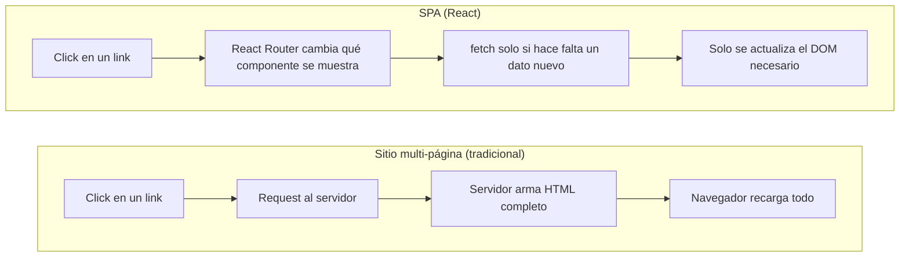

# Clase 1 — De la API al navegador: React, TypeScript y el entorno

## Por qué un framework de frontend

Hasta la Unidad 5 (Docker) todo lo que corrió, corrió en un servidor. Un cliente web es distinto en un punto clave: el código que escribís **se ejecuta en la máquina de otra persona**, dentro de un navegador, y tiene que reaccionar a que esa persona haga clic, escriba, o a que llegue una respuesta de red — en cualquier orden, en cualquier momento.

La forma "cruda" de hacer eso es manipular el DOM (Document Object Model — el árbol de elementos que el navegador renderiza) a mano:

```js
const boton = document.getElementById("btn-sumar");
let contador = 0;
boton.addEventListener("click", () => {
  contador++;
  document.getElementById("contador").textContent = contador;
});
```

Esto funciona para un contador. En una aplicación real, con decenas de piezas de estado que se afectan entre sí (el usuario está logueado → mostrar su nombre → habilitar el botón de logout → ocultar el de login), mantener manualmente sincronizado "qué cambió" con "qué parte del DOM hay que actualizar" se vuelve inmanejable y muy propenso a bugs (actualizás un dato y te olvidás de refrescar una de las cinco partes de la pantalla que dependían de él).

React propone lo opuesto: **describís cómo se ve la UI en función del estado actual**, y el framework se encarga de calcular qué cambió y actualizar el DOM por vos.

```jsx
function Contador() {
  const [contador, setContador] = useState(0);
  return <button onClick={() => setContador(contador + 1)}>{contador}</button>;
}
```

> **Adelanto**: `useState` y el `<button onClick={...}>` de arriba se explican recién en la Clase 2 (estado y eventos) y en "JSX", más abajo en esta misma clase — por ahora alcanza con leerlo como "una variable (`contador`) que, cuando cambia con `setContador`, hace que React vuelva a dibujar el componente".

No hay ningún `getElementById` ni `addEventListener` manual: `setContador` cambia el estado, React vuelve a ejecutar la función `Contador`, compara el resultado con lo que había en pantalla, y actualiza solo lo que cambió.

| | Manipulación manual del DOM | React (declarativo) |
|---|---|---|
| Qué escribís | Los **pasos** para llegar al resultado (buscar el elemento, cambiar su texto) | El **resultado** en función del estado actual |
| Quién sincroniza estado ↔ pantalla | El programador, a mano, en cada punto donde el estado cambia | El framework, automáticamente |
| Qué pasa al crecer la app | Cada dato nuevo es un lugar más donde olvidarse de actualizar el DOM | Cada dato nuevo es una variable de estado más; la UI se recalcula sola |

> **Concepto clave**: React (creado en Facebook/Meta, 2013) no es el único framework declarativo — Vue y Angular resuelven el mismo problema con otro API. Se elige React acá por ser, hoy, el más usado en la industria y el que más translada directo a otros frameworks similares una vez entendida la idea de "UI como función del estado".

## SPA vs. sitio multi-página

Con un backend tradicional (no una API), cada click de "siguiente página" dispara un request al servidor que devuelve un HTML nuevo completo, y el navegador recarga todo desde cero. Una **SPA** (*Single Page Application*, aplicación de una sola página) carga **un único HTML** al principio, y de ahí en adelante todo el cambio de "pantalla" lo resuelve JavaScript en el navegador — sin recargar la página. La navegación entre secciones (login, registro, home) la maneja una librería de ruteo en el cliente (React Router, Clase 4), no el servidor.

Esto es exactamente el motivo por el que la Unidad 6 construyó una **API que solo devuelve JSON**, nunca HTML: el servidor dejó de tener la responsabilidad de armar pantallas. Esa responsabilidad se mudó acá, al cliente.



## TypeScript: JavaScript con tipado estático

TypeScript es un **superset** de JavaScript: todo código JS válido es también TS válido, pero TS agrega un sistema de tipos que se chequea **antes** de correr el código (en compilación / al guardar), no en runtime. El navegador nunca ejecuta TypeScript directamente — la toolchain (Vite, en esta unidad) lo transpila a JS plano.

| | Java (ya lo conocés) | TypeScript |
|---|---|---|
| Cuándo se chequean los tipos | Compilación, con `javac` | "Compilación" (transpilación), con `tsc` — pero el chequeo también corre en vivo en el editor |
| Qué corre en producción | Bytecode (`.class`), sobre una JVM | JavaScript plano, sin rastro de tipos — un navegador nunca ejecuta TypeScript |
| Cómo se satisface un tipo | **Nominal**: una clase debe declarar `implements Interfaz` explícitamente | **Estructural** (duck typing verificado en compilación, igual que las interfaces de Go — ver Unidad 6 Clase 1): si el objeto tiene la forma correcta, cumple el tipo, sin declararlo |
| Tipos básicos | `int`, `String`, `boolean`, clases | `number`, `string`, `boolean`, `interface`/`type` |

```ts
interface Usuario {
  id: string;
  email: string;
}

function saludar(u: Usuario): string {
  return `Hola, ${u.email}`;
}

saludar({ id: "1", email: "ana@test.com" }); // OK — tiene la forma de Usuario
saludar({ id: "1" });                         // Error de compilación: falta "email"
```

> **Concepto clave — satisfacción estructural**: igual que en Go (Unidad 6, Clase 1) un `struct` nunca declara `implements Repository`, en TypeScript un objeto nunca declara `implements Usuario` — si tiene los campos correctos, el compilador lo acepta. Esto se conoce como **duck typing** ("si camina como un pato y grazna como un pato, para el compilador es un pato": importa la forma del objeto, no el nombre del tipo que declaró tener). Esto va a ser central en la Clase 3, cuando cada respuesta JSON del backend se tipe con una `interface` que refleja el DTO de la API.

## Instalación del entorno

```bash
# macOS
brew install node        # instala Node.js (el runtime) + npm (su gestor de paquetes)

# Windows (PowerShell)
winget install OpenJS.NodeJS.LTS
# alternativa sin winget: instalador .msi desde nodejs.org (elegir la versión LTS)

# Verificar la instalación (misma terminal en ambos sistemas)
node -v                   # ej: v22.x
npm -v                    # ej: 10.x
```

| Herramienta | Rol | Equivalente conceptual |
|---|---|---|
| **Node.js** | Runtime de JavaScript fuera del navegador — necesario para correr las herramientas de build (no para que la app final funcione: esa corre en el navegador) | La JVM, para las herramientas de build de Java |
| **npm** | Gestor de paquetes: instala dependencias, corre scripts declarados en `package.json` | Gradle/Maven |
| **`package.json`** | Declara las dependencias del proyecto y los scripts disponibles (`dev`, `build`, ...) | `build.gradle` |
| **`package-lock.json`** | Fija la versión exacta de cada dependencia instalada, se commitea | `go.sum` (Unidad 6) |

> Node no se usa para servir la app en producción en este curso — Vite (a continuación) usa Node solo como entorno de desarrollo y de build; el resultado final es HTML/CSS/JS estático que serviría cualquier servidor web.

## Creación del proyecto con Vite

**Vite** (francés: "rápido") es la herramienta de build usada en esta unidad: levanta un servidor de desarrollo con recarga instantánea (*Hot Module Replacement*) y arma el build final de producción. Reemplaza a *Create React App*, la herramienta oficial histórica de React, hoy discontinuada.

```bash
npm create vite@latest mi-app -- --template react-ts
cd mi-app
npm install     # descarga las dependencias declaradas en package.json (equivalente a "go mod tidy")
npm run dev     # levanta el servidor de desarrollo, por defecto en http://localhost:5173
```

`--template react-ts` le dice a Vite que arme el proyecto con React **y** TypeScript ya configurados — sin esa plantilla, el proyecto quedaría en JavaScript plano.

## Estructura del proyecto generado

```
mi-app/
├── index.html            ← el único HTML de la SPA; tiene un <div id="root">, nada más
├── package.json           ← dependencias + scripts (dev, build, preview)
├── tsconfig.json          ← configuración del compilador de TypeScript
├── vite.config.ts         ← configuración de Vite (plugin de React, etc.)
└── src/
    ├── main.tsx            ← punto de entrada: monta <App /> dentro de #root
    ├── App.tsx             ← primer componente
    └── App.css, index.css  ← estilos
```

| Script (`npm run ...`) | Qué hace |
|---|---|
| `dev` | Levanta el servidor de desarrollo con recarga en caliente — el que se usa todo el tiempo mientras se programa |
| `build` | Corre `tsc` (chequea tipos) y arma el build final optimizado en `dist/` — HTML/CSS/JS estático, listo para servir |
| `preview` | Sirve localmente el build de `dist/`, para probarlo tal cual va a producción |

> **En este curso**: `mi-app/` de arriba es la estructura genérica que arma Vite en cualquier carpeta nueva. El ejemplo de la unidad (`007a-ejemplo/`) sigue exactamente esa misma estructura por dentro, pero **no** vive como un proyecto suelto: convive con su propio backend de Go dentro de una carpeta `web/` en la raíz de ese mismo proyecto (`007a-ejemplo/web/`, al lado de `007a-ejemplo/api/`) — una API propia, con la misma arquitectura que la Unidad 6 pero su propia base de datos, no la API de `006-go/006b-ejemplo`. Es el mismo criterio de organización que ya usan Docker/Kubernetes y la mayoría de los repos reales: un solo repositorio ("monorepo") con una carpeta por servicio — acá, `api/` para el backend y `web/` para el cliente — en vez de dos proyectos totalmente separados.

## JSX: HTML dentro de una función de TypeScript

Los archivos `.tsx` (en vez de `.ts`) permiten escribir **JSX**: una sintaxis que se ve como HTML pero en realidad es **azúcar sintáctica** — una forma más corta y más legible de escribir algo que, por debajo, sigue siendo código normal; "azúcar" porque no agrega ninguna capacidad nueva al lenguaje, solo lo hace más fácil de leer y escribir. Concretamente, cada elemento JSX es una llamada a una función de React (`React.createElement(...)`) disfrazada de HTML:

```jsx
// Esto (JSX)...
const elemento = <h1>Hola, {nombre}</h1>;

// ...es exactamente esto por debajo (lo que Vite genera):
const elemento = React.createElement("h1", null, "Hola, ", nombre);
```

Las dos líneas producen el mismo resultado; la de JSX es simplemente más corta de escribir y más fácil de leer, sobre todo cuando hay muchos elementos anidados. El navegador nunca ve la versión con `<h1>` — Vite transpila cada archivo `.tsx` a la versión con `React.createElement(...)` antes de servirlo.

```tsx
function Saludo() {
  const nombre = "Ana";
  return (
    <div>
      <h1>Hola, {nombre}</h1>       {/* {} embebe una expresión de TS dentro del "HTML" */}
      <p>Son las {new Date().toLocaleTimeString()}</p>
    </div>
  );
}
```

> **Concepto clave**: `{expresión}` dentro de JSX no es un template string ni una directiva especial — es JavaScript/TypeScript normal evaluado ahí mismo. Cualquier expresión válida de TS puede ir adentro (una variable, una llamada a función, un ternario), pero **no** una sentencia (`if`, `for` sueltos) — para eso existen los patrones de renderizado condicional de la Clase 2.

JSX se parece a HTML pero no lo es, y algunos atributos cambian de nombre porque JSX es JavaScript por debajo:

| HTML | JSX | Por qué |
|---|---|---|
| `class="tarjeta"` | `className="tarjeta"` | `class` es una palabra reservada de JavaScript (para declarar clases de POO) |
| `onclick="..."` | `onClick={...}` | Los manejadores de evento se pasan como funciones de TS/JS, en camelCase, no como un string de código |
| `for="email"` (en `<label>`) | `htmlFor="email"` | `for` es palabra reservada de JavaScript (el bucle `for`) |

El resto de los atributos (`id`, `type`, `value`, `placeholder`, ...) se escriben igual que en HTML.

## El primer componente propio, tipado

Un componente de React es, en su forma más simple, **una función que devuelve JSX**. Recibe sus datos de entrada por un único parámetro, `props`, cuya forma se declara con una `interface` — el mismo mecanismo que un DTO en la Unidad 6, pero para pasar datos entre componentes en vez de por HTTP.

```tsx
interface TarjetaUsuarioProps {
  email: string;
  id: string;
}

function TarjetaUsuario({ email, id }: TarjetaUsuarioProps) {
  return (
    <div className="tarjeta">
      <p>Email: {email}</p>
      <p>ID: {id}</p>
    </div>
  );
}

export default TarjetaUsuario;
```

```tsx
// Uso desde otro componente (otro archivo .tsx):
import TarjetaUsuario from "./TarjetaUsuario";

// ...
<TarjetaUsuario email="ana@test.com" id="abc123" />
```

Si se omite `id` en el uso, o se le pasa un `number`, TypeScript marca el error en el editor **antes** de correr nada — el mismo valor que dan los tags `binding:"required"` de Gin (Unidad 6, Clase 5) del lado del servidor, acá aplicado del lado del cliente.

> **Cuidado**: el nombre de un componente **tiene que empezar con mayúscula** (`TarjetaUsuario`, no `tarjetaUsuario`). React usa esa convención para decidir, dentro del JSX, si una etiqueta como `<TarjetaUsuario />` es un componente propio o si `<div>` es una etiqueta HTML nativa — un componente en minúscula se interpretaría como una etiqueta HTML inexistente y no renderizaría nada.
