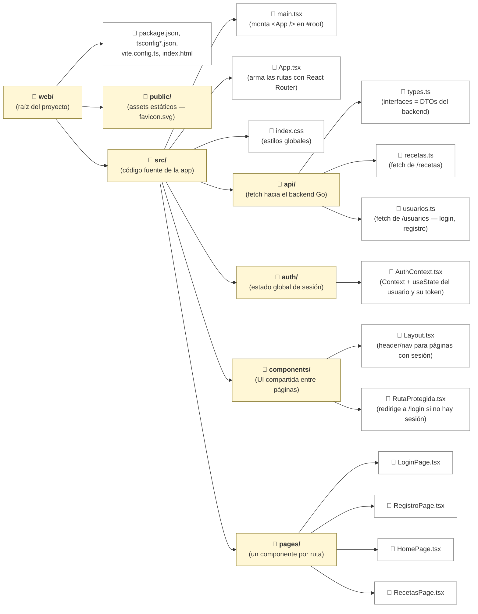
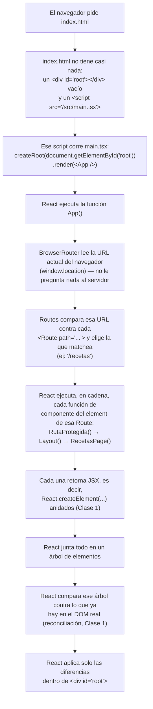

# Clase 2 — Estado, eventos y formularios controlados

## Resumen de la Clase 1

| Tema | Resumen |
|---|---|
| TypeScript | Es un superset de JavaScript que agrega un sistema de tipos chequeado en compilación (con `tsc`), nunca en el navegador, que solo ejecuta JS plano una vez transpilado. A diferencia de Java, donde un tipo se satisface de forma nominal (`implements Interfaz` explícito), en TypeScript la satisfacción es estructural: un objeto cumple una `interface` si tiene la forma correcta, sin declararlo (duck typing verificado en compilación). |
| Instalación del entorno | Node.js es el runtime de JavaScript fuera del navegador, necesario solo para correr las herramientas de build (no para la app final, que corre en el navegador) — el equivalente conceptual a la JVM para el tooling de Java. npm es su gestor de paquetes (equivalente a Gradle/Maven), que instala dependencias declaradas en `package.json` y corre scripts como `dev` o `build`. |
| Creación del proyecto con Vite | Vite es la herramienta de build de esta unidad: levanta un servidor de desarrollo con recarga instantánea (Hot Module Replacement) y arma el build final de producción, reemplazando a la discontinuada Create React App. `npm create vite@latest mi-app -- --template react-ts` genera un proyecto con React y TypeScript ya configurados. |
| Estructura del proyecto generado | Un proyecto Vite trae un único `index.html` con un `<div id="root">` vacío, `package.json` con las dependencias y scripts, `tsconfig.json` para el compilador de TypeScript, y una carpeta `src/` con `main.tsx` (punto de entrada que monta `<App />`) y el primer componente, `App.tsx`. Los scripts principales son `dev` (servidor con recarga en caliente), `build` (chequea tipos y genera `dist/`) y `preview` (sirve el build de `dist/` localmente). |
| JSX | Es la sintaxis, disponible en archivos `.tsx`, que permite escribir algo parecido a HTML dentro de una función de TypeScript; es azúcar sintáctica, porque cada elemento JSX es en realidad una llamada a `React.createElement(...)` que Vite transpila antes de servir el código — el navegador nunca ve el JSX original. Se parece a HTML pero no lo es: algunos atributos cambian de nombre porque son palabras reservadas de JavaScript (`class` → `className`, `onclick` → `onClick`, `for` → `htmlFor`), y `{expresión}` embebe JavaScript/TypeScript normal (nunca una sentencia como `if` o `for` sueltos). |
| Primer componente propio, tipado | Un componente de React es, en su forma más simple, una función que devuelve JSX y recibe sus datos de entrada por un único parámetro, `props`, cuya forma se declara con una `interface` — el mismo mecanismo que un DTO, pero para pasar datos entre componentes en vez de por HTTP. El nombre del componente tiene que empezar con mayúscula, porque React usa esa convención para distinguir un componente propio (`<TarjetaUsuario />`) de una etiqueta HTML nativa (`<div>`) dentro del JSX. |

### Jerarquía de carpetas del ejemplo (`007a-ejemplo/web/`)

Dentro de `src/`, cada carpeta agrupa una responsabilidad: `api/` habla con el backend, `auth/` guarda el estado de sesión, `components/` junta piezas de UI que se reusan entre páginas, y `pages/` tiene un componente por ruta. Así queda organizado el ejemplo completo de esta unidad:



## De `index.html` a la pantalla: cómo se ejecuta una page, paso a paso

Con esa jerarquía de carpetas ya ubicada, falta unir las piezas: **qué ejecuta el navegador, en qué orden, y de dónde sale la función que termina dibujando una page en particular.**



1. **El HTML no arma nada.** `index.html` (Clase 1) llega al navegador con un `<div id="root"></div>` vacío y un único `<script type="module" src="/src/main.tsx">`. Todo lo que se ve en pantalla lo arma ese script, no el HTML.
2. **`main.tsx` es el único punto de entrada.** `createRoot(document.getElementById("root")!).render(<App />)` le dice a React "tomá esta función, `App`, ejecutala, y poné el resultado adentro de ese `<div>`". De acá para adelante todo pasa dentro de ese `<div>`.
3. **`App()` decide qué page corresponde, no el servidor.** Adentro de `App.tsx`, `BrowserRouter` lee la URL actual del navegador (ej. `/recetas`) y `Routes` la compara contra cada `<Route path="...">` hasta encontrar la que matchea. Es el mismo trabajo que hacía `gin.Engine` (Unidad 6) mapeando un método+path a un handler — pero acá corre en el navegador, sin red de por medio, por eso una SPA cambia de "pantalla" sin recargar (Clase 1 — SPA vs. sitio multi-página).
4. **El `element` de esa `<Route>` es una cadena de funciones, no una sola.** Para `/recetas`, el `element` es `<RutaProtegida><Layout><RecetasPage /></Layout></RutaProtegida>`. React ejecuta esas funciones de afuera hacia adentro: primero `RutaProtegida()` (si no hay sesión, corta ahí con un `<Navigate />` y ninguna de las siguientes se ejecuta), después `Layout()`, y recién al final `RecetasPage()` — la función que realmente arma el contenido de esa page.
5. **Cada función retorna JSX, y JSX es solo datos.** `RecetasPage()` (como cualquier componente) no dibuja nada por sí misma: retorna la descripción de elementos anidados (`React.createElement(...)`, Clase 1) hasta llegar a etiquetas nativas (`<div>`, `<table>`, ...).
6. **React arma el árbol completo y lo compara contra el DOM real.** Con todo ese JSX ya resuelto, React arma un árbol de elementos y lo compara contra lo que hay actualmente en el `<div id="root">` (reconciliación, Clase 1), aplicando al DOM real solo las diferencias.

> **Concepto clave — qué se vuelve a ejecutar cuando cambia el estado**: un `setValor(...)` (o cualquier `set...` de `useState`) **no** vuelve a correr toda la cadena desde `main.tsx`. Solo vuelve a ejecutarse la función del componente donde está ese estado — y, en cascada, las funciones de los componentes que anida en su `return` — para volver a evaluar qué JSX corresponde ahora. `RutaProtegida()` y `Layout()`, por ejemplo, no se vuelven a ejecutar por un cambio de estado adentro de `RecetasPage()`, porque ese estado no es de ellos ni está en su `return`.

## Por qué hace falta "estado"

Una función de React, por sí sola, siempre devuelve lo mismo para los mismos `props` — es una función pura. Para que la UI **cambie con el tiempo** (un contador que sube, un input que se llena, una lista que crece) React necesita un lugar donde guardar esos valores que cambian y una forma de decirle "esto cambió, volvé a renderizar". Eso es el **estado**, y el hook para manejarlo es `useState`.

```tsx
import { useState } from "react";

function Contador() {
  const [valor, setValor] = useState<number>(0);
  //     ^valor actual      ^función para actualizarlo   ^tipo del estado

  return (
    <button onClick={() => setValor(valor + 1)}>
      Clickeado {valor} veces
    </button>
  );
}
```

`useState<number>(0)` inicializa el estado en `0` y fija su tipo en `number` — TypeScript ya no deja asignarle un `string` más adelante. La sintaxis `<number>` es un genérico, igual que `List<Integer>` en Java. Llamar a `setValor` no muta `valor` in-place: le pide a React que vuelva a ejecutar el componente con el nuevo valor, y ahí es donde el DOM se actualiza (ver Clase 1 — "React vs. manipulación manual del DOM").

> **Concepto clave — inferencia de tipos**: el `<Tipo>` explícito no siempre hace falta. `useState("")` ya queda tipado como `string` sin escribir `useState<string>("")`, porque TypeScript infiere el tipo a partir del valor inicial (mismo mecanismo que `var` en Java). Hace falta ponerlo explícito cuando el valor inicial no alcanza para describir todos los valores futuros: por ejemplo `useState<string | null>(null)` (Clase 3) para un estado que empieza en `null` pero después puede guardar un `string`.

> **Cuidado (el error más común)**: `setValor` es **asíncrono** en cuanto a cuándo el nuevo valor está disponible en `valor` — no esperes que `valor` refleje el cambio en la línea siguiente al `setValor(...)` dentro del mismo evento. Si el nuevo valor depende del anterior, usar la forma funcional: `setValor(v => v + 1)`.

> **Concepto clave — funciones flecha (`=>`)**: `() => setValor(valor + 1)` es una función anónima, el equivalente a un lambda de Java (`() -> setValor(valor + 1)`) pero con `=>` en vez de `->`. Con un solo parámetro, los paréntesis son opcionales (`v => v + 1` es lo mismo que `(v) => v + 1`); con cero o más de uno, van siempre. Si el cuerpo es una única expresión (sin llaves `{ }`), esa expresión es el valor de retorno implícito — por eso `(e) => setTexto(e.target.value)` no necesita `return`. Se puede escribir el manejador como función flecha inline (como acá) o como función nombrada aparte (como en la sección siguiente); ambas formas son válidas, y una función nombrada suele preferirse cuando el cuerpo tiene más de una línea.

## Eventos, tipados

Los manejadores de eventos de React (`onClick`, `onChange`, `onSubmit`, ...) reciben un objeto de evento **sintético** (una envoltura de React sobre el evento nativo del DOM, con la misma API pero normalizada entre navegadores). TypeScript exige tipar ese parámetro según el elemento y el evento:

```tsx
import { useState, type ChangeEvent, type FormEvent } from "react";

function Formulario() {
  const [texto, setTexto] = useState("");

  function manejarCambio(e: ChangeEvent<HTMLInputElement>) {
    setTexto(e.target.value); // e.target es el <input> que disparó el evento; .value, su contenido actual
  }

  function manejarEnvio(e: FormEvent<HTMLFormElement>) {
    e.preventDefault(); // evita el comportamiento por defecto del navegador (recargar la página)
    console.log("enviado:", texto);
  }

  return (
    <form onSubmit={manejarEnvio}>
      <input value={texto} onChange={manejarCambio} />
      <button type="submit">Enviar</button>
    </form>
  );
}
```

> **Concepto clave**: `ChangeEvent`, `FormEvent`, etc. son tipos que hay que importar de `"react"` (como en la línea `import ... type ChangeEvent ...` de arriba) — es la misma convención que usan `LoginPage.tsx` y `RegistroPage.tsx` en el ejemplo de la unidad. Es habitual verlos también escritos como `React.ChangeEvent<...>`, calificados con el namespace `React`; para eso hace falta `import type React from "react"` en vez del import nombrado. Ambas formas son equivalentes — esta unidad usa la forma con import nombrado.

> **Concepto clave**: `HTMLInputElement`, `HTMLFormElement` y `HTMLButtonElement` son tipos que ya vienen definidos por TypeScript para describir al DOM del navegador — no hace falta instalarlos ni importarlos aparte, TypeScript los conoce de fábrica. Cada uno determina qué propiedades expone `e.target` (un `<input>` tiene `.value`; un `<form>`, no).

| Tipo de evento | Cuándo se usa |
|---|---|
| `ChangeEvent<HTMLInputElement>` | `onChange` de un `<input>` |
| `FormEvent<HTMLFormElement>` | `onSubmit` de un `<form>` |
| `MouseEvent<HTMLButtonElement>` | `onClick` de un `<button>` (importado igual, de `"react"` — no confundir con el `MouseEvent` global del navegador) |

## Formularios controlados

Un input es **controlado** cuando su valor en pantalla viene siempre del estado de React (`value={texto}`), y cada tecleo actualiza ese estado (`onChange`) — React es la única fuente de verdad sobre "qué hay escrito ahí", nunca el DOM por su cuenta. Es el patrón que se usa en toda la unidad (y en el ejemplo — login y registro son formularios controlados).

```tsx
function LoginFormulario() {
  const [email, setEmail] = useState("");
  const [password, setPassword] = useState("");

  return (
    <form>
      <input
        type="email"
        value={email}
        onChange={(e) => setEmail(e.target.value)}
      />
      <input
        type="password"
        value={password}
        onChange={(e) => setPassword(e.target.value)}
      />
    </form>
  );
}
```

> **Concepto clave**: si un `<input>` tiene `value={...}` sin `onChange`, React lo deja de solo lectura — no hay forma de tipear ahí (el input siempre "vuelve" al valor del estado). El par `value` + `onChange` va siempre junto.

## Renderizado condicional

No hay una sentencia `if` dentro del JSX (Clase 1 — "una expresión, no una sentencia"), así que el condicional se resuelve con expresiones de TypeScript:

```tsx
function Estado({ cargando, error }: { cargando: boolean; error: string | null }) {
  if (cargando) return <p>Cargando...</p>;         // early return: la forma más clara para casos excluyentes

  return (
    <div>
      {error && <p className="error">{error}</p>}   {/* && : renderiza el JSX solo si error es "truthy" (JS lo trata como equivalente a true en un condicional) */}
      <p>Contenido normal</p>
    </div>
  );
}
```

| Patrón | Cuándo usarlo |
|---|---|
| `if (...) return <X />;` al principio del componente | Casos que se excluyen entre sí (cargando / con error / con datos) |
| `{condicion && <X />}` | Mostrar algo solo si una condición se cumple, sin alternativa |
| `{condicion ? <X /> : <Y />}` | Elegir entre dos JSX según una condición |

> **Concepto clave**: `{ cargando, error }: { cargando: boolean; error: string | null }` tipa las props igual que la `interface XxxProps` de la Clase 1, pero escribiendo la forma del objeto **inline**, sin ponerle nombre — sirve cuando ese tipo no se va a reutilizar en ningún otro lado. Es azúcar sintáctica (una forma más corta de escribir lo mismo, ver Clase 1 — "JSX"), no un mecanismo distinto: `{ cargando: boolean; error: string | null }` acá cumple exactamente el mismo rol que declarar antes `interface EstadoProps { cargando: boolean; error: string | null }` y usar `(props: EstadoProps)`.

> **Cuidado**: `{cantidad && <p>Hay {cantidad}</p>}` con `cantidad = 0` renderiza literalmente `0` en la pantalla (`0` es "truthy" para el `&&` de JS solo si es distinto de cero, pero acá es exactamente cero, que es falsy — el problema es que en vez de "nada" React igual imprime el `0` en lugar de omitir el JSX). Con valores numéricos que pueden ser `0`, conviene `cantidad > 0 && <p>...</p>` o el ternario.

## Listas y `key`

> **Concepto clave**: `array.map(fn)` (método nativo de los arrays de JS/TS, no de React) devuelve un **array nuevo** con el resultado de aplicar `fn` a cada elemento — igual que `.stream().map(fn)` en Java, pero sin necesidad de `.collect(...)` al final. Es la forma habitual de convertir un array de datos en un array de JSX, uno por elemento.

```tsx
interface Libro { id: string; titulo: string; }

function ListaLibros({ libros }: { libros: Libro[] }) {
  return (
    <ul>
      {libros.map((libro) => (
        <li key={libro.id}>{libro.titulo}</li>
      ))}
    </ul>
  );
}
```

`key` no es una prop más — es información privada que usa React para el algoritmo de reconciliación (decidir qué elemento de la lista es "el mismo" entre un render y el siguiente, en vez de recrear toda la lista). Tiene que ser **estable** (el mismo id en cada render) y **única entre hermanos**; usar el índice del array como `key` funciona solo si la lista nunca reordena ni inserta/borra en el medio — en el resto de los casos produce bugs de UI difíciles de rastrear (inputs que "recuerdan" el valor del elemento equivocado, por ejemplo).

## Tablas con varias columnas, responsive

El mismo patrón `array.map(fn)` con `key` de arriba sirve para generar filas de una tabla (`<tr>`), no solo `<li>`. Lo nuevo acá no es React — es que una `<table>` con muchas columnas no se achica sola en una pantalla angosta, y hay que resolverlo con CSS:

```tsx
interface Receta {
  id: string;
  nombre: string;
  categoria: string;
  tiempoPreparacionMinutos: number;
  porciones: number;
}

function TablaRecetas({ recetas }: { recetas: Receta[] }) {
  return (
    <div className="tabla-wrapper">
      <table>
        <thead>
          <tr>
            <th>Nombre</th>
            <th>Categoría</th>
            <th>Tiempo (min)</th>
            <th>Porciones</th>
          </tr>
        </thead>
        <tbody>
          {recetas.map((receta) => (
            <tr key={receta.id}>
              <td>{receta.nombre}</td>
              <td>{receta.categoria}</td>
              <td>{receta.tiempoPreparacionMinutos}</td>
              <td>{receta.porciones}</td>
            </tr>
          ))}
        </tbody>
      </table>
    </div>
  );
}
```

```css
.tabla-wrapper {
  overflow-x: auto;               /* scroll horizontal solo si la tabla no entra */
  -webkit-overflow-scrolling: touch;
}

table {
  width: 100%;
  min-width: 480px;               /* evita que las columnas se aplasten */
  border-collapse: collapse;
}

th, td {
  padding: 8px 10px;
  text-align: left;
  border-bottom: 1px solid #8884;
}
```

> **Concepto clave**: el `<div className="tabla-wrapper">` que envuelve a la `<table>` es lo que hace el trabajo — `overflow-x: auto` en ese contenedor le permite scrollear horizontalmente por dentro sin romper el layout del resto de la página, mientras que `min-width` en la tabla evita que el navegador comprima las columnas hasta hacerlas ilegibles. Es la técnica más usada en la práctica: no cambia el HTML semántico de la tabla (accesible para lectores de pantalla) y no hace falta ninguna librería.

Otras técnicas existen para cuando ni el scroll horizontal es aceptable en mobile — no se desarrollan en esta unidad, pero vale saber que existen:

| Técnica | Idea |
|---|---|
| Scroll horizontal en wrapper (la de arriba) | La tabla entera se ve igual en cualquier pantalla; en mobile se desliza |
| "Tarjetas" apiladas por fila (media query + `data-label` en cada `<td>`) | En mobile cada fila se muestra como bloque vertical en vez de fila de tabla |
| Ocultar columnas secundarias (`display: none` en un `<th>`/`<td>` bajo una media query) | Se pierde información en mobile, pero sin scroll ni reflow |

## Adentro de una page.tsx: qué función se ejecuta para renderizarla

El paso a paso anterior (arriba, después del diagrama de carpetas) llega hasta "React ejecuta `RecetasPage()`" — pero eso da por sentado algo que todavía no se explicó: **¿de dónde sale exactamente esa función, y cómo sabe React que es esa y no otra?**

No hay ninguna convención mágica por nombre de archivo (a diferencia de frameworks con *file-based routing*, donde el nombre del archivo determina la ruta). En React, la conexión es siempre explícita y pasa por tres puntos, los tres visibles en el código:

1. **Adentro de `RecetasPage.tsx` hay una sola función exportada.** El archivo puede tener helpers o tipos auxiliares (como `interface FormularioReceta` en el ejemplo), pero solo una función lleva `export` y su nombre coincide con el del archivo: `export function RecetasPage() { ... }`. Esa es, por convención, "la page" — el resto de lo que hay en el archivo existe para que esa función lo use.
2. **`App.tsx` importa esa función por su nombre exacto.** `import { RecetasPage } from "./pages/RecetasPage";` — es un *named export* (llaves `{ }`), así que el nombre importado tiene que ser idéntico al exportado. No hay ninguna búsqueda automática: si el archivo exportara la función con otro nombre, el import fallaría en compilación.
3. **Esa función se usa como tag de JSX dentro de un `element`.** `<Route path="/recetas" element={<RutaProtegida><Layout><RecetasPage /></Layout></RutaProtegida>} />`. `<RecetasPage />` no es HTML ni un string mágico — es, por debajo, `React.createElement(RecetasPage, ...)` (Clase 1): la referencia a la función `RecetasPage` importada en el paso 2 queda embebida ahí mismo, en el árbol de elementos. Cuando React llega a ese nodo del árbol (paso 4 del diagrama anterior), llama exactamente a esa función porque es la que el propio código le pasó — igual que llamar a cualquier función de TS a través de una referencia guardada en una variable.

> **Concepto clave — named export vs. default export**: `App.tsx` se exporta distinto que las pages: `export default App;` (Clase 1), mientras que `RecetasPage.tsx` usa `export function RecetasPage() { ... }` (named export). La diferencia está en el import: un *default export* se importa con cualquier nombre y sin llaves (`import App from "./App"` — por eso `main.tsx` podría importarlo como `import Cualquiera from "./App"` y seguiría funcionando), mientras que un *named export* se importa entre llaves y con el nombre exacto (`import { RecetasPage } from "./pages/RecetasPage"`). Esta unidad usa *named exports* para las pages y los componentes de `components/`, y reserva el *default export* para el punto de entrada de cada árbol de rutas (`App.tsx`) — así el nombre que aparece en cada `import { X }` es siempre una pista confiable de qué función se está usando, sin depender de cómo decidió llamarla quien escribe el import.

> **Cuidado**: si `RecetasPage.tsx` tuviera, además, otra función suelta sin usar dentro del `return` de `RecetasPage` (por ejemplo, un experimento a medio hacer), esa otra función simplemente nunca se ejecuta — no importa si está exportada o no. Lo único que decide si una función corre es si alguien, en algún punto de la cadena de JSX que arranca en `main.tsx`, la referencia con un tag (`<OtraFuncion />`) o la llama directamente.

