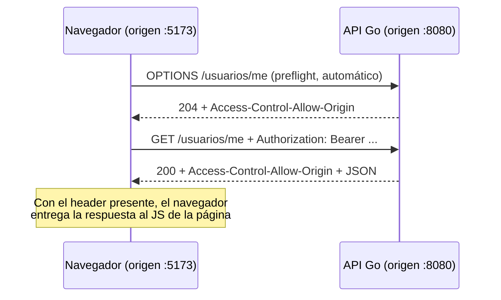

# Clase 3 — Efectos, `fetch` y contratos tipados con el backend

## `useEffect`: cuando hay que hacer algo que no es "dibujar la pantalla"

Todo lo que vimos hasta ahora (JSX, `useState`) sirve para una sola cosa: decidir qué se ve en pantalla según el estado actual. Pedirle datos a una API es otra cosa muy distinta: es algo que pasa "por afuera" de la pantalla, tarda un tiempo (porque viaja por internet) y no depende solo de lo que el componente tiene guardado. A este tipo de tareas se las llama **efectos** (el nombre técnico completo es "efecto secundario", pero no hace falta usarlo con los alumnos). `useEffect` es la herramienta de React para decir "esto ejecutalo aparte, no como parte del dibujado normal".

```tsx
import { useEffect, useState } from "react";

function Reloj() {
  const [hora, setHora] = useState(new Date());

  useEffect(() => {
    const id = setInterval(() => setHora(new Date()), 1000); // setInterval/clearInterval: API del navegador (no de React) — corre el callback cada 1000ms y devuelve un id para poder cancelarlo
    return () => clearInterval(id); // cleanup: corre antes del próximo efecto y al desmontar el componente
  }, []); // array de dependencias vacío: correr una sola vez, al montar

  return <p>{hora.toLocaleTimeString()}</p>;
}
```

| Array de dependencias | Cuándo se ejecuta |
|---|---|
| No poner nada (`useEffect(fn)`) | Después de **cada** vez que se redibuja la pantalla — casi nunca es lo que se quiere |
| `[]` (array vacío) | Una sola vez, apenas el componente aparece en pantalla — el caso típico para pedir los datos iniciales |
| `[valor]` | Cada vez que ese valor cambia de un dibujado al siguiente |

> **Para entender — la "limpieza"**: la función que `useEffect` puede devolver (es opcional) es como apagar la luz al salir de una habitación: se ejecuta justo antes de que el efecto se vuelva a disparar, y también cuando el componente desaparece de la pantalla. Ahí es donde se cancelan timers, conexiones, o pedidos de red que quedaron "en el aire". Si no se hace esto, puede pasar que un componente que ya no está en pantalla intente actualizar datos que a esta altura ya no le importan a nadie, y React avisa con un mensaje de advertencia.

> **Cuidado — quedarse dando vueltas sin parar**: si el efecto actualiza el estado del componente, y nos olvidamos de poner el array de dependencias (o lo ponemos mal, por ejemplo con un valor que cambia en cada dibujado), puede pasar esto: el efecto actualiza el estado → eso hace que el componente se vuelva a dibujar → volver a dibujar dispara el efecto otra vez → y así sin parar, en un ciclo infinito. Por eso, la regla para "pedir datos apenas se abre la pantalla" es siempre usar `[]`: le decimos a React "esto no depende de nada que cambie, ejecutalo una sola vez y listo".

## Pidiendo datos a una API con `fetch`

El navegador ya viene con una función para pedir datos a otra dirección de internet: `fetch`. No hace falta instalar nada para usarla (existe una alternativa muy usada, Axios, con más funciones extra, pero no la necesitamos para lo que vemos acá).

### Antes del ejemplo: qué son `async` y `await`

Pedirle algo a un servidor no da el resultado al instante, como sumar dos números — tarda un tiempo, porque viaja por internet. Es más parecido a pedir comida por delivery: hacés el pedido y no te quedás parado esperando sin hacer nada, seguís con lo tuyo, y cuando llega, la recibís. `async` y `await` son las dos palabras que usa JavaScript/TypeScript para escribir ese tipo de espera de forma que el código se lea de arriba hacia abajo, como si fuera secuencial, en vez de quedar todo enredado:

- `async` se le pone adelante a una función para avisar "esta función va a tardar en algún momento, y eso está contemplado".
- `await` se usa **adentro** de una función `async`, justo delante de algo que tarda (como un `fetch`). Pausa nada más que **esa función puntual** hasta que el resultado está listo — el resto de la página sigue funcionando con normalidad mientras tanto — y cuando el resultado llega, la función sigue como si nada, con ese valor ya disponible.

```tsx
interface Receta {
  id: string;
  nombre: string;
  categoria: string;
}

function ListaRecetas() {
  const [recetas, setRecetas] = useState<Receta[]>([]);
  const [cargando, setCargando] = useState(true);
  const [error, setError] = useState<string | null>(null);

  useEffect(() => {
    async function cargar() {
      try {
        const respuesta = await fetch("http://localhost:8080/recetas");
        if (!respuesta.ok) {
          throw new Error(`Error ${respuesta.status}`);
        }
        const datos: Receta[] = await respuesta.json();
        setRecetas(datos);
      } catch (e) {
        setError(e instanceof Error ? e.message : "Error desconocido");
      } finally {
        setCargando(false);
      }
    }
    cargar();
  }, []);

  if (cargando) return <p>Cargando...</p>;
  if (error) return <p className="error">{error}</p>;
  return (
    <ul>
      {recetas.map((r) => <li key={r.id}>{r.nombre} — {r.categoria}</li>)}
    </ul>
  );
}
```

> **Para entender — qué es una `Promise`**: el "comprobante de que en algún momento vas a tener el resultado" (siguiendo la analogía del delivery de más arriba) es lo que en JavaScript se llama `Promise`. `fetch(...)` en realidad devuelve una de estas — no la receta directamente, sino la promesa de que en algún momento va a estar. `await` es lo que permite "canjear" esa promesa por el valor real, sin bloquear nada más mientras se espera.

> **Cuidado — por qué armamos una función aparte llamada `cargar`**: hay una regla de sintaxis que conviene aprender de memoria más que pelearse por entenderla del todo: la función que recibe `useEffect` no puede marcarse `async` directamente. Por eso el patrón que se usa siempre es: adentro del efecto, se define una función `async` con otro nombre (acá, `cargar`), y se la llama ahí mismo. Es una receta fija que se repite igual en (casi) todos los componentes que piden datos.

> **Cuidado — por qué no alcanza con `e.message` en el `catch`**: en JavaScript se puede "lanzar" cualquier cosa como error, no necesariamente algo del tipo `Error` (hasta se puede lanzar un simple texto). Por eso TypeScript no sabe de antemano qué tipo de cosa es `e`, y no deja usar `.message` directamente. Hay que primero preguntar "¿esto que agarré es realmente un `Error`?" con `e instanceof Error` — recién ahí adentro, TypeScript deja leer el mensaje con tranquilidad porque ya sabe con qué está tratando.

> **Diferencia con lo que vieron en Go (Unidad 6)**: `fetch` **no** considera que algo salió mal cuando el servidor responde con un `404` o un `500` — para `fetch`, eso es una respuesta como cualquier otra. Solo se considera un fallo real cuando hay un problema de conexión (no hay internet, el servidor no existe, etc.). Por eso siempre hay que revisar a mano si `respuesta.ok` da verdadero — es el equivalente a chequear `if err != nil` en Go, pero acá "hubo un error HTTP" no cuenta como un error de JavaScript hasta que nosotros decidimos lanzarlo con `throw`.

## Tipando los contratos del backend (DTOs → `interface`)

En la Unidad 6 vimos que el servidor separa dos cosas: el usuario "completo" que se guarda internamente (con la contraseña encriptada, por ejemplo) y una versión "recortada" de esos mismos datos, que es la única que viaja por internet, sin nada sensible (eso es un DTO — mismo patrón acá, se puede ver en `007a-ejemplo/api/internal/usuario/dto.go`). Del lado de React pasa algo parecido: por cada una de esas "versiones recortadas" que viajan por la red, escribimos una `interface` de TypeScript que describe exactamente esos mismos campos, con el mismo nombre — ni uno de más, ni uno de menos:

```ts
// Contratos de 007a-ejemplo/api — reflejan exactamente los DTOs de Go
interface RegistroDTO {
  email: string;
  password: string;
}

interface LoginDTO {
  email: string;
  password: string;
}

interface UsuarioDTO {
  id: string;
  email: string;
}

interface LoginResponse {
  token: string;
}
```

```ts
async function login(dto: LoginDTO): Promise<LoginResponse> {
  const respuesta = await fetch("http://localhost:8080/usuarios/login", {
    method: "POST",
    headers: { "Content-Type": "application/json" },
    body: JSON.stringify(dto),
  });
  if (!respuesta.ok) {
    const cuerpo = await respuesta.json();
    throw new Error(cuerpo.error ?? "Error al iniciar sesión"); // ??: usa el operando derecho solo si el izquierdo es null/undefined (a diferencia de ||, que también reemplazaría "" o 0)
  }
  return respuesta.json();
}
```

> **Para remarcar en clase — esto es una promesa, no una garantía**: TypeScript **no revisa, mientras el programa está corriendo, que lo que llegó del servidor realmente tenga la forma que le prometimos** (`respuesta.json()` en realidad devuelve "puede ser cualquier cosa", y el `: Promise<LoginResponse>` es solo lo que nosotros, como programadores, le prometemos al compilador que va a venir). Si el backend cambia algo sin avisar, TypeScript no lo va a detectar al compilar: el problema recién va a aparecer cuando el programa ya esté corriendo, como un valor que de golpe es "indefinido". Existen herramientas (como `zod`) que sí revisan esto mientras el programa corre, pero quedan fuera de lo que vemos en esta materia — alcanza con que los alumnos entiendan que la revisión de tipos de TypeScript "se corta" justo en la frontera con la red.

## Variables de entorno con Vite

Un dato como la dirección del backend no conviene dejarlo escrito fijo en el código, porque cambia según dónde esté corriendo la aplicación (no es la misma dirección en la computadora de desarrollo que cuando la app ya está publicada). Para esto existen las variables de entorno: valores que se definen afuera del código, en un archivo aparte. Vite (la herramienta que arma el proyecto de React) exige que esas variables empiecen con el prefijo `VITE_`:

```bash
# .env
VITE_API_URL=http://localhost:8080
```

```ts
const API_URL = import.meta.env.VITE_API_URL;
```

> **Por qué el prefijo `VITE_` es obligatorio**: cuando la aplicación está lista para publicarse, Vite junta todo el código en unos pocos archivos finales (esto se llama el **build**, ver Clase 1 — `npm run build`). Esos archivos son los que se le mandan al navegador de cualquier persona que entre a la página — es decir, es código que **cualquiera puede ver y leer**, sin excepción, con las herramientas del navegador. Vite solo mete adentro de esos archivos finales las variables que arrancan con `VITE_`, justamente para que sea difícil filtrar por error algo que no debería ser público (una clave secreta de una API, por ejemplo) — esas otras variables sin el prefijo pueden existir del lado de la herramienta de build, pero nunca llegan al navegador.

## CORS: por qué el navegador bloquea la llamada

Cuando levantamos el cliente de React (que corre en `http://localhost:5173`, el puerto que usa Vite por defecto) y desde ahí llamamos a la API de Go (que corre en `http://localhost:8080`), para el navegador esas son **dos direcciones distintas**, aunque las dos digan "localhost" — cambia el número de puerto al final. Por seguridad, el navegador tiene una regla que dice: "el código JavaScript de una dirección no puede leer la respuesta que vino de otra dirección diferente" — aunque el pedido haya llegado bien al servidor y la respuesta haya vuelto bien, el navegador se la esconde al código.

**CORS** es, básicamente, el permiso que dan los servidores para saltear esa regla: es el mecanismo por el cual el **servidor** le avisa al navegador "esta otra dirección sí tiene permiso para leer lo que yo le mando". Ese permiso lo da el servidor agregando una información extra a su respuesta (el header `Access-Control-Allow-Origin`). Es una decisión que toma el backend, no algo que el cliente pueda arreglar por su cuenta — por eso en `007a-ejemplo/api/internal/middleware/cors_middleware.go` se agrega ese permiso a todas las respuestas de esta API.

> **Para entender — el "pedido de prueba" antes del pedido real (preflight)**: cuando el pedido no es tan simple (por ejemplo, si lleva un token de autenticación, o avisa que manda datos en formato JSON), el navegador, por su cuenta y sin que nuestro código se lo pida, manda primero un pedido de prueba (`OPTIONS`) preguntándole al servidor "¿tengo permiso para hacer esto?". Si el servidor no contesta bien ese pedido de prueba, el pedido real ni siquiera llega a mandarse — el código ni se entera de que esto pasó. Por eso el middleware contesta enseguida con un "todo bien" (`204`) apenas detecta un `OPTIONS` (ver el código): su único trabajo es responder ese pedido de prueba.



Esto explica algo que puede resultar confuso: `curl` y Postman (que usaron en la Unidad 6) nunca tuvieron este problema, porque CORS es una regla que aplica específicamente **el navegador** — no es una restricción real del servidor ni del protocolo HTTP. Por eso los ejemplos con `curl` de la Unidad 6 siempre funcionaron sin este middleware, y recién hizo falta agregarlo cuando conectamos un cliente real desde el navegador.

