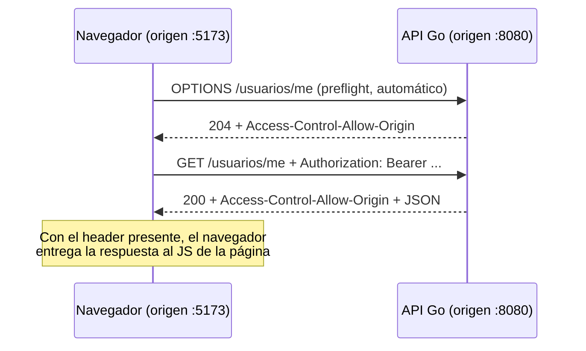

# Clase 3 — Efectos, `fetch` y contratos tipados con el backend

## `useEffect`: código que corre fuera del render

Todo lo visto hasta acá (JSX, `useState`) describe **qué renderizar**. Pedirle datos a una API es distinto: es un **efecto secundario** (*side effect*) — algo que pasa por fuera de "calcular la UI a partir del estado" y que además toma tiempo (la red). `useEffect` es el hook para ese caso.

```tsx
import { useEffect, useState } from "react";

function Reloj() {
  const [hora, setHora] = useState(new Date());

  useEffect(() => {
    const id = setInterval(() => setHora(new Date()), 1000); // setInterval/clearInterval: API del navegador (no de React) — corre el callback cada 1000ms y devuelve un id para poder cancelarlo
    return () => clearInterval(id); // cleanup: corre antes del próximo efecto y al desmontar el componente
  }, []); // array de dependencias vacío: correr una sola vez, al montar

  return <p>{hora.toLocaleTimeString()}</p>;
}
```

| Array de dependencias | Cuándo corre el efecto |
|---|---|
| Sin array (`useEffect(fn)`) | Después de **cada** render — casi nunca es lo que se quiere |
| `[]` | Una sola vez, al montar el componente (el caso típico para pedir datos iniciales) |
| `[valor]` | Cada vez que `valor` cambia entre un render y el siguiente |

> **Concepto clave — cleanup**: la función que devuelve `useEffect` (opcional) corre antes de que el efecto se vuelva a disparar, y al desmontar el componente. Es donde se cancelan timers, subscripciones, o (más adelante, con `fetch`) requests en vuelo — sin esto, un componente que ya no está en pantalla puede intentar `setState` sobre datos que ya no importan, y React tira un warning.

> **Cuidado — loop infinito**: si el efecto llama a una función que actualiza estado (`setState`) y se omite el array de dependencias (o se pasa un array vacío mal puesto, o un valor que cambia en cada render, como un objeto u array creado inline), React puede volver a ejecutar el efecto en cada render que ese `setState` provoca, entrando en un ciclo infinito de renders. Por eso "pedir datos al montar" siempre usa `[]`: le dice a React "este efecto no depende de nada que cambie, corré una sola vez".

## Pidiendo datos a una API con `fetch`

El navegador trae `fetch` nativo — no hace falta instalar nada para hacer requests HTTP (Axios es una alternativa popular con más funcionalidades, pero no es necesaria para lo que cubre esta unidad).

```tsx
interface Receta {
  id: string;
  nombre: string;
  categoria: string;
}

function ListaRecetas() {
  const [recetas, setRecetas] = useState<Receta[]>([]);
  const [cargando, setCargando] = useState(true);
  const [error, setError] = useState<string | null>(null);

  useEffect(() => {
    async function cargar() {
      try {
        const respuesta = await fetch("http://localhost:8080/recetas");
        if (!respuesta.ok) {
          throw new Error(`Error ${respuesta.status}`);
        }
        const datos: Receta[] = await respuesta.json();
        setRecetas(datos);
      } catch (e) {
        setError(e instanceof Error ? e.message : "Error desconocido");
      } finally {
        setCargando(false);
      }
    }
    cargar();
  }, []);

  if (cargando) return <p>Cargando...</p>;
  if (error) return <p className="error">{error}</p>;
  return (
    <ul>
      {recetas.map((r) => <li key={r.id}>{r.nombre} — {r.categoria}</li>)}
    </ul>
  );
}
```

> **Concepto clave — `Promise`, `async`/`await`**: una operación de red no tiene el resultado disponible al instante. En JS/TS eso se modela con una `Promise`: un valor que representa "un resultado que va a estar disponible más adelante", sin bloquear el hilo del navegador mientras tanto. `fetch(...)` devuelve una `Promise<Response>`; `respuesta.json()` devuelve otra `Promise`. Una función marcada `async` puede usar `await` adentro: `await` pausa **esa función** (no el navegador entero, que sigue respondiendo a otros eventos) hasta que la Promise se resuelve, y da como resultado el valor ya resuelto — es la forma de leer código asíncrono como si fuera secuencial. No hay un equivalente directo en Go (que resuelve esto con goroutines y channels, Unidad 6) ni en el Java visto hasta ahora.

> **Cuidado — por qué `cargar` es una función aparte**: la función que recibe `useEffect` no puede ser `async` directamente (`useEffect(async () => {...}, [])` es un error de tipos) porque el valor que devuelve un efecto lo usa React para el cleanup (ver más arriba) — y una función `async` siempre devuelve una `Promise`, nunca `undefined` ni una función de limpieza. Por eso el patrón estándar es declarar una función `async` aparte adentro del efecto (acá, `cargar`) y llamarla sin `await`, dejando que el efecto en sí siga siendo síncrono.

> **Cuidado — el tipo de `e` en el `catch`**: TypeScript tipa la variable de un `catch` como `unknown` (podría ser cualquier cosa — en JS se puede hacer `throw "un string"`), no como `Error`. Por eso no alcanza con `e.message`: hay que reducir ese tipo a algo más específico primero con `e instanceof Error` (esto se llama **type narrowing**, "angostar" el tipo) — TypeScript recién ahí deja acceder a `.message`, porque dentro del `if` ya sabe que `e` es un `Error`.

> **Diferencia con `error`, `err` de Go (Unidad 6)**: `fetch` **no** rechaza la promesa por un `404` o `500` — solo lo hace ante un fallo de red real (sin conexión, DNS, CORS bloqueado). Por eso hay que chequear `respuesta.ok` (equivalente al `if err != nil` de Go, pero acá el "error HTTP" no es un `Error` de JS hasta que se lanza explícitamente).

## Tipando los contratos del backend (DTOs → `interface`)

La Unidad 6 separó explícitamente el modelo interno (`Usuario`, con el hash de la contraseña) del DTO que viaja por HTTP (`UsuarioDTO`, sin el hash — mismo patrón acá, ver `007a-ejemplo/api/internal/usuario/dto.go`). Del lado del cliente, cada uno de esos DTOs se refleja con una `interface` de TypeScript — el mismo campo, el mismo nombre de JSON, ningún campo de más:

```ts
// Contratos de 007a-ejemplo/api — reflejan exactamente los DTOs de Go
interface RegistroDTO {
  email: string;
  password: string;
}

interface LoginDTO {
  email: string;
  password: string;
}

interface UsuarioDTO {
  id: string;
  email: string;
}

interface LoginResponse {
  token: string;
}
```

```ts
async function login(dto: LoginDTO): Promise<LoginResponse> {
  const respuesta = await fetch("http://localhost:8080/usuarios/login", {
    method: "POST",
    headers: { "Content-Type": "application/json" },
    body: JSON.stringify(dto),
  });
  if (!respuesta.ok) {
    const cuerpo = await respuesta.json();
    throw new Error(cuerpo.error ?? "Error al iniciar sesión"); // ??: usa el operando derecho solo si el izquierdo es null/undefined (a diferencia de ||, que también reemplazaría "" o 0)
  }
  return respuesta.json();
}
```

> **Concepto clave**: TypeScript **no valida en runtime** que la respuesta de `fetch` realmente tenga la forma de `LoginResponse` — `respuesta.json()` devuelve `any`, y el `: Promise<LoginResponse>` es una promesa del programador al compilador, no una garantía verificada contra el JSON real. Si el backend cambia el contrato sin avisar, el error aparece en runtime (un campo `undefined`), no en compilación. Librerías como `zod` resuelven esto con validación real en runtime — queda fuera del alcance de esta unidad introductoria, pero vale saber que el chequeo de tipos de TS termina en la frontera de red.

## Variables de entorno con Vite

Un valor como la URL del backend no debería quedar hardcodeado — cambia entre desarrollo y producción. Vite expone variables de entorno con el prefijo obligatorio `VITE_`:

```bash
# .env
VITE_API_URL=http://localhost:8080
```

```ts
const API_URL = import.meta.env.VITE_API_URL;
```

> **Por qué el prefijo `VITE_` es obligatorio**: el **bundle** es el archivo (o los pocos archivos) `.js` finales que Vite arma en `dist/` juntando todo el código de la app — es lo que termina sirviéndose al navegador (ver Clase 1 — `npm run build`). Todo lo que termina ahí adentro es código que corre en el navegador de un desconocido — **público**, sin excepción. Vite solo expone al cliente las variables que empiezan con `VITE_`, precisamente para que no sea trivial filtrar por accidente una variable de entorno sensible (una clave de API privada, por ejemplo) que sí puede vivir sin ese prefijo del lado del build tool pero nunca debería llegar al navegador.

## CORS: por qué el navegador bloquea la llamada

Al levantar el cliente de React (`http://localhost:5173`, el puerto por defecto de Vite) y llamarlo contra la API de Go (`http://localhost:8080`), el navegador ve dos **orígenes** distintos (protocolo + dominio + puerto) y aplica la *same-origin policy*: por defecto, JavaScript corriendo en el origen `5173` no puede leer una respuesta que vino del origen `8080`, aunque el request efectivamente haya llegado al servidor.

**CORS** (*Cross-Origin Resource Sharing*) es el mecanismo por el cual el **servidor** le dice al navegador "este otro origen sí puede leer mi respuesta", vía el header `Access-Control-Allow-Origin`. Es una decisión del backend, no del cliente — por eso `007a-ejemplo/api/internal/middleware/cors_middleware.go` agrega ese header a toda respuesta de esta API.

> **Concepto clave — preflight**: para requests "no simples" (con un header como `Authorization`, o `Content-Type: application/json`), el navegador manda automáticamente un `OPTIONS` **antes** del request real, para confirmarle al servidor qué orígenes/métodos/headers están permitidos — sin que el código JS lo pida explícitamente, ni se entere de que pasó. Si el servidor no responde ese `OPTIONS` con los headers correctos, `fetch` nunca llega a mandar el request real. Por eso el middleware corta la respuesta con un `204` apenas ve `OPTIONS` (ver el código): es exclusivamente para contestar ese preflight.



`curl` y Postman (Unidad 6) nunca tropiezan con esto — CORS es una política que aplica **el navegador**, no una restricción del servidor en sí; por eso los ejemplos con `curl` del README de la Unidad 6 siempre funcionaron sin este middleware, y solo hizo falta agregarlo al conectar un cliente real desde el navegador.

