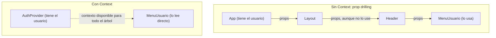
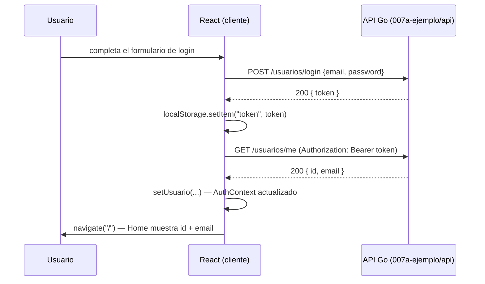

# Clase 4 — Ruteo, sesión y estado global de autenticación

## React Router: navegación sin recargar la página

```bash
npm install react-router-dom
```

```tsx
import { BrowserRouter, Routes, Route, Link } from "react-router-dom";

function App() {
  return (
    <BrowserRouter>
      <nav>
        <Link to="/login">Login</Link>
        <Link to="/registro">Registro</Link>
      </nav>
      <Routes>
        <Route path="/login" element={<LoginPage />} />
        <Route path="/registro" element={<RegistroPage />} />
        <Route path="/" element={<HomePage />} />
      </Routes>
    </BrowserRouter>
  );
}
```

`<Link>` reemplaza al `<a>`: intercepta el click y le pide a React Router que cambie qué `<Route>` está activo, **sin** que el navegador dispare un request de página completa (ver Clase 1 — SPA vs. multi-página). `useNavigate()` hace lo mismo mediante código, típicamente después de una acción (redirigir a `/` después de un login exitoso):

```tsx
import { useNavigate } from "react-router-dom";

function LoginPage() {
  const navigate = useNavigate();

  async function manejarLogin() {
    await login(/* ... */); // login viene de useAuth() — ver "AuthContext", más abajo
    navigate("/"); // redirige sin recargar
  }
  // ...
}
```

## El problema de compartir el estado de sesión

`usuario` y `token` los necesitan varios componentes que no tienen relación de padre-hijo directa entre sí (`LoginPage` los produce; `HomePage` los lee; una barra de navegación necesita saber si hay sesión para mostrar "Login" o "Cerrar sesión"). Pasarlos como `props` bajando de componente en componente (*prop drilling*) hasta llegar al que realmente los necesita se vuelve inmanejable rápido. La **Context API** de React resuelve exactamente este problema: un valor disponible para cualquier componente descendiente, sin pasarlo explícitamente por cada nivel intermedio.



## `AuthContext`: estado global de autenticación

La Context API son tres piezas que trabajan juntas: `createContext<T>(valorPorDefecto)` crea un objeto `Context` (`T` fija el tipo del valor que va a circular, misma sintaxis genérica que `useState<number>(0)` de la Clase 2); ese objeto expone un componente `Context.Provider` que, montado en algún punto del árbol, hace disponible un `value` para todos sus descendientes; y `useContext(Context)` es el hook que un descendiente llama para leer ese `value`. El código de abajo asume dos funciones ya construidas contra la API con el estilo de la Clase 3 (`obtenerPerfil`, que hace `GET /usuarios/me` con el token, y `loginRequest`, que hace `POST /usuarios/login`) — en el proyecto de ejemplo viven en `007a-ejemplo/web/src/api/usuarios.ts` con otros nombres (`api.obtenerPerfil`, `api.login`); acá se simplifican para enfocar el ejemplo en el contexto, no en el fetch.

```tsx
import { createContext, useContext, useState, useEffect, type ReactNode } from "react";

interface Usuario { id: string; email: string; }

interface AuthContextValue {
  usuario: Usuario | null;
  cargando: boolean;
  login: (email: string, password: string) => Promise<void>;
  logout: () => void;
}

const AuthContext = createContext<AuthContextValue | null>(null);

export function AuthProvider({ children }: { children: ReactNode }) {
  const [usuario, setUsuario] = useState<Usuario | null>(null);
  const [cargando, setCargando] = useState(true);

  useEffect(() => {
    const token = localStorage.getItem("token");
    if (!token) { setCargando(false); return; }
    obtenerPerfil(token)
      .then(setUsuario)
      .catch(() => localStorage.removeItem("token")) // token vencido o inválido
      .finally(() => setCargando(false));
  }, []);

  async function login(email: string, password: string) {
    const { token } = await loginRequest({ email, password });
    localStorage.setItem("token", token);
    setUsuario(await obtenerPerfil(token));
  }

  function logout() {
    localStorage.removeItem("token");
    setUsuario(null);
  }

  return (
    <AuthContext.Provider value={{ usuario, cargando, login, logout }}>
      {children}
    </AuthContext.Provider>
  );
}

export function useAuth() {
  const ctx = useContext(AuthContext);
  if (!ctx) throw new Error("useAuth debe usarse dentro de un AuthProvider");
  return ctx;
}
```

Cualquier componente descendiente de `<AuthProvider>` accede a la sesión con una sola línea: `const { usuario, logout } = useAuth();` — sin recibir nada por props.

> **Concepto clave — `children` y `ReactNode`**: `children` es una prop especial que JSX arma sola a partir de lo que quede entre las etiquetas de apertura y cierre de un componente (`<AuthProvider>ESTO ES children</AuthProvider>`) — nunca se pasa como atributo explícito. `ReactNode` es el tipo de TypeScript para "cualquier cosa que React sepa renderizar" (un elemento JSX, un string, un número, un array de esos, o `null`); es el tipo correcto para una prop `children` genérica, que puede terminar recibiendo cualquier árbol. `AuthProvider` recibe como `children` el resto de la app y lo devuelve sin tocarlo dentro de `<AuthContext.Provider>` — solo lo "envuelve" para darle acceso al contexto. (El `type` antes de `ReactNode` en el `import` marca que es un tipo, no un valor: ayuda a la herramienta de build a saber que esa importación se puede eliminar del bundle final.)

> **Cuidado — por qué `useContext` puede devolver `null`**: el tipo declarado es `createContext<AuthContextValue | null>(null)`. Ese `null` es lo que devolvería `useContext(AuthContext)` si se lo llamara desde un componente que **no** está dentro de ningún `<AuthContext.Provider>` — un error de uso del código, no un estado válido de la sesión (eso ya lo representa `usuario: Usuario | null`, adentro del objeto). Por eso `useAuth()` no devuelve `ctx` tal cual: si es `null`, tira un error explícito y entendible en vez de dejar que el resto del componente falle más abajo con un `Cannot read properties of null` críptico.

> **Concepto clave — `localStorage`, y por qué el token vive ahí y no solo en memoria**: `localStorage` es una API del navegador (no de React): un almacén de pares clave-valor de tipo `string`, separado por origen (protocolo+dominio+puerto), que se lee y escribe en forma sincrónica con `.getItem(clave)`, `.setItem(clave, valor)` y `.removeItem(clave)`. Un `useState` se pierde al refrescar la página (F5 recarga toda la SPA desde cero); `localStorage` persiste entre recargas y pestañas del mismo origen, así que al volver a abrir la app el `useEffect` de arriba puede recuperar la sesión sin pedir login de nuevo — a costa de exponer el token a cualquier script que corra en la página (por eso nunca hay que renderizar HTML no confiable sin sanitizar en una SPA que guarda tokens así).

> **Por qué acá no es `useEffect(async () => {...})`**: la función que recibe `useEffect` tiene que devolver `undefined` o una función de cleanup (Clase 3) — nunca una `Promise`, que es justo lo que devuelve siempre una función `async`. La Clase 3 evitaba esto declarando una función `async` aparte y llamándola adentro del efecto; acá se resuelve distinto, encadenando `.then/.catch/.finally` directo sobre la promesa de `obtenerPerfil`, sin `async/await`. `.then(setUsuario)` pasa `setUsuario` directamente como callback porque ambas funciones reciben un único argumento con la misma forma (el usuario) — es equivalente a `.then((u) => setUsuario(u))`, pero más corto.

## Rutas protegidas

```tsx
import type { ReactNode } from "react";
import { Navigate } from "react-router-dom";
import { useAuth } from "./AuthContext";

function RutaProtegida({ children }: { children: ReactNode }) {
  const { usuario, cargando } = useAuth();

  if (cargando) return <p>Cargando...</p>;
  if (!usuario) return <Navigate to="/login" replace />;
  return children;
}
```

```tsx
<Route path="/" element={<RutaProtegida><HomePage /></RutaProtegida>} />
```

`cargando` evita un falso negativo: sin ese chequeo, en el primer render (antes de que el `useEffect` de `AuthProvider` termine de consultar `/usuarios/me`) `usuario` todavía es `null` y `RutaProtegida` redirigiría a `/login` aunque la sesión sea válida.

> **Concepto clave**: cuando hay sesión, `RutaProtegida` no arma JSX propio — devuelve `children` tal cual, el árbol que se le pasó (`<HomePage />` en el uso de arriba), como si `RutaProtegida` no estuviera puesto. Solo interviene para bloquear (`cargando`) o redirigir (`!usuario`); en el caso "todo bien" es transparente.

> **El prop `replace` de `<Navigate>`**: navegar normalmente agrega una entrada nueva al historial del navegador. `replace` hace que la redirección **reemplace** la entrada actual en vez de sumar una — así, si el usuario toca "atrás" desde `/login`, no vuelve a la ruta protegida (que lo mandaría de nuevo para acá), sino a la página anterior a esa.

> **Por qué `AuthProvider` tiene que envolver las rutas**: `RutaProtegida` llama a `useAuth()`, y `useAuth()` necesita que algún `<AuthContext.Provider>` esté montado **por encima** de él en el árbol — si no, `useContext` devuelve `null` y `useAuth()` tira el error visto en la sección anterior. Como `RutaProtegida` se usa adentro de un `<Route element={...}>`, eso significa que `AuthProvider` tiene que envolver a `<Routes>` (o a `<BrowserRouter>` entero), no al revés:

```tsx
function App() {
  return (
    <BrowserRouter>
      <AuthProvider>
        <Routes>
          <Route path="/login" element={<LoginPage />} />
          <Route path="/registro" element={<RegistroPage />} />
          <Route path="/" element={<RutaProtegida><HomePage /></RutaProtegida>} />
        </Routes>
      </AuthProvider>
    </BrowserRouter>
  );
}
```

Con este árbol, `AuthProvider` monta antes de que cualquier `<Route>` se evalúe (es un ancestro de `<Routes>`), y su `useEffect` arranca a resolver el token de inmediato — `cargando` empieza en `true` para todas las rutas hasta que esa consulta a `/usuarios/me` termina, sea cual sea la ruta activa.

## El flujo completo, de punta a punta



